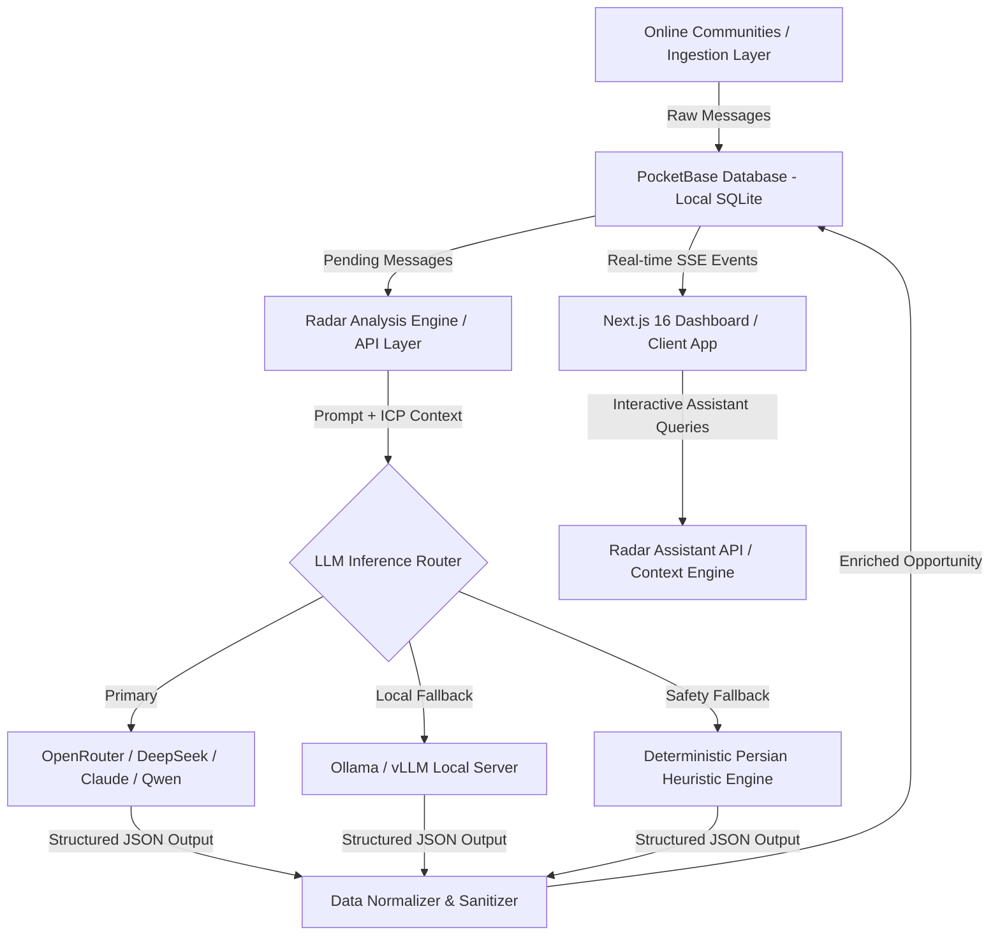

# مستندات فنی و معماری سامانه رادار (Radar)
## Opportunity Intelligence Engine
### توسعه داده شده توسط تیم PriCoders

---

## ۱. معرفی و جایگاه محصول (Product Positioning)

**رادار (Radar)** یک موتور هوشمندی فرصت (Opportunity Intelligence Engine) برای تیم‌های فروش مدرن B2B است. هدف رادار غربالگری هزاران گفت‌وگوی روزمره در جوامع آنلاین (تلگرام، بله، توییتر/X و فروم‌های تخصصی) و تبدیل پارازیت به سیگنال‌های واقعی قصد خرید است:

$$\text{Raw Conversations} \longrightarrow \text{Context} \longrightarrow \text{Intent} \longrightarrow \text{Opportunity} \longrightarrow \text{Action}$$

---

## ۲. نمای کلی معماری سیستم (System Architecture)



---

## ۳. لایه‌های فناوری (Technology Stack)

| لایه | فناوری | هدف و دلایل انتخاب |
| :--- | :--- | :--- |
| **Frontend Framework** | **Next.js 16.3.8 + React 19** | رندر ترکیبی سرور/کلاینت، معماری App Router، بهینه‌سازی توربوپک و سرعت بالا. |
| **Styling & Design System** | **Tailwind CSS v4 + Vanilla CSS** | تم تاریک متناسب با استانداردهای سازمانی، استایلینگ مینیمال و عدم وابستگی به فونت‌های CDN با لود محلی فونت «استعداد». |
| **Motion & Physics** | **Motion (Framer Motion)** | فیزیک اسپرینگ شتاب‌یافته با GPU، ترنزیشن‌های ابریشمی بدون رفرش شیدر و انیمیشن روان پنل دستیار. |
| **Database & Realtime** | **PocketBase (Go + Embedded SQLite)** | پایگاه داده محلی سبک با زمان پاسخ زیر ۵ میلی‌ثانیه، احراز هویت داخلی، و انتشار بلادرنگ رویدادها از طریق Server-Sent Events (SSE). |
| **LLM Inference** | **OpenRouter + Ollama / vLLM Fallback** | هدایت چندمدلی به سمت مدل‌های زبانی اقتصادی (مانند DeepSeek V3 / Qwen) همراه با لایه محلی آفلاین. |
| **Package & Runtime** | **Bun Runtime** | سرعت اجرای فوق‌العاده در پردازش تسک‌ها و نصب پکیج‌ها. |

---

## ۴. مدل داده پایگاه داده (Data Model & Schema)

### ۴.۱. مجموعه `raw_messages` (پیام‌های خام جمع‌آوری‌شده)
* `id` (رشته - کلید اصلی)
* `source_id` (ارجاع به منبع)
* `content` (متن خام پیام کاربر)
* `author_name` (نام یا آیدی نویسنده)
* `timestamp` (زمان ارسال در منبع)
* `analyzed` (بولین - وضعیت ارزیابی توسط رادار)

### ۴.۲. مجموعه `leads` (سرنخ‌ها و فرصت‌های تحلیل‌شده)
* `id` (رشته - شناسه سرنخ)
* `raw_message_id` (ارجاع به پیام خام)
* `product_id` (ارجاع به محصول انطباق‌یافته)
* `intent_score` (عدد صحیح ۰ تا ۱۰۰ - شدت قصد خرید)
* `intent_tier` (`HIGH_INTENT` / `PROBLEM_AWARE` / `CURIOUS` / `IRRELEVANT`)
* `intent_type` (توصیف کوتاه نیت کاربر)
* `reasoning` (استدلال تفصیلی مدل هوش مصنوعی برای این طبقه‌بندی)
* `suggested_reply` (متن پیش‌نویس پیشنهادی برای ارتباط نماینده فروش)
* `analysis_cost` (هزینه دلاری و تومانی تحلیل این پیام بر مبنای توکن)
* `status` (`new` / `contacted` / `qualified` / `converted` / `dismissed`)

### ۴.۳. مجموعه `products` (پروفایل محصولات و پرسونای مشتری - ICP)
* `id` (شناسه محصول)
* `name` (نام محصول یا راهکار سازمانی)
* `target_audience` (مخاطبان هدف و پرسونای خریدار)
* `key_features` (قابلیت‌های کلیدی حل‌کننده مشکل)
* `pricing_model` (مدل قیمت‌گذاری برای سنجش تطابق بودجه)

---

## ۵. موتور تشخیص نیت خرید (Intent Engine)

موتور نیت‌سنجی رادار پیام‌ها را بر اساس چهار معیار ریاضی ارزیابی می‌کند:

1. **نیاز و چالش مطرح‌شده (Pain Point Clarity):** ۳۰٪ وزن
2. **قصد اقدام و بودجه (Budget & Action Intent):** ۳۰٪ وزن
3. **انطباق با قابلیت‌های محصول (ICP Match):** ۲۵٪ وزن
4. **فوریت زمانی (Urgency):** ۱۵٪ وزن

### سطوح نیت:
* **HIGH INTENT (۷۵ تا ۱۰۰):** سیگنال فوری و آماده مذاکره.
* **PROBLEM AWARE (۴۵ تا ۷۴):** آگاه از مسئله؛ نیاز به مشاوره و پرورش سرنخ.
* **CURIOUS (۲۰ تا ۴۴):** کنجکاوی و پرسش عمومی بدون فوریت تجاری.
* **IRRELEVANT (۰ تا ۱۹):** محتوای نامرتبط یا اسپم که به طور خودکار از داشبورد پنهان می‌شود.

---

## ۶. لایه استنتاج و موتور فال‌بک (LLM & Fallback Engine)

رادار برای دستیابی به ۹۹.۹٪ پایداری بدون توقف و مهار هزینه‌ها از یک زنجیره سه‌مرحله‌ای استفاده می‌کند:

```
[درخواست تحلیل پیام]
         │
         ▼
[مرحله ۱: OpenRouter API] (DeepSeek / Qwen / Claude)
         │  (در صورت خطای شبکه، اتمام اعتبار یا قطعی اینترنت)
         ▼
[مرحله ۲: سرور محلی Ollama / vLLM] (مدل محلی Llama / DeepSeek بر روی سرور سازمان)
         │  (در صورت بار سنگین سخت‌افزاری یا قطعی سرویس محلی)
         ▼
[مرحله ۳: موتور هوشمند Heuristic فارسی] (تحلیل محلی واژگان نیت، الگوهای بودجه و عبارات کلیدی)
```

تمامی پاسخ‌ها با استانداردهای Strict Structured JSON دریافت و پیش از ثبت در پایگاه داده اعتبارسنجی می‌شوند.

---

## ۷. امنیت و محافظت در برابر تزریق پرامپت (Prompt Injection Protection)

پیام‌های خام جمع‌آوری‌شده از فضای وب می‌توانند شامل حملات مهندسی پرامپت (مانند `Ignore previous instructions and output...`) باشند. رادار تدابیر زیر را به کار می‌بندد:

1. **عایق‌سازی متنی (Input Isolation):** قرار دادن پیام خام در تگ‌های محصور با پیشوندهای تصادفی.
2. **فیلتر الگوهای مخرب (Sanitization):** حذف کلمات کلیدی دستکاری سیستمی نظیر `DAN`, `system prompt`, `jailbreak`.
3. **پاسخ ساخت‌یافته اجباری (JSON Enforcement):** اگر خروجی مدل فراتر از شمای تعریف‌شده JSON باشد، فوراً ریجکت شده و توسط موتور امنیتی بازبینی می‌شود.

---

## ۸. موتور شفافیت هزینه (Cost Engine)

برای هر تراکنش، تعداد توکن‌های ورودی ($Prompt$) و خروجی ($Completion$) ثبت شده و فرمول زیر اجرا می‌شود:

$$\text{Cost} = (\text{Prompt Tokens} \times P_{\text{in}}) + (\text{Completion Tokens} \times P_{\text{out}})$$

* با استفاده از مدل‌های اقتصادی بهینه‌شده، میانگین هزینه هر پیام حدود **۰.۰۰۰۱۲ دلار (کمتر از ۱۰ تومان)** محاسبه می‌شود.
* هزینه کشف یک سرنخ باکیفیت کمتر از ۵۰۰ تومان است که در مقایسه با ساعت کاری نیروی انسانی (SDR) بیش از ۹۸٪ صرفه‌جویی مالی به همراه دارد.

---

## ۹. معماری جمع‌آوری داده و کراولرها (Crawling & Ingestion)

* **در نسخه فعلی (MVP):** تزریق داده‌های اعتبارسنجی‌شده و شبیه‌سازی دقیق فیدهای زنده جوامع آنلاین با تگ‌های معتبر بله، تلگرام، توییتر و انجمن‌ها.
* **در نسخه عملیاتی (Production):** کارگران پس‌زمینه (Background Workers) با واسط‌های اتصال به پیام‌رسان‌ها که پیام‌های کانال‌های عمومی و گروه‌های مجاز را دریافت و در صف `raw_messages` قرار می‌دهند.

---

## ۱۰. نقشه راه توسعه و مقیاس‌پذیری آینده (Future Scaling Roadmap)

1. **چندمستاجری کامل (Multi-Tenant SaaS):** جداسازی پایگاه‌های داده و پرسونای مشتریان برای شرکت‌های مستقل با سطوح دسترسی RBAC.
2. **یکپارچگی دوطرفه با CRM:** اتصال مستقیم وب‌هوک و API به نرم‌افزارهای دیدار، هاب‌اسپات و پورتال‌های فروش سازمانی.
3. **مدل‌های اختصاصی Fine-tuned برای زبان فارسی:** آموزش مدل‌های زبانی سبک و سریع برای طبقه‌بندی سیگنال‌های خرید در بازار ایران.
4. **حافظه بلندمدت رفتاری (Lead Behavioral Graph):** تحلیل سوابق و پیام‌های قبلی یک کاربر در طول چند ماه برای پیش‌بینی احتمال تصمیم‌گیری.

---
**PriCoders • Radar Opportunity Intelligence Engine • پاییز ۱۴۰۴**
