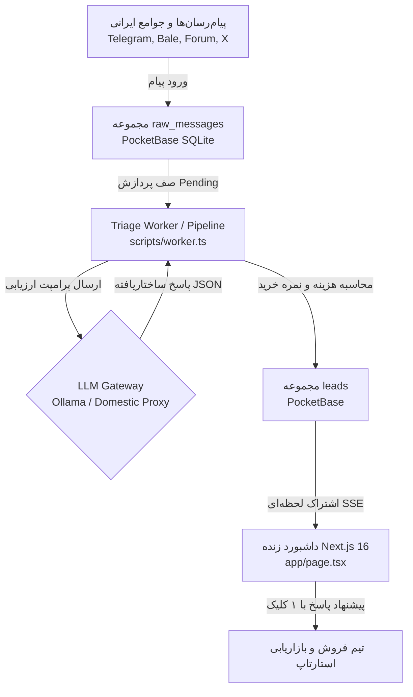

# 📡 AI Lead Radar (رادار هوشمند سرنخ و سیگنال خرید)

> **Autonomous Sales-Intent Agent for Startups & SMBs Operating in Iran**  
> پایشگر خودکار گروه‌ها، کانال‌ها و انجمن‌های ایرانی (تلگرام، بله، توییتر/X و فروم‌ها)، تفکیک نویز از سیگنال خرید واقعی، پیش‌نویس پاسخ متناسب با فرهنگ و زبان فارسی، و حسابداری دقیق هزینه پردازش توکن‌ها.

[](https://bun.sh)
[](https://nextjs.org)
[-b827fc.svg)](https://pocketbase.io)
[](LICENSE)
[](#critical-constraints-for-iran-operational-environment)

---

## 🇮🇷 معماری منطبق بر شرایط عملیاتی و اینترنت ایران (Critical Constraints)

1. **عدم وابستگی به سرویس‌های ابری خارجی (Zero Foreign Cloud Lock-in)**:
   - بدون نیاز به Firebase, Supabase, Vercel KV یا سرویس‌های آنالیتیکس خارجی که به دلیل تحریم‌ها یا فیلترینگ دچار قطعی می‌شوند.
   - بک‌اند سبک، تک‌فایلی و مقیم بر سرور داخلی یا Localhost با دیتابیس توکار **PocketBase (SQLite)**.
2. **کدنویسی خالص با تایپ‌اسکریپت و بدون کتابخانه‌های سنگین جانبی (Vanilla TypeScript First)**:
   - حذف پکیج‌های حجیم شخص ثالث (مانند `clsx`, `tailwind-merge` یا آیکون‌های خارجی).
   - توابع ادغام کلاس (`lib/cn.ts`)، کلاینت ارتباط با LLM (`lib/llm.ts`) و موتور حسابداری توکن‌ها (`lib/pricing.ts`) همگی به صورت دست‌نویس با Vanilla TypeScript پیاده‌سازی شده‌اند.
3. **عدم استفاده از CDNهای مسدودشونده (Zero External CDNs)**:
   - کلیه آیکون‌ها به صورت کامپوننت‌های توکار SVG در `components/Icons.tsx` قرار دارند.
   - فونت‌ها از استک فونت‌های پیش‌فرض و سیستمی فارسی (Vazirmatn, Sahel, Shabnam, IRANSans, Tahoma) بهره می‌برند.
4. **پشتیبانی بومی از راست‌به‌چپ (RTL) و اصطلاحات زبان فارسی**:
   - تحلیل ادبیات محاوره‌ای و عامیانه گروه‌های کسب‌وکار ایرانی (مثل «سامانه مودیان کلافه‌مون کرده»، «جایگزین فیلتر نشده چی پیشنهاد میدید؟»، «تسویه ریالی شتاب»).
   - تفکیک خودکار سیگنال‌های ۴گانه: **خرید قطعی (High Intent)**، **دردمند (Problem Aware)**، **کنجکاو (Curious)** و **نویز و چت روزمره (Irrelevant)**.
5. **انعطاف در اتصال به مدل‌های زبانی (Resilient LLM Gateway)**:
   - اتصال استاندارد به مدل‌های لوکال (Ollama / vLLM روی سرور GPU داخلی) یا گیت‌وی‌های واسط داخلی مطابق استاندارد OpenAI REST.
   - همراه با **موتور تحلیلی رزرو داخلی (Persian Heuristic Engine Fallback)** برای شرایط قطعی اینترنت بین‌الملل.

---

## 🏗️ معماری سیستم (System Architecture)



---

## 📁 ساختار پروژه (Project Directory Structure)

```text
radar/
├── package.json               # پیکربندی اسکریپت‌ها با Bun 1.4+
├── tsconfig.json              # تنظیمات سخت‌گیرانه TypeScript
├── next.config.ts             # تنظیمات Next.js 16
├── postcss.config.mjs         # پیکربندی Tailwind CSS v4
├── LICENSE                    # مجوز MIT
├── .env.example               # راهنمای متغیرهای محیطی
├── app/
│   ├── globals.css            # استایل‌های سراسری، پالت دارک و فونت‌های سیستمی
│   ├── layout.tsx             # لی‌اوت اصلی با قابلیت RTL و متادیتای SEO
│   ├── page.tsx               # داشبورد اصلی رادار و اشتراک زنده سرنخ‌ها (SSE)
│   ├── settings/page.tsx      # فرم مدیریت محصول و پرسونای مشتری (ICP)
│   └── api/
│       ├── analyze/route.ts   # اندپوینت تریاژ و ارزیابی تکی پیام
│       └── simulate/route.ts  # اندپوینت شبیه‌ساز تزریق زنده پیام‌ها
├── components/
│   ├── Icons.tsx              # آیکون‌های SVG خالص بدون نیاز به پکیج خارجی
│   ├── Navbar.tsx             # نوبار با مانیتور سلامت دیتابیس و دکمه تزریق دمو
│   ├── MetricsHeader.tsx      # ۵ کارت شاخص کلیدی عملکرد (KPI) و فیلترها
│   └── LeadCard.tsx           # کارت نمایش سرنخ، نمره خرید، توکن‌ها و پاسخ پیشنهادی
├── lib/
│   ├── cn.ts                  # تابع ترکیب کلاس‌های شرطی (Vanilla TS)
│   ├── pocketbase.ts          # کلاینت تایپ‌شده PocketBase و احراز هویت ادمین
│   ├── llm.ts                 # کلاینت مستقل ارتباط با هوش مصنوعی و موتور فال‌بک
│   └── pricing.ts             # موتور محاسبه هزینه میکروسنت توکن‌ها و معادل تومانی
├── pocketbase/
│   ├── pocketbase             # باینری سرور محلی PocketBase (در گیت ایگنور است)
│   └── setup_schema.ts        # اسکریپت ساخت خودکار جداول و فیلدها
└── scripts/
    ├── seed_demo.ts           # اسکریپت تزریق ۲۶ پیام واقعی جامعه کسب‌وکار ایران
    └── worker.ts              # پایپ‌لاین تریاژ خودکار پیام‌ها و ارزیابی سرنخ‌ها
```

---

## 🚀 راهنمای سریع راه‌اندازی (Quickstart Guide)

### ۱. پیش‌نیازها
- نصب [Bun 1.4+](https://bun.sh)
- سیستم‌عامل لینوکس / سرور ایرانی یا مک/ویندوز

### ۲. نصب وابستگی‌ها
```bash
bun install
```

### ۳. تنظیم متغیرهای محیطی
یک کپی از فایل `.env.example` با نام `.env` بسازید:
```bash
cp .env.example .env
```

### ۴. اجرای دیتابیس پاکت‌بیس (PocketBase)
سرور جیبی و سریع پاکت‌بیس را به صورت محلی اجرا کنید:
```bash
bun run pb
# یا به شکل مستقیم:
./pocketbase/pocketbase serve --http="0.0.0.0:8090"
```
> داشبورد مدیریت پاکت‌بیس در نشانی `http://127.0.0.1:8090/_/` قابل دسترسی است.

### ۵. ساخت خودکار جداول و داده‌های اولیه
در ترمینال دیگر، اسکریپت راه‌اندازی اسکیما را اجرا کنید:
```bash
bun run setup:pb
```
این اسکریپت کالکشن‌های زیر را همراه با روابط و فیلدهای لازم می‌سازد:
- `products`: مشخصات محصول B2B (شامل محصول نمونه «حساب‌آنلاین پارس»، ارزش‌های پیشنهادی و کلمات کلیدی).
- `sources`: کانال‌ها و گروه‌های تحت رصد (تلگرام، بله، فروم و توییتر/X).
- `raw_messages`: صف پیام‌های خام و پردازش‌نشده.
- `leads`: سرنخ‌های امتیازدهی‌شده همراه با استدلال هوش مصنوعی و هزینه‌ها.

### ۶. تزریق پیام‌های نمونه واقعی جوامع ایرانی
برای تست اولیه سامانه با ۲۶ پیام واقعی (شامل ۵ پیام با قصد خرید قطعی، ۵ پیام دردمند و ۱۶ پیام نویز و روزمره):
```bash
bun run seed
```

### ۷. اجرای پایپ‌لاین تریاژ و ارزیابی
برای ارزیابی پیام‌های معلق با هوش مصنوعی و ایجاد سرنخ‌ها:
```bash
bun run worker
```

### ۸. اجرای سرور فرانت‌اند و داشبورد زنده
```bash
bun dev
```
اکنون مرورگر خود را باز کرده و به نشانی **`http://localhost:3000`** بروید.

---

## 💎 امکانات و قابلیت‌های برجسته (Key Features)

- **داشبورد زنده و Real-Time**: اتصال زنده به پایگاه داده از طریق Server-Sent Events (SSE)؛ به محض ورود یا تغییر سرنخ، داشبورد بدون رفرش بروزرسانی می‌شود.
- **دکمه تزریق زنده پیام‌ها (Simulate Live Feed)**: تعبیه‌شده در بالای صفحه برای دموی زنده در ارائه‌ها و جلسات فروش استارتاپی.
- **۵ کارت شاخص کلیدی عملکرد (KPIs)**:
  1. تعداد کل پیام‌های رصدشده
  2. درصد نویز و هرزنامه‌های فیلترشده (Noise Reduction %)
  3. تعداد سرنخ‌های واجد شرایط خرید (Qualified Leads)
  4. هزینه کل مصرف توکن‌ها به دلار (با دقت ۶ رقم اعشار)
  5. بهای تمام‌شده پردازش به ازای هر سرنخ + برآورد ریالی/تومانی
- **کپی سریع پیش‌نویس پاسخ**: کپی متن شخصی‌سازی‌شده و طبیعی متناسب با لحن پیام با ۱ کلیک.
- **تغییر وضعیت سرنخ**: امکان تغییر وضعیت به «تأییدشده»، «ارتباط برقرار شد» یا «نادیده گرفتن».
- **تنظیمات پویا در `/settings`**: مدیریت لحظه‌ای ارزش‌های محصول، کلمات کلیدی پایش و پرسونای مشتری (ICP).

---

## 🔌 مستندات وب‌سرویس‌ها (REST API Endpoints)

### `POST /api/simulate`
تزریق یک پیام جامعه فرضی به صف و تریاژ آنی آن برای شبیه‌سازی زنده:
```bash
curl -X POST http://localhost:3000/api/simulate -H "Content-Type: application/json" -d '{}'
```

### `POST /api/analyze`
ارزیابی آنی یک پیام دلخواه بر اساس پرسونای محصول:
```bash
curl -X POST http://localhost:3000/api/analyze \
  -H "Content-Type: application/json" \
  -d '{
    "content": "سلام، دنبال یه نرم‌افزار حسابداری ابری خوب برای شرکتمون هستیم که سامانه مودیان رو پشتیبانی کنه. چی پیشنهاد می‌دید؟",
    "author_handle": "@iran_founder"
  }'
```

---

## 📜 لایسنس
این پروژه تحت مجوز [MIT License](LICENSE) منتشر شده است.
