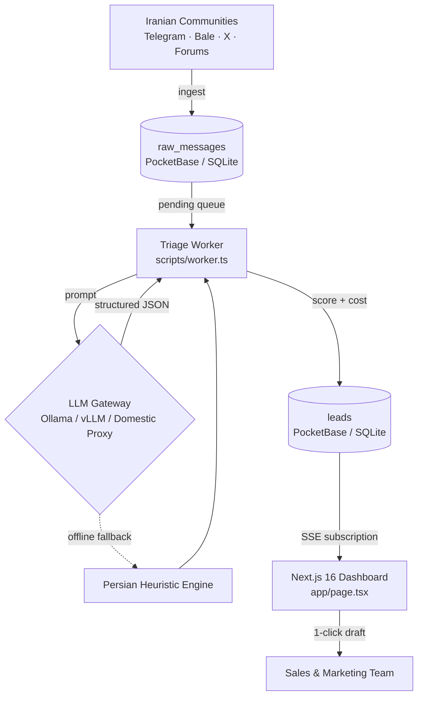

# Radar — AI Lead Radar

> **Local-first B2B buying-intent engine for teams operating in Iran.**
> Radar monitors Persian community platforms (Telegram, Bale, X/Twitter, forums), triages inbound messages in real time, separates genuine buying signals from noise, and drafts culturally appropriate Persian replies — with zero foreign-cloud dependency.

[](https://bun.sh)
[](https://nextjs.org)
[](https://react.dev)
[-b827fc.svg)](https://pocketbase.io)
[](https://tailwindcss.com)
[](LICENSE)
[](#1-zero-foreign-cloud-lock-in)

---

## Table of Contents

- [Overview](#overview)
- [Operational Constraints](#operational-constraints)
- [Key Features](#key-features)
- [System Architecture](#system-architecture)
- [Tech Stack](#tech-stack)
- [Data Model](#data-model)
- [Project Structure](#project-structure)
- [Quickstart](#quickstart)
- [Deployment](#deployment)
- [Environment Variables](#environment-variables)
- [API Reference](#api-reference)
- [Design System](#design-system)
- [License](#license)

---

## Overview

Radar is an autonomous sales-intent agent. It ingests community messages from Iranian business channels, evaluates each message against a configured product and Ideal Customer Profile (ICP), and produces a structured lead record containing:

- an **intent classification** and a **0–100 intent score**,
- a **natural-language rationale** explaining the classification,
- a **ready-to-send Persian reply draft**,
- an **itemized cost report** (input/output tokens, USD, and IRR/IRT estimate).

The entire pipeline — ingestion, triage, scoring, cost accounting, and the live dashboard — runs on a single machine or a domestic server. No external cloud service is required at any stage.

---

## Operational Constraints

### 1. Zero Foreign Cloud Lock-in

Sanctions and filtering make foreign SaaS unreliable in Iran. Radar therefore avoids Firebase, Supabase, Vercel KV, and third-party analytics entirely. The backend is a single self-hosted **PocketBase (SQLite)** binary running on localhost or a domestic server.

### 2. Vanilla TypeScript First

Heavy third-party utility packages (`clsx`, `tailwind-merge`, icon packs) are intentionally excluded. The class-merging helper (`lib/cn.ts`), the LLM client (`lib/llm.ts`), and the token-cost engine (`lib/pricing.ts`) are all hand-written.

### 3. Zero External CDNs

Every icon is an inline SVG component in `components/Icons.tsx`. Typography uses the self-hosted **Ravi** family shipped in `public/fonts/ravi/` (with fallback to Estedad) — no Google Fonts, no CDN requests.

### 4. Native Persian / RTL Support

The interface renders right-to-left (`lang="fa"`, `dir="rtl"`) with Persian numerals, and the triage engine is tuned for colloquial Iranian business language — for example, *"سامانه مودیان کلافه‌مون کرده"* or *"تسویه ریالی شتاب"*. Messages are classified into four tiers:

| Tier | Label | Meaning |
| --- | --- | --- |
| `high_intent` | High Intent | Explicit buying intent, budget, and timeline |
| `problem_aware` | Problem Aware | Feels the pain, has not decided to buy |
| `curious` | Curious | Exploratory interest, no urgency |
| `irrelevant` | Irrelevant | Off-topic chatter and noise |

### 5. Resilient LLM Gateway

The evaluator speaks the OpenAI-compatible REST standard, so it connects to a local **Ollama / vLLM** instance on an internal GPU server or to a domestic proxy gateway. When the model endpoint is unreachable, a **Persian heuristic fallback engine** keeps triage running during international connectivity outages.

---

## Key Features

- **Live dashboard over Server-Sent Events** — leads and KPIs update instantly via PocketBase subscriptions (`pb.collection("leads").subscribe("*")`), with no manual refresh.
- **Five KPI cards** — total monitored messages, noise-reduction percentage, qualified leads, total token spend in USD, and cost per lead with IRR/IRT estimate.
- **Simulate Live Feed** — a one-click demo injector that pushes realistic Persian community messages through the full triage pipeline; ideal for presentations.
- **One-click reply copy** — generates and copies a natural, tone-matched Persian response draft.
- **Lead lifecycle management** — move leads between `new`, `approved`, `contacted`, and `dismissed`.
- **Platform filtering and sorting** — filter the feed by Telegram, Bale, X/Twitter, or forums.
- **Product & ICP settings (`/settings`)** — manage value propositions, monitored keywords, and buyer persona at runtime.
- **Precise cost accounting** — per-message input/output tokens, configurable USD rates, and derived local-currency cost.

---

## System Architecture



---

## Tech Stack

| Layer | Technology |
| --- | --- |
| Runtime & package manager | Bun 1.4+ |
| Frontend framework | Next.js 16 (App Router, Turbopack) · React 19 |
| Language | TypeScript 5 (strict) |
| Styling | Tailwind CSS v4 + vanilla CSS (`app/globals.css`) |
| Database & realtime | PocketBase (embedded SQLite) + SSE subscriptions |
| AI inference | OpenAI-compatible endpoint (Ollama / vLLM) with offline heuristic fallback |
| Typography | Ravi (self-hosted TTF, RTL, full Persian typography, fallback to Estedad) |

---

## Data Model

| Collection | Purpose |
| --- | --- |
| `products` | Product identity, value propositions, monitored keywords, and ICP definition |
| `sources` | Monitored channels and groups (Telegram, Bale, X, forums) |
| `raw_messages` | Ingested messages with author handle, platform, thread context, and processing status |
| `leads` | Evaluation records: intent level, intent score, reasoning, suggested reply, token usage, estimated cost, and lead status |

---

## Project Structure

```text
radar/
├── package.json               # Scripts and Bun configuration
├── tsconfig.json              # Strict TypeScript configuration
├── next.config.ts             # Next.js 16 configuration
├── postcss.config.mjs         # Tailwind CSS v4 pipeline
├── LICENSE                    # MIT license
├── .env.example               # Environment variable template
├── app/
│   ├── globals.css            # Global styles, dark palette, self-hosted fonts
│   ├── layout.tsx             # Root layout (RTL, metadata)
│   ├── page.tsx               # Live dashboard and SSE lead feed
│   ├── settings/page.tsx      # Product, keyword, and ICP management
│   └── api/
│       ├── analyze/route.ts   # Single-message triage endpoint
│       └── simulate/route.ts  # Live demo message injector
├── components/
│   ├── Icons.tsx              # Inline SVG icons (no icon package)
│   ├── Navbar.tsx             # Navbar with DB health monitor and demo trigger
│   ├── MetricsHeader.tsx      # KPI cards and platform filters
│   └── LeadCard.tsx           # Lead card: score, tokens, reply draft
├── lib/
│   ├── cn.ts                  # Conditional class merger (vanilla TS)
│   ├── pocketbase.ts          # Typed PocketBase client and superuser auth
│   ├── llm.ts                 # LLM client and offline fallback evaluator
│   └── pricing.ts             # Token cost engine (USD + local currency)
├── pocketbase/
│   ├── pocketbase             # Local PocketBase binary (git-ignored)
│   └── setup_schema.ts        # Idempotent schema and seed bootstrap
├── public/fonts/ravi/         # Self-hosted Ravi font files (Thin to ExtraBold)
├── public/fonts/estedad/      # Self-hosted Estedad font files
└── scripts/
    ├── seed_demo.ts           # 26 realistic Persian community messages
    └── worker.ts              # Automated triage pipeline
```

---

## Quickstart

### 1. Prerequisites

- [Bun 1.4+](https://bun.sh)
- Linux, macOS, or Windows

### 2. Install dependencies

```bash
bun install
```

### 3. Configure environment

```bash
cp .env.example .env
```

Review the values in [Environment Variables](#environment-variables).

### 4. Download the PocketBase binary

The server binary is git-ignored (`pocketbase/pocketbase`), so it is not
included in a fresh clone. Download the matching OS/arch build from the
[PocketBase releases](https://github.com/pocketbase/pocketbase/releases)
and place it at `pocketbase/pocketbase`. Example for macOS (arm64):

```bash
cd pocketbase
curl -L -o pb.zip https://github.com/pocketbase/pocketbase/releases/download/v0.40.4/pocketbase_0.40.4_darwin_arm64.zip
unzip -o pb.zip pocketbase
chmod +x pocketbase
rm pb.zip
cd ..
```

Pick the `linux_amd64`, `darwin_arm64`, or `windows_amd64` zip that matches
your machine. Any recent v0.2x+ server works with the `pocketbase` JS client.

### 5. Start PocketBase

```bash
bun run pb
# equivalent to:
# ./pocketbase/pocketbase serve --http=127.0.0.1:8090
```

The PocketBase admin dashboard is available at `http://127.0.0.1:8090/_/`.

### 6. Create the superuser, then the schema

`bun run setup:pb` authenticates with the superuser from your `.env`, so the
superuser must exist first. In a second terminal (PocketBase still running):

```bash
# Values must match POCKETBASE_ADMIN_EMAIL / POCKETBASE_ADMIN_PASSWORD in .env
./pocketbase/pocketbase superuser upsert "admin@leadradar.local" "your-secure-password-min-16-chars"

bun run setup:pb
```

This creates `products`, `sources`, `raw_messages`, and `leads` with all relations and fields, plus a demo product record.

### 7. Seed demo data (optional)

Loads 26 realistic Persian community messages — 5 high-intent, 5 problem-aware, and 16 noise:

```bash
bun run seed
```

### 8. Run the triage pipeline

```bash
bun run worker
```

### 9. Start the dashboard

```bash
bun dev
```

Open `http://localhost:3000`.

### Available Scripts

| Command | Description |
| --- | --- |
| `bun dev` | Start the Next.js development server |
| `bun run build` | Production build |
| `bun run start` | Serve the production build |
| `bun run pb` | Start the local PocketBase server |
| `bun run setup:pb` | Create/verify the PocketBase schema |
| `bun run seed` | Insert 26 demo community messages |
| `bun run worker` | Triage all pending messages and create leads |

---

## Deployment

### Architecture on the server

```text
Internet → Caddy (TLS, ports 80/443)
  ├─ https://radar.example.com    → Next.js 127.0.0.1:3000 (dashboard + API)
  └─ https://pb.example.com       → PocketBase 127.0.0.1:8090 (SQLite in pb_data/)
systemd timer every 3 min → bun run scripts/worker.ts (one-shot triage, then exits)
Optional: Ollama / vLLM / domestic gateway (without one, the Persian heuristic fallback keeps triage running)
```

Only 80/443 are exposed. Ports 3000/8090 stay on localhost.

### One-command deploy (Debian-based servers)

On the server, as a user with sudo:

```bash
git clone <repo-url> /opt/radar && cd /opt/radar
sudo bash DEPLOY.sh --domain radar.example.com
```

This single command does everything below: installs Bun, Caddy, and the
PocketBase `linux_amd64` binary; creates `.env` (generating secrets it isn't
given); creates the superuser and schema; patches the CSP for your domains;
builds the app; installs and starts `systemd` units (`radar-pb`,
`radar-web`, `radar-worker.timer`); writes the Caddy vhosts; and runs health
checks.

```bash
sudo bash DEPLOY.sh --help   # full option list
sudo bash DEPLOY.sh \
  --domain radar.example.com \
  --pb-domain pb.example.com \
  --email admin@example.com \
  --worker-interval 5min
```

Secrets (`--admin-password`, `--radar-password`, `--api-key`, `--llm-key`)
can be passed as flags or entered at hidden prompts; anything omitted is
generated with `openssl rand` and printed once at the end. The script is
idempotent — re-running it updates config and rebuilds rather than
duplicating anything.

### What DEPLOY.sh does, step by step

1. Installs system deps (`curl`, `unzip`, `openssl`), Bun to `/opt/bun`
   (symlinked as `/usr/local/bin/bun`), and Caddy from its official apt repo.
2. Downloads the pinned PocketBase `linux_amd64` binary into `pocketbase/`
   (git-ignored, same as local dev).
3. Creates `pocketbase/` superuser (`superuser upsert`, idempotent), then
   `bun run setup:pb`. Never runs `seed` in production.
4. Patches `connect-src` in `next.config.ts` with your domains (idempotent —
   skipped if already present), then `bun run build`.
5. Installs/enables `radar-pb.service`, `radar-web.service`, and
   `radar-worker.{service,timer}`, all running as the unprivileged `radar`
   user, and (re)starts them.
6. Writes a marked `# BEGIN RADAR` block into `/etc/caddy/Caddyfile`,
   reloads Caddy (automatic TLS certificates), and polls the public URLs.

### Manual deployment (without the script)

```bash
bun install
./pocketbase/pocketbase superuser upsert "$POCKETBASE_ADMIN_EMAIL" "$POCKETBASE_ADMIN_PASSWORD"
bun run setup:pb
bun run build
bun run start            # port 3000
./pocketbase/pocketbase serve --http=127.0.0.1:8090
# every few minutes via cron/systemd timer:
bun run scripts/worker.ts
```

### Production checklist

- `NEXT_PUBLIC_POCKETBASE_URL` must be the **public** PB origin — the
  browser connects to PocketBase directly for the live SSE feed
  (`lib/pocketbase.ts`). Localhost values only work for local dev.
- `next.config.ts` `connect-src` must list that PB origin (plus `wss:`).
  `DEPLOY.sh` patches this; manual deploys must do it by hand **before**
  building, since `NEXT_PUBLIC_*` values are baked in at build time — always
  build on the server after the production `.env` is final.
- Set `RADAR_ADMIN_PASSWORD`. Unset, `/login` falls back to the PocketBase
  admin password and then to `"BuildX"` (`lib/auth.ts`).
- Login cookies are `Secure` in production, so HTTPS is mandatory —
  `/login` won't hold a session over plain HTTP.
- The assistant chat endpoint (`app/api/assistant/route.ts`) defaults to
  `https://openrouter.ai/api/v1` and has no heuristic fallback (unlike
  triage). Point `LLM_BASE_URL` at a domestic gateway for that endpoint, or
  expect it to fail under filtering.
- Back up `pb_data/` nightly — it is the entire database. PocketBase also
  has built-in backup to S3-compatible storage under Settings > Backups.
- Firewall: allow 80/443 only; keep 3000/8090 on loopback.

---

## Environment Variables

| Variable | Default | Description |
| --- | --- | --- |
| `POCKETBASE_URL` | `http://127.0.0.1:8090` | Server-side PocketBase address |
| `NEXT_PUBLIC_POCKETBASE_URL` | `http://127.0.0.1:8090` | Browser-facing PocketBase address |
| `POCKETBASE_ADMIN_EMAIL` | `admin@leadradar.local` | Superuser email for schema setup |
| `POCKETBASE_ADMIN_PASSWORD` | — | Superuser password (**change in production**) |
| `RADAR_ADMIN_PASSWORD` | falls back to `POCKETBASE_ADMIN_PASSWORD`, then `"BuildX"` | Dashboard `/login` password (**always set in production**) |
| `RADAR_API_KEY` | — | Programmatic API key for worker / ingestion webhooks |
| `LLM_BASE_URL` | `http://localhost:11434/v1` | OpenAI-compatible endpoint (Ollama / vLLM / domestic gateway) |
| `LLM_API_KEY` | `dummy` | API key, if the endpoint requires one |
| `LLM_MODEL` | `llama3.1` | Model identifier used for triage |
| `INPUT_TOKEN_COST_PER_MILLION` | `0.15` | USD per 1M input tokens |
| `OUTPUT_TOKEN_COST_PER_MILLION` | `0.60` | USD per 1M output tokens |

---

## API Reference

### `POST /api/analyze`

Triages a single message — either an existing `raw_messages` record by ID or ad-hoc text.

```bash
curl -X POST http://localhost:3000/api/analyze \
  -H "Content-Type: application/json" \
  -d '{
    "content": "سلام، دنبال یه نرم‌افزار حسابداری ابری خوب برای شرکتمون هستیم که سامانه مودیان رو پشتیبانی کنه. چی پیشنهاد می‌دید؟",
    "author_handle": "@iran_founder",
    "platform": "telegram"
  }'
```

**Request body**

| Field | Type | Notes |
| --- | --- | --- |
| `raw_message_id` | `string` | Triage an already-ingested message (alternative to `content`) |
| `content` | `string` | Message text to evaluate |
| `author_handle` | `string` | Optional, defaults to `@guest_user` |
| `thread_context` | `string` | Optional surrounding conversation |
| `platform` | `string` | Optional: `telegram`, `bale`, `twitter_x`, `forum` |
| `product_id` | `string` | Optional; defaults to the first configured product |

**Response** — `200 OK`

```json
{
  "success": true,
  "evaluation": {
    "intent_level": "high_intent",
    "intent_score": 92,
    "reasoning": "…",
    "suggested_reply": "…",
    "input_tokens": 812,
    "output_tokens": 194,
    "estimated_cost_usd": 0.00024
  }
}
```

### `POST /api/simulate`

Injects a realistic community message into the feed and triages it immediately. Pass an optional `index` to select a specific demo message; otherwise one is chosen at random.

```bash
curl -X POST http://localhost:3000/api/simulate \
  -H "Content-Type: application/json" \
  -d '{}'
```

---

## Design System

The UI follows a high-contrast, Vercel-inspired dark aesthetic:

- **Backgrounds** — `#000000` page, `#0a0a0a` cards
- **Borders** — solid `#1f1f1f`, hover `#333333` (dotted/dashed borders are prohibited)
- **Accent** — `#00e599` emerald
- **Motion** — Apple/Vercel easing `cubic-bezier(0.16, 1, 0.3, 1)`, card elevation on hover (`translateY(-1.5px)`), tactile press states (`active:scale-95`)
- **Radar emblem** — a continuous 360° sweep animation (`.radar-needle`, `@keyframes radarSweep`) on the logo in `components/Icons.tsx`
- **Layout** — sticky specification sidebar on `/settings`, pointer-cursor interaction on all cards, tiles, and filter pills

---

## License

Released under the [MIT License](LICENSE).
