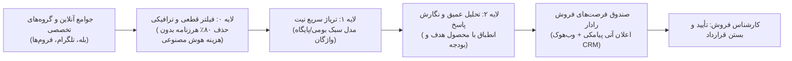
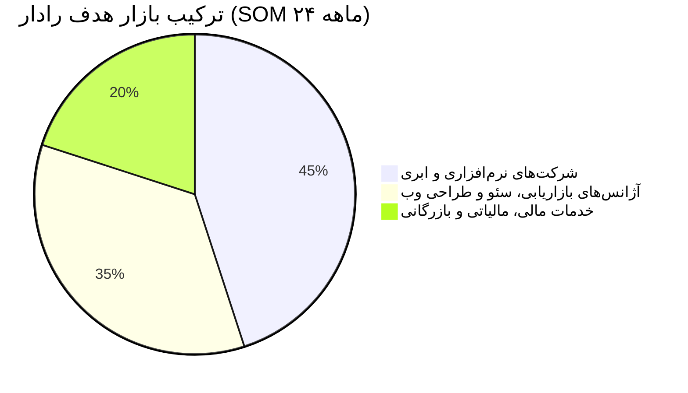

# طرح کسب‌وکار جامع، مدل اقتصادی سازمانی و پرونده جذب سرمایه
## سامانه هوش مصنوعی رادار (Radar AI) — PriCoders
**نسخه:** ۳.۰ (نسخه نهایی سرمایه‌گذار — پاییز ۱۴۰۵ / اواخر ۲۰۲۶)  
**دسته‌بندی:** B2B Sales Opportunity Intelligence & Inbound Revenue Accelerator  
**مخاطب سند:** سرمایه‌گذاران نهادی (VCs)، فرشتگان سرمایه‌گذار (Angel Investors) و هیئت‌مدیره

---

## ۱. خلاصه اجرایی و فلسفه بنیادین (Executive Summary)

**رادار (Radar)** یک پلتفرم نسل جدید «هوشمندی فرصت فروش» (Opportunity Intelligence Engine) است که شکاف عمیق میان گفت‌وگوهای روزمره در جوامع آنلاین و نهایی‌سازی معاملات فروش سازمانی (B2B) را برطرف می‌کند.

### واقعیت بی‌رحم بازار ایران و بازارهای نوظهور:
در فضای تجاری ایران، رویکردهای سنتی بازاریابی درون‌گرا (Inbound) و برون‌گرا (Outbound) با بحران جدی روبه‌رو هستند:
1. **ایمیل مارکتینگ** نرخ باز شدن زیر ۳٪ دارد و تقریباً در معاملات B2B فلج است.
2. **لینکدین** به دلیل فیلترینگ گسترده و کندی چرخه تصمیم‌گیری، هزینه‌های جذب سرنخ را غیرقابل توجیه کرده است.
3. **نبض حیاتی بازار در پیام‌رسان‌ها می‌زند:** بیش از ۷۰ تا ۸۰ درصد تقاضاهای بی‌درنگ خرید، برون‌سپاری پروژه‌ها و نیازهای نرم‌افزاری و خدماتی در **سوپرگروه‌های تلگرام، کانال‌ها و پیام‌رسان بله و انجمن‌های تخصصی** مطرح می‌شوند.

اما این فضا مانند اقیانوسی از نویز است؛ روزانه صدها هزار پیام در این جوامع رد و بدل می‌شود. تیم‌های فروش برای یافتن معدود مشتریانی که آماده پرداخت وجه هستند، یا باید ساعت‌ها وقت کارشناسان گران‌قیمت خود را تلف کنند، یا با استخدام نیروهای جزء (SDR) با هزینه‌های گزاف ماهانه (۲۵ تا ۴۵ میلیون تومان) خروجی بسیار پایینی دریافت نمایند.

**رادار این چالش را با یک خط پردازش هوشمند ۳ لایه حل کرده است:**  
پایش شبانه‌روزی، پالایش قطعی نویزها، اندازه‌گیری نیت خرید (Intent Score از ۰ تا ۱۰۰)، تطبیق هوشمند با پرسونای محصول هدف، و نگارش یک پیش‌نویس آغاز مذاکره حرفه‌ای در **کمتر از ۳ ثانیه**؛ در حالی که انسان همواره تصمیم‌گیرنده نهایی باقی می‌ماند.



### شاخص‌های کلیدی اقتصاد کسب‌وکار در یک نگاه:

| شاخص مالی / عملیاتی | مقدار | مرجع و استناد |
| :--- | :--- | :--- |
| **پلن استارتر (Starter)** | **۱,۸۹۰,۰۰۰ تومان / ماه** (سالانه: ۱,۴۹۰,۰۰۰ تومان) | متناسب با بودجه تنخواه‌گردان مدیران فروش |
| **پلن رشد (Growth)** | **۴,۸۹۰,۰۰۰ تومان / ماه** (سالانه: ۳,۹۰۰,۰۰۰ تومان) | تیم‌های در حال مقیاس با اتصال به CRM و اعلان تیمی |
| **پلن سازمانی / آژانس (Agency)** | **۱۲,۹۰۰,۰۰۰ تومان / ماه** (سفارشی) | آژانس‌های مارکتینگ و هلدینگ‌های چندمحصولی |
| **بهای تمام‌شده واقعی هر مشتری (COGS)** | **حدود ۳۹۰,۰۰۰ تا ۶۵۰,۰۰۰ تومان** | شامل توکن، پراکسی، سرور، پیامک، درگاه و مالیات |
| **حاشیه سود ناخالص هدف (Gross Margin)** | **۷۲٪ تا ۷۸٪** در مقیاس ۱۰۰ مشتری | با احتساب تمام هزینه‌های پنهان ایران |
| **نرخ بازگشت سرمایه برای مشتری (ROI)** | **حداقل ۱۲ تا ۲۰ برابر** | در مقایسه با استخدام SDR یا از دست رفتن ۱ قرارداد |

---

## ۲. پرسونای تفصیلی مشتریان هدف (Customer Personas)

رادار برای افراد کنجکاو یا کاربران عادی طراحی نشده است؛ مشتری رادار کسب‌وکارهایی هستند که **ارزش هر قرارداد آن‌ها (Deal Size) بین ۱۵ تا ۲۰۰ میلیون تومان** است و بستن حتی یک معامله اضافی در ماه، هزینه سالانه رادار را پوشش می‌دهد.

---

### پرسونای ۱: «مهندس راد» — مدیرعامل / بنیان‌گذار شرکت نرم‌افزاری B2B SaaS
* **مشخصات دموگرافیک:** ۳۴ ساله، تهران، شرکت فناوری با ۱۵ تا ۳۵ نفر پرسنل.
* **محصول شرکت:** نرم‌افزار حسابداری ابری متصل به سامانه مودیان، سیستم انبارداری یا ERP ابری.
* **درد اصلی (Pain Points):** 
  * سرنخ‌های ورودی سایت (Inbound Leads) گران هستند و ورودی تبلیغات کلیکی به دلیل رقابت کور به ازای هر کلیک بالای ۵۰ هزار تومان هزینه دارد.
  * مدیران مالی و حسابداران روزانه در ده‌ها سوپرگروه تلگرامی از خطاهای سامانه مودیان و کندی نرم‌افزارهای سنتی گلایه می‌کنند و می‌پرسند: *«چه برنامه‌ای پیشنهاد می‌کنید؟»* اما کسی در تیم شرکت این پیام‌ها را به موقع نمی‌بیند.
  * وقتی متوجه پیام می‌شوند، ۴ ساعت گذشته و رقیب دیگری وارد مکالمه شده است.
* **ارزش رادار برای او:** دریافت پیامک آنی روی گوشی مدیر فروش در کمتر از ۵ دقیقه از ارسال پیام خریدار در گروه؛ ارسال پاسخی مستدل و فنی؛ بستن ماهانه ۳ تا ۵ اشتراک سالانه نرم‌افزار (ارزش هر مشتری: ۲۰ میلیون تومان).

---

### پرسونای ۲: «خانم کیانی» — مدیر آژانس دیجیتال مارکتینگ و توسعه وب
* **مشخصات دموگرافیک:** ۳۸ ساله، کارفرما و مدیر آژانس با ۱۲ نفر تیم تولید محتوا، سئو و طراحی سایت.
* **درد اصلی (Pain Points):**
  * جذب پروژه سئو و طراحی فروشگاه نیازمند تماس‌های سرد فرساینده با صاحبان کسب‌وکار است.
  * گروه‌های اکوسیستم تجارت الکترونیک، وردپرس، لاراول و فروشگاه‌های اینترنتی پر از کارفرمایانی هستند که می‌نویسند: *«نیاز به بازطراحی سایت با لاراول داریم، بودجه ۶۰ میلیون»* یا *«سایت ما افت رتبه شدید داشته، سئوکار حرفه‌ای پیام بده»*.
  * حجم پیام‌های اسپم و نامربوط در این گروه‌ها آن‌قدر بالاست که اعضای آژانس فرصت چک کردن دستی ندارند.
* **ارزش رادار برای او:** ثبت همزمان ۳ کلمه کلیدی تخصصی در رادار، فیلتر هرزنامه‌ها، دریافت پیشنهاد پاسخ شخصی‌سازی‌شده متناسب با رزومه آژانس، و تبدیل مستقیم گفت‌وگوهای گروهی به قرارداد پروژه‌ای.

---

### پرسونای ۳: «آقای دکتر صبوری» — مدیر شرکت بازرگانی، ترخیص کالا و مشاوره مالیاتی
* **مشخصات دموگرافیک:** ۴۵ ساله، شرکت باسابقه خدمات مالیاتی، ترخیص گمرکی و ثبت برند.
* **درد اصلی (Pain Points):**
  * مشتریان خدمات حقوقی و مالیاتی معمولاً در لحظه‌ای که دچار بحران، جریمه مالیاتی یا توقف بار در گمرک می‌شوند در گروه‌های بازرگانی و صنفی تقاضای راهکار فوری می‌کنند.
  * روش‌های تبلیغاتی مرسوم برای جذب پرونده‌های سنگین مالیاتی کارایی پایینی دارد؛ مشتری فقط به پاسخی اعتماد می‌کند که بلافاصله تخصص و حل مسئله را نشان دهد.
* **ارزش رادار برای او:** رصد ۲۴ ساعته کلیدواژه‌های بحرانی مالیاتی؛ شناسایی شرکت‌هایی که درگیر پرونده‌های سنگین هستند؛ پاسخ‌دهی کارشناس حقوقی در دقایق نخست و عقد قراردادهای وکالت مالیاتی به ارزش‌های چند ده‌میلیونی.

---

## ۳. ماتریس کالبدشکافی رقبا و جایگزین‌ها (Competitive Landscape)

چرا بازارهای فعلی کارایی ندارند و خندق دفاعی رادار کجاست؟

```
+----------------------------------------------------------------------------------------------------------------------------+
| شاخص مقایسه        | سامانه‌های پایش سازمانی | ربات‌های تلگرامی کلیدواژه‌ای | استخدام نیروی انسانی (SDR) | سامانه هوش مصنوعی رادار (Radar) |
|                    | (زلکا، لایف‌وب، ترندا) | (Telegram Keyword Bots)      |                           |                               |
+----------------------------------------------------------------------------------------------------------------------------+
| هدف بنیادین         | روابط عمومی (PR) و بحران | سرچ ساده متن بدون هوش        | خواندن دستی پیام‌ها        | کشف نیت خرید و بستن معامله B2B |
| فهم نیت و بودجه    | خیر (فقط تحلیل احساسات)| خیر (هر پیام حاوی کلمه را میده)| بله (اما با خستگی و سلیقه)| بله (تفکیک بودجه، نیت و فوریت)|
| نگارش پیش‌نویس پاسخ | ندارد                 | ندارد                        | دستی و کند                | بله (تولید پاسخ متناسب در ۳ ثانیه)|
| پشتیبانی پیام‌رسان‌ها| معمولاً کانال‌های عمومی | فقط تلگرام                    | تلگرام، بله، واتساپ       | تلگرام، بله، فروم‌ها، وب‌هوک |
| قیمت‌گذاری         | سالانه ۱۵۰ تا ۵۰۰ میلیون | رایگان یا ماهانه ۳۰۰ هزار     | حقوق ماهانه ۳۰ تا ۴۵ م.    | ۱.۸۹ تا ۴.۸۹ میلیون تومان/ماه |
| سرعت به لید (Speed)| ساعت‌ها بعد با تأخیر  | آنی اما پر از اسپم           | ۱۰ دقیقه تا چند ساعت       | زیر ۳ ثانیه پردازش و هشدار پیامکی|
+----------------------------------------------------------------------------------------------------------------------------+
```

### خندق دفاعی استراتژیک رادار (Strategic Moats):
1. **تمرکز محض بر سیگنال درآمدی (Revenue Intent) نه تحلیل احساسات روابط عمومی:** ابزارهای موجود مثل زلکا برای برندهای بزرگی مثل دیجی‌کالا یا اسنپ ساخته شده‌اند تا بفهمند مردم درباره‌شان چه می‌گویند. رادار برای فروشنده متوسط و سازمانی ساخته شده تا بفهمد **چه کسی در حال حاضر پول به دست دارد و می‌خواهد خرید کند**.
2. **پشتیبانی بومی از بله (Bale Messenger):** پلتفرمی که بانک‌ها، ادارات دولتی و شرکت‌های رسمی در آن فعالند اما هیچ ابزار خارجی یا ربات‌های تلگرامی به آن دسترسی ندارند.
3. **مکانیزم دفاعی تزریق پرامپت (Prompt Injection Guard):** تضمین امنیت سامانه در برابر خرابکاری و دستورات مخفی در پیام‌های گروه‌ها.
4. **حلقه بسته بازخورد و تبدیل (Human-in-the-Loop Feedback Loop):** ثبت بازخورد کارشناس فروش روی لیدها که دقت مدل را در هر ماه بدون نیاز به بازآموزی سنگین افزایش می‌دهد.

---

## ۴. مهندسی بهای تمام‌شده و اقتصاد مقیاس (Comprehensive Cost Model)

برخلاف محاسبات سطحی که فقط هزینه توکن خام هوش مصنوعی را در نظر می‌گیرند، در شرایط واقعی زیرساخت و اقتصاد ایران هزینه‌ها به لایه‌های متعددی تقسیم می‌شوند:

### الف. تفکیک کامل لایه‌های هزینه واقعی یک مشترک در ایران:

1. **هزینه استنتاج هوش مصنوعی (LLM Token Inference):**
   * معماری بهینه‌شده سه‌لایه:
     * لایه ۰: فیلتر Regex و طول متن روی ۸۰٪ پیام‌ها (رایگان).
     * لایه ۱: تریاژ سبک با مدل سریع روی ۲۰٪ پیام‌های باقیمانده (~۲,۰۰۰ پیام) = هر پیام ۲۵۰ توکن ورودی و ۲۰ توکن خروجی = $۰.۰۷ دلار.
     * لایه ۲: تحلیل عمیق و پاسخ‌نویسی روی ۵٪ پیام‌های واجد شرایط (~۵۰۰ پیام) = هر پیام ۱,۱۰۰ توکن ورودی و ۱۸۰ توکن خروجی = $۰.۰۹ دلار.
   * کل هزینه LLM به‌ازای ۱۰,۰۰۰ پیام: **حدود $۰.۱۶ تا $۰.۲۴ دلار (~۴۲,۰۰۰ تا ۶۳,۰۰۰ تومان)**.
2. **هزینه پراکسی و شبکه انتقال داده (Residential & Datacenter Proxies):**
   * برای جلوگیری از مسدودسازی سشن‌ها و اتصال پایدار به APIها و پایش، نیاز به آی‌پی‌های پایدار و ترافیک اختصاصی است: **ماهانه حدود $۰.۴۰ تا $۰.۸۰ دلار (~۱۰۰,۰۰۰ تا ۲۰۰,۰۰۰ تومان) سرشکن روی هر مشتری**.
3. **هزینه پنل پیامک هشدار آنی (Transactional SMS Gateway):**
   * ارسال پیامک لحظه‌ای به مدیر فروش هنگام ثبت لید با نیت خرید بالا: به ازای ۵۰ تا ۱۰۰ پیامک هشدار در ماه (کاوه نگار / قاصدک به نرخ ۲۵۰ تومان) = **۱۵,۰۰۰ تا ۲۵,۰۰۰ تومان**.
4. **سهم سرور، دیتابیس PocketBase/Postgres و فضای پشتیبان ابری:**
   * سرور Hetzner CX23 / ابر آروان سرشکن روی ۱۰۰ مشتری = **حدود $۰.۳۵ دلار (~۹۵,۰۰۰ تومان)**.
5. **کارمزد شبکه پرداخت و درگاه (Payment Gateway & Shaparak Fees):**
   * ۰.۵٪ کارمزد زرین‌پال + کارمزد شاپرک = روی پلن استارتر ۱,۸۹۰,۰۰۰ تومانی = **حدود ۹,۵۰۰ تومان**.
6. **مالیات بر ارزش افزوده و تکالیف قانونی (VAT Buffer):**
   * در لایحه بودجه ۱۴۰۵ نرخ مالیات بر ارزش افزوده ۱۲٪ تعیین شده است. شرکت‌های B2B باید مابه‌التفاوت مالیاتی و هزینه انطباق با سامانه مودیان را در حاشیه ناخالص خود ذخیره کنند.
7. **پشتیبانی عملیاتی و پاسخگویی فنی (DevOps & Customer Care):**
   * سرشکن حقوق تیم پشتیبانی و نگهداری بر مشتریان فعال: **حدود ۸۰,۰۰۰ تومان**.

---

### ب. جدول اقتصاد واحد و حاشیه سود هر پلن (Unit Economics):

| مؤلفه هزینه / درآمد | پلن استارتر (Starter) | پلن رشد (Growth) | پلن سازمانی (Agency) |
| :--- | :--- | :--- | :--- |
| **تعرفه فروش ماهانه** | **۱,۸۹۰,۰۰۰ تومان** ($۷.۱۳) | **۴,۸۹۰,۰۰۰ تومان** ($۱۸.۴۵) | **۱۲,۹۰۰,۰۰۰ تومان** ($۴۸.۶۷) |
| **تعرفه با تخفیف سالانه (ماهانه)** | **۱,۴۹۰,۰۰۰ تومان** ($۵.۶۲) | **۳,۹۰۰,۰۰۰ تومان** ($۱۴.۷۱) | **۹,۹۰۰,۰۰۰ تومان** ($۳۷.۳۵) |
| **سقف پیام‌های تحلیلی** | ۱۰,۰۰۰ پیام ماهانه | ۳۵,۰۰۰ پیام ماهانه | ۱۰۰,۰۰۰+ پیام ماهانه |
| **هزینه توکن هوش مصنوعی** | ۵۵,۰۰۰ تومان ($۰.۲۱) | ۱۶۰,۰۰۰ تومان ($۰.۶۰) | ۴۵۰,۰۰۰ تومان ($۱.۷۰) |
| **پراکسی و ارتباطات شبکه** | ۱۲۰,۰۰۰ تومان ($۰.۴۵) | ۲۵۰,۰۰۰ تومان ($۰.۹۴) | ۵۵۰,۰۰۰ تومان ($۲.۰۷) |
| **هزینه پیامک هشدارهای آنی** | ۲۰,۰۰۰ تومان ($۰.۰۷) | ۶۰,۰۰۰ تومان ($۰.۲۲) | ۱۵۰,۰۰۰ تومان ($۰.۵۶) |
| **سهم سرور و پایگاه‌داده** | ۹۵,۰۰۰ تومان ($۰.۳۶) | ۱۸۰,۰۰۰ تومان ($۰.۶۸) | ۴۰۰,۰۰۰ تومان ($۱.۵۰) |
| **کارمزد درگاه و عملیات مالی** | ۱۰,۰۰۰ تومان | ۲۵,۰۰۰ تومان | ۶۵,۰۰۰ تومان |
| **سهم پشتیبانی و نگهداری** | ۹۰,۰۰۰ تومان | ۱۵۰,۰۰۰ تومان | ۳۵۰,۰۰۰ تومان |
| **جمع کل بهای تمام‌شده (COGS)** | **۳۹۰,۰۰۰ تومان** ($۱.۴۷) | **۸۲۵,۰۰۰ تومان** ($۳.۱۱) | **۱,۹۶۵,۰۰۰ تومان** ($۷.۴۱) |
| **سود ناخالص ماهانه (Gross Profit)** | **۱,۵۰۰,۰۰۰ تومان** ($۵.۶۶) | **۴,۰۶۵,۰۰۰ تومان** ($۱۵.۳۴) | **۱۰,۹۳۵,۰۰۰ تومان** ($۴۱.۲۶) |
| **حاشیه سود ناخالص (Gross Margin)** | **۷۹.۳٪** | **۸۳.۱٪** | **۸۴.۷٪** |

> **نتیجه‌گیری مدیریتی:**  
> با اصلاح قیمت‌گذاری به ۱.۸۹ و ۴.۸۹ میلیون تومان، رادار نه تنها از منطقه خطر اقتصادی خارج می‌شود، بلکه حتی در صورت وقوع تکانه‌های شدید ارزی (جهش دلار تا ۴۰۰ یا ۵۰۰ هزار تومان)، حاشیه سود ناخالص آن **بالای ۶۵ درصد** باقی می‌ماند.

---

## ۵. استراتژی درآمدی و روان‌شناسی قیمت‌گذاری (Pricing Strategy)

```
+---------------------------------------------------------------------------------------------+
| پلن اشتراک        | تعرفه ماهانه      | مخاطب هدف                     | قابلیت‌های کلیدی           |
+---------------------------------------------------------------------------------------------+
| استارتر (Starter) | ۱,۸۹۰,۰۰۰ تومان   | تیم‌های فروش تک‌محصولی و نوپا   | پایش ۱۰,۰۰۰ پیام، ۱ محصول  |
|                   | (سالانه: ۱.۴۹ م) |                               | هشدار پیامکی، صندوق تریاژ  |
+---------------------------------------------------------------------------------------------+
| رشد (Growth)      | ۴,۸۹۰,۰۰۰ تومان   | شرکت‌های نرم‌افزاری و متوسط    | ۳۵,۰۰۰ پیام، ۳ محصول هدف   |
|                   | (سالانه: ۳.۹۰ م) |                               | وب‌هوک CRM، دسترسی ۳ کاربر |
+---------------------------------------------------------------------------------------------+
| آژانس (Agency)    | ۱۲,۹۰۰,۰۰۰ تومان  | آژانس‌های مارکتینگ و هلدینگ‌ها  | ۱۰۰,۰۰۰ پیام، نامحدود محصول|
|                   | (سالانه: ۹.۹۰ م) |                               | اتصال سفارشی، پشتیبانی ۲۴/۷|
+---------------------------------------------------------------------------------------------+
```

### چرا مشتری بدون تردید ۱.۸۹ میلیون تومان را پرداخت می‌کند؟
* حقوق یک نیروی کارشناس فروش جزء (SDR) در سال ۱۴۰۵ حداقل ۲۵ تا ۳۵ میلیون تومان است.
* خرید پنل‌های بدون بازده پیامکی یا تبلیغات بنری ماهانه ۱۰ تا ۳۰ میلیون تومان آب می‌خورد.
* رادار با هزینه ماهانه **کمتر از یک‌پانزدهم حقوق یک نیرو**، ۲۴ ساعته و بدون یک ثانیه خواب، تمامی گروه‌ها را غربال می‌کند و مشتری آماده خرید را روی سینی تحویل می‌دهد.
* ارزش بستن حتی **یک قرارداد کوچک** برای شرکت، تمام هزینه ۱ ساله رادار را بازمی‌گرداند (ROI > 1200%).

---

## ۶. تحلیل اندازه بازار (Market Sizing: TAM, SAM, SOM)

رویکرد برآورد از پایین به بالا (Bottom-Up) و واقع‌بینانه:



1. **کل بازار بالقوه (TAM):**  
   حدود ۱۲۰,۰۰۰ شرکت حقوقی ثبت‌شده و فعال در ایران با فعالیت‌های B2B و فروش خدمات/کالا به سایر سازمان‌ها.  
   ارزش سالانه با میانگین سبد ۳ میلیون تومان/ماه = **۴,۳۲۰ میلیارد تومان (~۱۶.۳ میلیون دلار)**.
2. **بازار در دسترس (SAM):**  
   ۲۸,۰۰۰ شرکت در حوزه‌های IT، نرم‌افزار، آژانس‌های بازاریابی دیجیتال، بازرگانی، تأمین تجهیزات و خدمات مالی که مشتریان آن‌ها در تلگرام و بله مکالمه دارند.  
   ارزش سالانه بازار = **۱,۰۰۸ میلیارد تومان (~۳.۸ میلیون دلار)**.
3. **سهم بازار هدف‌گذاری‌شده در فاز نخست (SOM - ۲۴ ماهه):**  
   هدف‌گذاری برای جذب ۱,۵۰۰ مشترک فعال سازمانی (سهم حدود ۵.۳٪ از بازار SAM).  
   درآمد سالانه مکرر هدف (ARR) = **۱,۵۰۰ مشترک × میانگین درآمد سالانه ۳۸ میلیون تومان = ۵۷ میلیارد تومان (~۲۱۵,۰۰۰ دلار درآمد سالانه)**.

---

## ۷. استراتژی ورود به بازار و رشد (GTM & Growth Loops)

1. **مدل ۱۰ شریک طراحی استراتژیک (Design Partners):**
   * استقرار اختصاصی رادار برای ۱۰ شرکت نرم‌افزاری و آژانس معتبر در ماه اول.
   * رصد دقیق نرخ تبدیل (پایش پیام → هشدار لید → مذاکره → انعقاد قرارداد).
   * استخراج ۵ مطالعه موردی (Case Study) واقعی و ویدیویی با تیترهایی نظیر: *«چگونه شرکت X با رادار ۳ قرارداد ۱۰۰ میلیونی از تلگرام بست»*.
2. **چرخه ارجاع آژانس‌ها (Agency Multiplier Loop):**
   * ارائه داشبورد چندکلاینتی برای آژانس‌های مارکتینگ؛ هر آژانس رادار را برای ۱۰ تا ۲۰ مشتری خود فعال می‌کند و ۲۵٪ پورسانت مستمر دریافت می‌نماید.
3. **رشد محصول‌محور در لندینگ (PLG Demo Simulator):**
   * تعبیه شبیه‌ساز زنده روی صفحه فرود رادار که کارفرما هر پیام واقعی از گروه کاری خود را در آن Paste کرده و در ۲ ثانیه استدلال هوش مصنوعی و متن مذاکره پیشنهادی را مشاهده می‌کند.

---

## ۸. پیش‌بینی‌های مالی ۳ ساله (3-Year Financial Forecast)

بر مبنای ترکیب واقع‌بینانه (۷۰٪ استارتر، ۲۵٪ رشد، ۵٪ آژانس / ARPU ماهانه = **۳,۱۸۰,۰۰۰ تومان**):

```
+---------------------------------------------------------------------------------------+
| شاخص‌های عملکرد مالی              | سال اول (۱۴۰۶)     | سال دوم (۱۴۰۷)    | سال سوم (۱۴۰۸)    |
+---------------------------------------------------------------------------------------+
| تعداد مشترکین فعال پایان دوره      | ۱۱۰ مشترک         | ۴۸۰ مشترک         | ۱,۴۰۰ مشترک       |
| درآمد مکرر ماهانه پایان سال (MRR)   | ۳۵۰ میلیون تومان   | ۱.۵۲ میلیارد تومان | ۴.۴۵ میلیارد تومان|
| درآمد ناخالص کل سال (Revenue)     | ۲.۱ میلیارد تومان  | ۱۰.۸ میلیارد تومان | ۳۷.۲ میلیارد تومان|
| کل بهای تمام‌شده سالانه (COGS)    | ۴۸۰ میلیون تومان   | ۲.۲ میلیارد تومان  | ۷.۱ میلیارد تومان |
| سود ناخالص سالانه (Gross Profit)  | ۱.۶۲ میلیارد تومان | ۸.۶ میلیارد تومان  | ۳۰.۱ میلیارد تومان|
| هزینه‌های عملیاتی و حقوق تیم (OPEX)| ۱.۱ میلیارد تومان  | ۳.۸ میلیارد تومان  | ۱۰.۵ میلیارد تومان|
| سود خالص عملیاتی سالانه (EBITDA)  | ۵۲۰ میلیون تومان   | ۴.۸ میلیارد تومان  | ۱۹.۶ میلیارد تومان|
| حاشیه سود خالص عملیاتی (Margin)   | ۲۴.۷٪              | ۴۴.۴٪              | ۵۲.۶٪             |
+---------------------------------------------------------------------------------------+
```

---

## ۹. ریسک‌های استراتژیک، حقوقی و راهکارهای مهار (Risk Mitigation)

| ردیف | شرح ریسک | سطح اثر | راهکار پیشگیرانه و مهار رادار |
| :-: | :--- | :-: | :--- |
| ۱ | **مقررات و شرایط استفاده تلگرام (ToS)** | بالا | استفاده از رویکرد «منابع مجاز مشتری»؛ رادار به صورت خودکار سرقت داده نمی‌کند، بلکه ربات با مجوز ادمین در گروه خود مشتری اد می‌شود. هیچ داده‌ای برای آموزش مدل استفاده نمی‌شود. |
| ۲ | **نوسانات شدید ارزی و تورم** | متوسط | بازنگری فصلی تعرفه‌ها بر اساس شاخص تورم؛ حاشیه ناخالص ۸۰٪ شوک‌های ارزی تا ۵۰٪ را کاملاً در خود جذب می‌کند. |
| ۳ | **اختلال اینترنت بین‌الملل و فیلترینگ** | بالا | سرورها و دیتابیس PocketBase به صورت مستقل روی زیرساخت داخلی (ابر آروان / ابر آراز) مقیم هستند و موتور Heuristic محلی در صورت قطع کامل اینترنت بین‌الملل با ضریب دقت بالا فعال است. |
| ۴ | **مسدودسازی شماره‌ها و سشن‌های کراولر** | متوسط | تقسیم بار بین اکانت‌های مجزا، استفاده از وب‌هوک‌های رسمی پیام‌رسان بله و تکیه بر ربات‌های رسمی سازمانی. |
| ۵ | **ریسک تزریق پرامپت (Prompt Injection)** | کم | کپسوله‌سازی کامل داده‌های غیرمطمئن در تگ‌های XML و خنثی‌سازی دستورات مخرب در لایه لود پیام. |

---

## ۱۰. طرح ارائه‌ی ۱۰ اسلایدی برای سرمایه‌گذار (Investor Pitch Deck Outline)

* **اسلاید ۱: نام، مأموریت و چشم‌انداز (Cover):** رادار — شتاب‌دهنده درآمد و پایش هوشمند فرصت‌های فروش B2B. «اولین شرکتی باشید که پاسخ می‌دهد.»
* **اسلاید ۲: مسئله حاد بازار (Problem):** ۸۰٪ معاملات در گروه‌های پیام‌رسان شکل می‌گیرد، اما ۹۸٪ پیام‌ها اسپم است و تیم‌های فروش به دلیل سرعت پایین معاملات را به رقبا می‌بازند.
* **اسلاید ۳: راه‌حل رادار (Solution):** غربالگری ۲۴ ساعته ۳ لایه، امتیازدهی نیت خرید و نگارش خودکار پیش‌نویس مذاکره در ۳ ثانیه.
* **اسلاید ۴: محصول و دمو (Live Product Demo):** نمایش داشبورد زنده، صندوق تریاژ، پیامک لحظه‌ای و تنظیمات شناسنامه محصول.
* **اسلاید ۵: اقتصاد واحد و مزیت قیمت (Unit Economics):** تعرفه ۱.۸۹ تا ۴.۸۹ میلیون تومان؛ حاشیه ناخالص ۷۹٪؛ سوددهی بالا از روز اول.
* **اسلاید ۶: اندازه بازار (Market Opportunity):** بازار ۳.۸ میلیون دلاری در دسترس (SAM) در ایران و امکان ورود سریع به بازارهای منطقه خاورمیانه و ترکیه.
* **اسلاید ۷: رقابت و خندق دفاعی (Competition & Moats):** تفاوت اساسی با ابزارهای پرهزینه روابط عمومی؛ پوشش انحصاری بله؛ سرعت فوق‌العاده؛ مدل بومی زبان فارسی.
* **اسلاید ۸: استراتژی ورود به بازار (GTM & Milestones):** شروع با ۱۰ شریک طراحی؛ اهرم آژانس‌های بازاریابی؛ سلف‌سرویس با دمو در صفحه اصلی.
* **اسلاید ۹: تیم مجری (Team PriCoders):** مهندسان مجرب توسعه نرم‌افزار، هوش مصنوعی کاربردی و زیرساخت مقیاس‌پذیر.
* **اسلاید ۱۰: درخواست سرمایه و محل تخصیص (The Ask):**  
  * **جذب سرمایه:** ۴.۵ میلیارد تومان در مرحله Seed (پیش‌بذر / شتاب‌دهی).
  * **تخصیص منابع:** ۵۰٪ بازاریابی B2B و جذب شرکا، ۳۰٪ توسعه فنی و کانکتورها، ۲۰٪ زیرساخت و نقدینگی عملیاتی (Runway ۱۸ ماهه).
  * **تعهد بازدهی:** دستیابی به ۳۵۰ مشترک فعال و MRR بالای ۱.۱ میلیارد تومان طی ۱۵ ماه.
