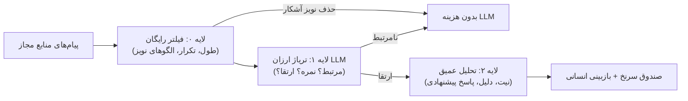

# طرح کسب‌وکار و پرونده سرمایه‌گذار — رادار (Radar)
### Opportunity Intelligence Engine — تیم PriCoders
**نسخه ۲.۰ • ۱۵ مهر ۱۴۰۵ (۷ اکتبر ۲۰۲۶)**
**جایگزین نسخه ۱.۰.** اعداد این نسخه از کد واقعی پروژه و منابع بیرونی استخراج شده و هر عدد برچسب منشأ دارد.

---

## راهنمای برچسب‌ها

| برچسب | معنا |
| :--- | :--- |
| **[منبع]** | از منبع بیرونی در تاریخ ۱۵ مهر ۱۴۰۵ بررسی شده (پیوست الف) |
| **[کد]** | از کد واقعی مخزن اندازه‌گیری یا استخراج شده |
| **[فرض]** | فرض مدل‌سازی ما؛ هنوز با داده واقعی تأیید نشده |
| **[اعتبارسنجی]** | ادعایی که پیش از ارائه به سرمایه‌گذار باید با آزمایش یا مصاحبه ثابت شود |

---

## ۰. اصلاحیه‌ها نسبت به نسخه ۱.۰

نسخه قبلی چند عدد را بدون پشتوانه معماری یا منبع نوشته بود. این موارد اصلاح شده‌اند:

| # | ادعای نسخه ۱.۰ | وضعیت واقعی | اثر |
| :-: | :--- | :--- | :--- |
| 1 | هزینه هوش مصنوعی ۱۰ هزار پیام = **$0.126** | با کد فعلی (یک‌مرحله‌ای، پرامپت کامل) حدود **$1.42 تا $2.13**. با معماری دومرحله‌ای (که هنوز ساخته نشده) **$0.30 تا $0.91** | هزینه LLM تا ۱۷ برابر بیشتر از عدد قبلی در کد فعلی |
| 2 | حاشیه سود ناخالص **۸۱٪** | **۲۵٪ تا ۶۳٪** در مقیاس ۱,۰۰۰ مشتری، بسته به مدل جمع‌آوری داده. زیر ۱۰۰ مشتری: **−۱۲٪ تا ۵۰٪** | ادعای ۸۱٪ حذف شد |
| 3 | سرور ≈ ۹۶,۵۰۰ تومان به‌ازای هر مشتری | هزینه سرور ثابت است و بین مشتریان تقسیم می‌شود: با ۱۰ مشتری ≈ $1.5، با ۱۰۰ مشتری ≈ $0.7 | مدل هزینه از «به‌ازای مشتری» به «ثابت ÷ تعداد مشتری» تغییر کرد |
| 4 | جمع‌آوری داده (کراولر، پراکسی، سشن) در COGS نبود | بزرگ‌ترین ریسک هزینه و حقوقی پروژه است | بخش ۴.۵ و ۱۰ |
| 5 | «۸۰٪ معاملات B2B در تلگرام و بله شکل می‌گیرد» | منبع ندارد | حذف شد؛ به مصاحبه‌های بخش ۱۱ سپرده شد |
| 6 | «MVP زنده در Production» | MVP با داده نمونه و پایش دستی/وب‌هوک است؛ جمع‌آوری خودکار پیام ساخته نشده و سامانه تک‌مستاجری است [کد] | بخش ۳ |
| 7 | اجاره GPU حدود $40 تا $65 در ماه | **اشتباه بود.** GEX44-1 هتزنر **€232.30 در ماه + €114 هزینه راه‌اندازی** [منبع] | بخش ۴.۹ |
| 8 | اندازه بازار ۱,۸۰۰ میلیارد تومان | شمارش شرکت‌ها بدون منبع است. به‌صورت فرضیه و با روش پایین‌به‌بالا بازنویسی شد | بخش ۶ |
| 9 | هزینه هر پیام «زیر ۱۰ تومان» (لندینگ و مستند فنی) | هزینه واقعی LLM بین **۸ تا ۵۶ تومان** است (۱۴ تومان در سناریوی پایه دومرحله‌ای) | بخش ۴.۳ و ۱۲ |

> **نتیجه:** اقتصاد رادار در حالت درست (منابع مجاز مشتری + معماری دومرحله‌ای) سالم و سودآور است. حاشیه سود بزرگ‌تر از چیزی نیست که نسخه ۱.۰ ادعا می‌کرد. این پروژه با قیمت‌های فعلی یک کسب‌وکار کوچک و سودده است، نه یک شرکت در مقیاس VC. مسیر رشد در بخش ۹ آمده است.

---

## ۱. خلاصه اجرایی

**رادار** پیام‌های جوامع آنلاین فارسی‌زبان (بله، تلگرام، فروم‌ها) را برای تیم‌های فروش B2B پایش می‌کند، پیام‌های بی‌ارزش را فیلتر می‌کند و برای هر پیام مرتبط نمره نیت خرید (۰ تا ۱۰۰)، دلیل انتخاب و پیش‌نویس پاسخ ارائه می‌دهد. انسان پاسخ را بازبینی و ارسال می‌کند. ارسال خودکار وجود ندارد و عمداً ساخته نمی‌شود.

### اعداد کلیدی (همه با برچسب منشأ)

| شاخص | مقدار | منشأ |
| :--- | :--- | :--- |
| نرخ دلار مبنا | **265,000 تومان** (بازار آزاد تهران، ۲۶۲ تا ۲۶۶ هزار در ۱۵ مهر ۱۴۰۵) | [منبع] |
| قیمت پلن استارتر | 690,000 تومان/ماه ≈ **$2.60** (سالانه 550,000 ≈ $2.08) | فرضیه قیمت |
| قیمت پلن رشد | 2,190,000 تومان/ماه ≈ **$8.26** (سالانه 1,750,000 ≈ $6.60) | فرضیه قیمت |
| هزینه LLM به‌ازای ۱۰ هزار پیام (دومرحله‌ای، پایه) | **$0.53** (۱۴۱,۰۰۰ تومان) | [فرض] روی تعرفه [منبع] |
| هزینه LLM همان حجم با کد فعلی (یک‌مرحله‌ای) | **$1.42 تا $2.13** | [کد] + [منبع] |
| حاشیه ناخالص، ۱۰۰ مشتری، منابع مجاز مشتری | **≈ ۵۰٪** | [فرض] |
| حاشیه ناخالص، ۱۰۰ مشتری، پایش عمومی توسط رادار | **≈ ۱۲٪** | [فرض] |
| نقطه سربه‌سر عملیاتی (با تیم ۳ نفره بسیار فشرده) | **≈ ۳۴۰ مشتری** (حالت مجاز مشتری) | [فرض] |

### سه تصمیم کلیدی که این سند به آن‌ها می‌رسد

1. **ورود با «منابع مجاز مشتری»** (ربات بله، ربات تلگرام در گروه خود مشتری، ورود دستی/فوروارد). پایش گسترده کانال‌های عمومی توسط رادار هم حاشیه سود را نابود می‌کند و هم ریسک حقوقی تلگرام دارد (بخش ۴.۵ و ۱۰).
2. **ساخت معماری سه‌لایه (فیلتر رایگان ← تریاژ ارزان ← تحلیل عمیق)** پیش از فروش انبوه. بدون آن هزینه LLM چند برابر می‌شود.
3. **قیمت فعلی را «فرضیه» بدانیم.** پیش‌بینی ما این است که ارزش مشتری چند برابر قیمت است و جا برای افزایش قیمت وجود دارد (بخش ۵). این فقط با آزمایش پایلوت ثابت می‌شود.

---

## ۲. مسئله

تیم‌های فروش، آژانس‌ها و شرکت‌های نرم‌افزاری ایرانی نیاز مشتری را اغلب در گروه‌ها و کانال‌های پیام‌رسان می‌بینند، مثل «کسی نرم‌افزار حسابداری متصل به سامانه مودیان سراغ داره؟». دو مشکل وجود دارد:

- **نویز زیاد:** بخش بسیار بزرگی از پیام‌ها سلام، خبر، تبلیغ و گپ است. نسبت دقیق باید اندازه‌گیری شود [اعتبارسنجی].
- **سرعت پاسخ:** در تحقیقات جهانی لید وب، تماس در ۵ دقیقه اول احتمال تبدیل را چندین برابر می‌کند (مقاله معروف HBR درباره عمر کوتاه لیدهای آنلاین). این آمار درباره فرم‌های وب است. اثر آن در گفت‌وگوی گروهی ایران باید اثبات شود [اعتبارسنجی].

**جایگزین‌های فعلی مشتری:** پایش دستی توسط کارشناس فروش، ربات‌های کلیدواژه‌ای تلگرام (بدون فهم نیت)، یا هیچ‌کاری. قیمت و کیفیت هر جایگزین در مصاحبه‌های بخش ۱۱ اندازه‌گیری می‌شود. عدد حقوق کارشناس فروش در نسخه قبلی هم فرض بود و تا تأیید با آگهی‌های استخدام واقعی [اعتبارسنجی] در ROI استفاده نمی‌شود.

---

## ۳. راه‌حل و وضعیت واقعی محصول

### ۳.۱ جریان محصول

### ۳.۲ جدول وضعیت پیاده‌سازی [کد]

| قابلیت | وضعیت | توضیح |
| :--- | :-: | :--- |
| امتیازدهی نیت ۴ سطحی با LLM (OpenAI-compatible) | ✅ ساخته‌شده | [lib/llm.ts](file:///run/media/parsa-naderi/Backup/Codes/Learning/WebPractices/Full-stack-base/Radar/lib/llm.ts) |
| استدلال، ویژگی منطبق و پیش‌نویس پاسخ | ✅ ساخته‌شده | خروجی JSON ساختاریافته |
| دفاع در برابر تزریق پرامپت (تگ XML، پاک‌سازی خروجی) | ✅ ساخته‌شده | در `buildPrompt` و `sanitizeSuggestedReply` |
| موتور جایگزین Regex فارسی (بدون هزینه) | ✅ ساخته‌شده | `heuristicPersianEvaluator`؛ هسته لایه ۰ آینده |
| صندوق سرنخ، وضعیت پیگیری، داشبورد | ✅ ساخته‌شده | PocketBase + Next.js |
| ثبت توکن و هزینه برای هر سرنخ | 🟡 ناقص | جدول قیمت مدل‌های Gemini/GPT ندارد؛ نرخ تبدیل تومان اشتباه است (بخش ۱۲) |
| جمع‌آوری خودکار پیام (بله/تلگرام) | ⛔ ساخته نشده | فقط `POST /api/analyze` و اسکریپت worker و داده نمونه |
| معماری دومرحله‌ای (فیلتر + تریاژ + عمیق) | ⛔ ساخته نشده | فقط پاس عمیق وجود دارد |
| چندمستاجری (Multi-tenant)، کاربران و صورت‌حساب | ⛔ ساخته نشده | تمام مسیرها «اولین رکورد محصول» را برمی‌دارند |
| اتصال CRM / وب‌هوک خروجی، چندکاربره، چندمحصولی | ⛔ نقشه راه | محتوای پلن رشد |

> برای سرمایه‌گذار: **ما فقط «موتور تحلیل و رابط» را اثبات کرده‌ایم. «داده ورودی»، «مقیاس‌پذیری» و «تجاری‌سازی» هنوز ساخته نشده‌اند.** سند فنی نقشه ساخت آن‌ها را دارد.

---

## ۴. مدل اقتصاد واحد (Unit Economics)

### ۴.۱ مفروضات پایه

| پارامتر | مقدار | منشأ |
| :--- | :--- | :--- |
| نرخ دلار | 265,000 تومان | [منبع] |
| مدل تریاژ و تحلیل (مرجع قیمت) | Gemini 2.5 Flash-Lite: **$0.10 ورودی / $0.40 خروجی** به‌ازای ۱ میلیون توکن | [منبع] |
| مدل جایگزین مرجع | GPT-4o mini: $0.15 / $0.60 | [منبع] |
| سرور ابری کوچک (CX23) | ≈ €5.49 تا €5.99 در ماه (≈ $6 تا $7) | [منبع] |
| سرور GPU اختصاصی (GEX44-1) | **€232.30 در ماه + €114 هزینه راه‌اندازی** | [منبع] |
| کارمزد درگاه پرداخت | 1.5٪ درآمد | [فرض] |
| ترکیب مشتریان سال اول | ۸۵٪ استارتر / ۱۵٪ رشد | [فرض] |
| ریزش ماهانه مشتری | ۸٪ | [فرض] |

> **هشدار دوام مدل:** گوگل مدل Gemini 2.5 Flash-Lite را «legacy» اعلام کرده و برای پروژه‌های جدید نسل‌های جدیدتر را پیشنهاد می‌کند [منبع]. قیمت نسل جدید ممکن است فرق کند. مدل مالی ما نباید به یک مدل خاص وابسته شود. جدول قیمت مدل باید قابل پیکربندی باشد (بخش ۱۲ سند فنی).

> **هشدار دسترسی:** API رسمی OpenAI و Gemini برای ایران در دسترس نیست و پرداخت به آن‌ها با تحریم‌ها محدود است [منبع]. تعرفه‌های بالا «قیمت کاتالوگ» است. مسیر قانونی و پایدار دسترسی (ارائه‌دهنده داخلی، مدل متن‌باز میزبانی‌شده، یا شرکت خارج از ایران) باید پیش از تجاری‌سازی روشن شود (بخش ۴.۹ و ۱۰).

### ۴.۲ مصرف توکن واقعی در کد [کد]

اندازه‌گیری از [lib/llm.ts](file:///run/media/parsa-naderi/Backup/Codes/Learning/WebPractices/Full-stack-base/Radar/lib/llm.ts):

- قالب پرامپت سیستم: **3,095 کاراکتر**
- قالب پرامپت کاربر: **388 کاراکتر**
- به این‌ها اطلاعات محصول (نام، توضیح، ICP، کلیدواژه‌ها) و متن پیام اضافه می‌شود.
- مجموع ≈ **4,200 کاراکتر** که با مخلوط انگلیسی و فارسی (حدود 3.6 کاراکتر به‌ازای هر توکن) ≈ **1,000 تا 1,200 توکن ورودی** می‌شود [فرض، باید با `usage.prompt_tokens` واقعی تأیید شود].
- خروجی: برای نویز حدود ۵۰ توکن (JSON با فیلدهای خالی) و برای سرنخ ۱۵۰ تا ۲۵۰ توکن. میانگین ≈ **80 توکن** [فرض].
- **هر پیام دقیقاً یک بار LLM را صدا می‌زند** و پاس دوم یا فیلتر ارزان وجود ندارد.

> تخمین قبلی «۴۰۰ تا ۶۵۰ توکن ورودی» پرامپت سیستم را کمتر از واقع حساب می‌کرد. فایل [scripts/worker.ts](file:///run/media/parsa-naderi/Backup/Codes/Learning/WebPractices/Full-stack-base/Radar/scripts/worker.ts) و `POST /api/analyze` هر دو مستقیم `evaluateMessageWithLLM` را صدا می‌زنند.

### ۴.۳ هزینه LLM به‌ازای ۱۰,۰۰۰ پیام

**الف) معماری فعلی (یک‌مرحله‌ای، 1,100 ورودی / 80 خروجی)**

| مدل | هزینه / ۱۰ هزار پیام | تومان / پیام |
| :--- | :-: | :-: |
| Gemini 2.5 Flash-Lite | **$1.42** | 38 |
| GPT-4o mini | **$2.13** | 56 |

> یک بررسی خارجی عدد $0.09 را برای Flash-Lite با 500 ورودی و 100 خروجی نوشته بود. محاسبه درست $0.90 است ($0.00009 × 10,000). خطای ده‌برابر بود.

**ب) معماری هدف (سه‌لایه؛ لایه ۰ رایگان و بدون LLM)**

| سناریو | لایه ۱ (ورودی/خروجی) | درصد ارتقا | لایه ۲ (ورودی/خروجی) | هزینه / ۱۰ هزار پیام | تومان / پیام |
| :--- | :-: | :-: | :-: | :-: | :-: |
| خوش‌بینانه | 150 / 20 | 5٪ | 800 / 150 | **$0.30** | 8 |
| **پایه** | 250 / 25 | 10٪ | 1,100 / 180 | **$0.53** | 14 |
| محافظه‌کارانه | 350 / 30 | 20٪ | 1,300 / 220 | **$0.91** | 24 |

محاسبه سناریوی پایه: لایه ۱ = ($0.25 ورودی + $0.10 خروجی) = $0.35. لایه ۲ روی ۱,۰۰۰ پیام = ($0.11 + $0.072) = $0.182. جمع = **$0.532**.

**ج) مقیاس هزینه LLM برای یک مشتری (سناریوی پایه)**

| حجم ماهانه | خوش‌بینانه | **پایه** | محافظه‌کارانه | پایه به تومان |
| :-: | :-: | :-: | :-: | :-: |
| 10,000 (استارتر) | $0.30 | **$0.53** | $0.91 | ≈ 141,000 |
| 50,000 (رشد) | $1.50 | **$2.66** | $4.53 | ≈ 705,000 |
| 100,000 | $3.00 | **$5.32** | $9.06 | ≈ 1,410,000 |

> هزینه LLM در سناریوی پایه ≈ **۲۰٪ قیمت استارتر** و ≈ **۳۲٪ قیمت رشد** است. LLM هزینه اصلی نیست، اما ناچیز هم نیست.

**نکات بهبود (ثبت‌شده، اما در عدد پایه لحاظ نشده):**
- **لایه ۰ رایگان:** حذف ۴۰٪ پیام‌های کوتاه، تکراری، لینک‌تنها و سلام‌واحوال‌پرسی هزینه LLM را حدود ۴۰٪ کم می‌کند.
- **کش کردن پیشوند ثابت پرامپت:** تخفیف توکن ورودی کش‌شده (نرخ بسته به ارائه‌دهنده).
- **سقف خروجی (`max_tokens`):** جلوگیری از جهش هزینه با خروجی طولانی (در کد فعلی تنظیم نشده).

### ۴.۴ زیرساخت مشترک (ثابت ماهانه) [فرض]

| مرحله | تعداد مشتری | محتوا | هزینه ماهانه |
| :--- | :-: | :--- | :-: |
| ۱ | تا ۲۰ | یک سرور کوچک (برنامه + PocketBase + worker)، پشتیبان، دامنه، پایش | ≈ **$15** |
| ۲ | ۲۰ تا ۱۵۰ | تفکیک برنامه و worker، دیسک بزرگ‌تر، پشتیبان، لاگ و پایش | ≈ **$70** |
| ۳ | ۱۵۰ تا ۱,۰۰۰ | سرورهای اختصاصی یا دوتایی، پایش جدی | ≈ **$250** |

ذخیره‌سازی ناچیز است (حدود ۱۲ مگابایت به‌ازای ۱۰ هزار پیام در ماه). هزینه اصلی زیرساخت «ثابت» است و با افزایش مشتری سرشکن می‌شود.

### ۴.۵ جمع‌آوری داده (Ingestion): بزرگ‌ترین مجهول

دو مدل متفاوت اقتصادی و حقوقی:

| ویژگی | **حالت ۱: منابع مجاز مشتری** | **حالت ۲: پایش عمومی توسط رادار** |
| :--- | :--- | :--- |
| روش | مشتری ربات بله یا ربات تلگرام را در گروه خود اضافه می‌کند؛ ورود دستی یا فوروارد | رادار با سشن‌های MTProto خود به کانال‌ها و گروه‌های عمومی می‌پیوندد |
| هزینه به‌ازای مشتری | ≈ **$0.10 تا $0.30** | ≈ **$1.10 (استارتر) تا $3.40 (رشد)** [فرض] |
| ریسک بن و قطع | کم | بالا (بن سشن، Flood، نیاز به پراکسی و شماره) |
| ریسک حقوقی تلگرام | کمتر | **بالا** (بخش ۱۰) |
| چشم‌انداز مشتری | «گروه‌های خود شما» | «کل بازار برای شما» |

مبنای محاسبه حالت ۲ [فرض]: هر حساب ≈ $15 در ماه (شماره + پراکسی)، برای حفظ ایمنی حدود ۱۰۰ منبع، هر مشتری ≈ ۱۰ منبع، اشتراک ۵۰٪ منابع بین مشتریان، و ضریب ۱.۵ برای جایگزینی حساب‌های بن‌شده.

**پرسش حجم:** یک گروه فعال با چند هزار عضو ممکن است ماهانه ۶ تا ۳۰ هزار پیام تولید کند. بنابراین ۱۰ هزار پیام استارتر شاید فقط یک تا دو گروه شلوغ را پوشش دهد. حجم واقعی باید در ۱۰ گروه هدف اندازه‌گیری شود [اعتبارسنجی]. **واحد صورت‌حساب باید «پیام تحلیل‌شده پس از لایه ۰» باشد، نه کل پیام‌های دریافتی.**

### ۴.۶ هزینه و حاشیه ناخالص بر اساس تعداد مشتری

COGS شامل LLM، جمع‌آوری داده، کارمزد درگاه و سهم زیرساخت مشترک است. ترکیب ۸۵٪ استارتر و ۱۵٪ رشد، درآمد متوسط به‌ازای هر مشتری (ARPU) = **$3.45 ≈ 915,000 تومان**.

**هزینه متغیر به‌ازای هر مشتری (بدون زیرساخت مشترک)**

| پلن | قیمت | LLM | داده (حالت ۱ / ۲) | کارمزد | جمع متغیر (حالت ۱ / ۲) |
| :--- | :-: | :-: | :-: | :-: | :-: |
| استارتر | $2.60 | $0.53 | $0.10 / $1.10 | $0.04 | **$0.67 / $1.67** |
| رشد | $8.26 | $2.66 | $0.30 / $3.40 | $0.12 | **$3.08 / $6.18** |

**حاشیه ناخالص ترکیبی (۸۵٪ استارتر / ۱۵٪ رشد)**

| تعداد مشتری | زیرساخت مشترک | **حالت ۱: منابع مجاز مشتری** | حالت ۲: پایش عمومی |
| :-: | :-: | :-: | :-: |
| 10 | $15 | **26.6٪** | −11.4٪ |
| 100 | $70 | **49.8٪** | 11.7٪ |
| 1,000 | $250 | **62.8٪** | 24.8٪ |

**حاشیه به تفکیک پلن در ۱۰۰ مشتری**

| پلن | حالت ۱ | حالت ۲ |
| :--- | :-: | :-: |
| استارتر | 47.3٪ | 8.9٪ |
| رشد | 54.2٪ | 16.7٪ |

> **نتیجه:** در حالت ۲ پلن استارتر عملاً سودده نیست. **حالت ۱ باید مسیر پیش‌فرض باشد.** در مقیاس بالا اشتراک منابع بین مشتریان هزینه حالت ۲ را کم می‌کند، اما این اثر در جدول بالا لحاظ نشده (محافظه‌کارانه).

### ۴.۷ حساسیت به نرخ ارز

درآمد ما تومان است و هزینه‌های اصلی (API، سرور) دلار. حاشیه ترکیبی حالت ۱ با ۱۰۰ مشتری، با قیمت تومانی ثابت:

| سناریو | حاشیه ناخالص |
| :--- | :-: |
| دلار ۲۶۵ هزار (مبنا) | **49.8٪** |
| دلار ۳۵۰ هزار | 33.7٪ |
| دلار ۴۵۰ هزار | 14.8٪ |
| دلار ۶۰۰ هزار | **−13.6٪** |
| دلار ۲۶۵ هزار + ۲۰٪ کارمزد واسطه پرداخت ارزی | 39.8٪ |
| دلار ۳۵۰ هزار + ۲۰٪ کارمزد واسطه | 20.5٪ |

**نتیجه برای مدل کسب‌وکار:** قیمت‌ها باید ماهانه یا فصلی با نرخ ارز بازبینی شوند. پرداخت سالانه نقدینگی می‌دهد، اما ریسک ارز را به ما برمی‌گرداند. کف قیمت باید بر اساس «هزینه دلاری + حاشیه هدف» محاسبه شود، نه عدد ثابت تومانی.

### ۴.۸ نقطه سربه‌سر و ارزش طول عمر مشتری [فرض]

| معیار | حالت ۱ | حالت ۲ |
| :--- | :-: | :-: |
| سهم هر مشتری در پوشش هزینه ثابت (ARPU منهای متغیر) | $2.42 | $1.10 |
| مشتری لازم برای پوشش **فقط زیرساخت** (مراحل ۱ / ۲ / ۳) | 7 / 29 / 104 | 14 / 64 / 227 |
| مشتری لازم برای پوشش **تیم ۳ نفره بسیار فشرده** (150 میلیون تومان در ماه ≈ $566) و زیرساخت مرحله ۳ | **≈ 337** | ≈ 739 |
| ارزش طول عمر مشتری (حاشیه ماهانه در ۱۰۰ مشتری × ۱۲.۵ ماه) | **$21.5** (≈ 5.7 میلیون تومان) | $5.1 |
| سقف هزینه جذب مشتری برای نسبت ۳ به ۱ | **≈ $7.2** (≈ 1.9 میلیون تومان) | ≈ $1.7 |

درآمد ماهانه لازم برای سربه‌سر تیم در حالت ۱ ≈ 337 × $3.45 ≈ **$1,160 ≈ 308 میلیون تومان در ماه**.

### ۴.۹ میزبانی مدل: API یا GPU اختصاصی

| معیار | API (Flash-Lite / مشابه) | GPU اختصاصی (GEX44-1) |
| :--- | :--- | :--- |
| هزینه ثابت | صفر | **€232.30 در ماه** (≈ $250) + €114 راه‌اندازی [منبع] |
| هزینه متغیر | $0.0000532 به‌ازای هر پیام (پایه) | تقریباً صفر |
| نقطه تساوی با API | | **حدود 4.7 میلیون پیام در ماه ≈ 294 مشتری** (سناریوی محافظه‌کارانه: 2.76 میلیون ≈ 172 مشتری) |
| مزیت | شروع فوری، بدون عملیات | حاکمیت داده، استقلال از تحریم و قطعی API |
| ریسک | **دسترسی و پرداخت از ایران** [منبع]، تغییر مدل‌ها | کیفیت مدل ۸ میلیاردی روی فارسی عامیانه نیاز به ارزیابی دارد |

> میزبانی GPU برای **کاهش هزینه** منطقی نیست، تا حدود ۲۰۰ تا ۳۰۰ مشتری. دلیل آن «حاکمیت داده و ریسک دسترسی» است. هزینه GPU یا استنتاج داخلی ایران هنوز استعلام نشده [اعتبارسنجی].

---

## ۵. قیمت‌گذاری: فرضیه و آزمایش

### ۵.۱ طرح فعلی (فرضیه)

| | **استارتر** | **رشد** |
| :--- | :--- | :--- |
| قیمت ماهانه | 690,000 تومان | 2,190,000 تومان |
| قیمت با پرداخت سالانه | 550,000 تومان (≈ ۲۰٪ تخفیف) | 1,750,000 تومان |
| سقف | **10,000 پیام تحلیل‌شده** | **50,000 پیام تحلیل‌شده** |
| وضعیت | فعال | به‌زودی |
| سایر | ۱ کاربر، ۱ محصول، تعداد محدود منبع | چندکاربره، چندمحصولی، CRM (نقشه راه) |
| قیمت تمام‌شده به‌ازای هر ۱,۰۰۰ پیام برای مشتری | ≈ 69,000 تومان | ≈ 43,800 تومان |

**اضافه‌مصرف (فرضیه):** ۶۰,۰۰۰ تومان به‌ازای هر ۱,۰۰۰ پیام اضافه. هزینه LLM همان ۱,۰۰۰ پیام ≈ ۱۴,۱۰۰ تومان است.

### ۵.۲ ارزش برای مشتری و جای افزایش قیمت [اعتبارسنجی]

مثال فرضی با پلن استارتر:
- ۱۰,۰۰۰ پیام تحلیل‌شده ← حدود ۴۰۰ پیام پرچم‌خورده (۴٪)، که حدود ۲۰ تا ۴۰ مورد واقعاً قابل اقدام است.
- با نرخ بستن ۵٪ و ارزش متوسط قرارداد ۱۰ میلیون تومان ← ۱ تا ۲ قرارداد، یعنی **۱۰ تا ۲۰ میلیون تومان** درآمد ماهانه.
- حتی با نرخ بستن ۱.۵٪ ← ۳ تا ۶ میلیون تومان، یعنی ۴ تا ۹ برابر قیمت.

اگر این فرض‌ها تأیید شود، قیمت استارتر در بازه **990,000 تا 1,490,000 تومان** هم قابل دفاع است و حاشیه ناخالص را بسیار بهبود می‌دهد. **این آزمایش پیش از هر تغییر قیمت انجام می‌شود:**

1. نظرسنجی قیمت (Van Westendorp) با ۲۵ مشتری بالقوه.
2. پایلوت پولی با سه سلول قیمت: ۶۹۰ هزار، ۹۹۰ هزار، ۱.۴۹ میلیون.
3. ارزیابی نرخ تبدیل پایلوت به پرداخت و ریزش ماه دوم.

**قیمت کف:** برای حفظ حاشیه ۵۰٪ در حالت ۱ و ۱۰۰ مشتری، قیمت استارتر نباید از **$2.1** (≈ ۵۶۰ هزار تومان به نرخ ۲۶۵ هزار) پایین‌تر بیاید. تخفیف‌های بزرگ‌تر از آن مجاز نیست.

### ۵.۳ هزینه هر سرنخ قابل اقدام [فرض]
COGS استارتر در ۱۰۰ مشتری (حالت ۱) ≈ $1.37 ÷ ۳۰ سرنخ قابل اقدام ≈ **$0.046 ≈ 12,000 تومان**. عدد قبلی «کمتر از ۵۰۰ تومان به‌ازای هر سرنخ» حذف شد؛ آن عدد فقط هزینه توکن را حساب می‌کرد.

---

## ۶. بازار (روش پایین‌به‌بالا)

شمارش‌های زیر **فرضیه بدون منبع** هستند و پیش از ارائه باید با منبع جایگزین شوند (ثبت شرکت‌ها، اتحادیه‌ها، داده پلتفرم‌های آگهی) [اعتبارسنجی]:

| سطح | تعریف | تعداد (فرض) | ARPU سالانه | اندازه (ARR) |
| :--- | :--- | :-: | :-: | :-: |
| TAM | کسب‌وکارهای ایرانی با فروش B2B فعال | 150,000 | 915,000 × 12 | ≈ 1,650 میلیارد تومان ≈ **$6.2 میلیون** |
| SAM | شرکت‌ها و تیم‌های نرم‌افزاری، خدماتی و آژانس‌هایی که مشتری‌شان در گروه‌های بله و تلگرام فعال است | 25,000 | 915,000 × 12 | ≈ 275 میلیارد تومان ≈ **$1.0 میلیون** |
| SOM (۳ سال) | سهم قابل دستیابی | 800 | | ≈ 11.7 میلیارد تومان ≈ **$44 هزار** |

> **صادقانه:** با قیمت‌های فعلی تومانی، بازار ایران برای رادار در حد چند میلیون دلار است. این برای یک کسب‌وکار کوچک سودده کافی است، اما برای VC بین‌المللی کافی نیست، مگر ARPU چند برابر شود یا بازار گسترش یابد (بخش ۹).

---

## ۷. رقابت

| دسته | نمونه | نقاط ضعف نسبت به رادار | عدد قیمت |
| :--- | :--- | :--- | :--- |
| ابزارهای جهانی شنود شبکه‌های اجتماعی | Brand24، Mention | بدون پشتیبانی بله و فارسی عامیانه، قیمت دلاری، پرداخت دشوار از ایران | **باید استعلام شود** [اعتبارسنجی] |
| ربات‌های کلیدواژه‌ای تلگرام | ربات‌های ساده | فقط کلمه را پیدا می‌کنند و نیت و بودجه را نمی‌فهمند | رایگان یا ارزان |
| پایش دستی توسط کارشناس | — | کند، خسته‌کننده، غیرقابل مقیاس | حقوق کارشناس [اعتبارسنجی] |
| CRMهای ایرانی | (مثلاً دیدار) | تحلیل نیت از گفت‌وگوی عمومی را ندارند. در نقشه راه، شریک اتصال‌اند، نه رقیب | — |

**مزیت قابل دفاع (فقط موارد واقعی):**
1. تنظیم پرامپت و ارزیابی روی فارسی عامیانه ایران. مزیت واقعی فقط با **مجموعه داده برچسب‌خورده اختصاصی** پایدار می‌شود (بخش ۱۱).
2. حلقه بازخورد: وضعیت «تأییدشده/ردشده» سرنخ‌ها برچسب رایگان برای بهبود دقت است [کد: `lead_status`].
3. طراحی «انسان در حلقه»، بدون ارسال خودکار، که ریسک بن‌شدن مشتری در گروه‌ها را کم می‌کند.

> «مزیت نرم‌افزاری» تنها (پرامپت) کپی‌پذیر است. دیوار واقعی رقابتی باید **داده برچسب‌خورده، توزیع و اتصال به منابع** باشد.

---

## ۸. ورود به بازار (GTM)

1. **۱۰ شریک طراحی (Design Partner)** از آژانس‌ها و شرکت‌های نرم‌افزاری که مشتری‌شان در گروه‌های عمومی حاضر است. هدف: داده برچسب‌خورده و دو مورد اثبات نتیجه (سرنخ ← جلسه ← قرارداد).
2. **رشد محصول‌محور:** نسخه نمایشی روی لندینگ، شبیه‌ساز چسباندن پیام و آزمون ۱۰ پیام رایگان.
3. **«استفاده از رادار برای فروش رادار»:** پایش گروه‌های خود ما (حالت ۱ و مجاز) و ثبت نرخ تبدیل، به‌عنوان مدرک.
4. **کانال نمایندگی** برای آژانس‌ها با پورسانت مستمر. نرخ پورسانت پس از پایلوت تعیین می‌شود؛ ۲۰٪ فقط فرضیه است.
5. **آمار قابل عرضه به سرمایه‌گذار:** تعداد شریک فعال، سرنخ‌های تأییدشده، دقت اندازه‌گیری‌شده، نرخ ریزش پایلوت.

---

## ۹. پیش‌بینی مالی (سه سناریو) و اهرم‌های رشد

**فرض‌ها:** نرخ ثابت 265,000 تومان، پلن رشد از ماه ۶ سال اول در دسترس، حالت ۱ منابع داده. مقادیر پایان سال است، نه درآمد تجمعی.

| | سال ۱ | سال ۲ | سال ۳ |
| :--- | :-: | :-: | :-: |
| **پایه:** مشتری فعال | 80 | 300 | 800 |
| سهم رشد از مشتریان | 15٪ | 25٪ | 35٪ |
| ARPU ماهانه | $3.45 | $4.02 | $4.58 |
| MRR | $276 ≈ 73 میلیون تومان | $1,206 ≈ 319 میلیون | $3,668 ≈ 972 میلیون |
| ARR | **$3.3 هزار** ≈ 0.88 میلیارد تومان | **$14.5 هزار** ≈ 3.8 میلیارد | **$44 هزار** ≈ 11.7 میلیارد |
| حاشیه ناخالص (حالت ۱) | 30٪ تا 45٪ | ≈ 55٪ | ≈ 60٪ |

| سناریو سال ۳ | فرض | ARR |
| :--- | :--- | :-: |
| **بدبینانه** | ۲۵۰ مشتری، ARPU مبنا | **$10.4 هزار** ≈ 2.7 میلیارد تومان |
| **پایه** | ۸۰۰ مشتری | **$44 هزار** ≈ 11.7 میلیارد تومان |
| **خوش‌بینانه** | قیمت ۱.۵ برابر (اگر آزمایش تأیید کند)، ۵۰٪ پلن رشد، ۲,۰۰۰ مشتری | **$196 هزار** ≈ 51.8 میلیارد تومان |

> **برداشت صادقانه:** در حالت پایه، سال ۳ تازه حدود سربه‌سر تیم کوچک است. رادار با قیمت فعلی **کسب‌وکار کوچک و سودآور** است. برای اینکه چشم‌انداز سرمایه‌گذاری جسورانه بسازد، یک یا چند اهرم زیر باید اثبات شود:

**اهرم‌های رشد (هر کدام باید اعتبارسنجی شود):**
1. **قیمت ارزش‌محور:** افزایش قیمت بر اساس ROI مشتری (بخش ۵.۲).
2. **قیمت بر اساس نتیجه:** مبلغ به‌ازای هر «سرنخ تأییدشده» یا پورسانت قرارداد.
3. **پلن آژانس (چندمشتری):** یک آژانس برای ۱۰ تا ۵۰ مشتری خود. ARPU چند برابر می‌شود.
4. **گسترش جغرافیایی:** سایر بازارهای فارسی‌زبان (مثلاً دری/افغانستان، تاجیکستان) یا زبان‌های دیگر. بدون هیچ ادعای اندازه بازار تا مطالعه.
5. **افزودن منابع:** وب‌هوک ورودی برای گفت‌وگوهای داخلی مشتری (پشتیبانی، چت سایت). خارج از شبکه‌های عمومی و بدون ریسک تلگرام.

---

## ۱۰. ثبت ریسک‌ها

| # | ریسک | احتمال | اثر | کاهش |
| :-: | :--- | :-: | :-: | :--- |
| 1 | **شرایط استفاده تلگرام:** شرایط API تلگرام استفاده از داده برای آموزش، تنظیم دقیق، اعتبارسنجی یا «توسعه و استقرار» مدل‌های AI/ML را مگر با رضایت صریح و مستمر هر کاربر منع می‌کند. نتیجه: ممکن است تحلیل پیام‌ها با LLM هم شامل آن شود [منبع: نتیجه جست‌وجو؛ متن کامل بند باید مستقیم خوانده شود] | بالا | **بسیار بالا** (قطع دسترسی، حقوقی) | حالت ۱ (داده متعلق به مشتری و با رضایت)، نظر حقوقی مکتوب، بله به‌عنوان کانال اول، عدم استفاده از داده برای آموزش مدل |
| 2 | **دسترسی و پرداخت به APIهای آمریکایی از ایران** [منبع] | بالا | بسیار بالا | لایه ارائه‌دهنده قابل تعویض، ارائه‌دهنده داخلی یا مدل متن‌باز، استعلام قیمت‌ها، بازنگری شرکت یا ساختار پرداخت |
| 3 | **ریسک ارز:** هزینه‌ها دلاری و درآمد تومانی [بخش ۴.۷] | بالا | متوسط | بازنگری ماهانه قیمت، شرط ارزی در قراردادهای سالانه، کف قیمت |
| 4 | بن‌شدن سشن‌ها و ناپایداری جمع‌آوری | متوسط | بالا | حالت ۱ و عدم تکیه بر سشن‌های اشتراکی |
| 5 | کیفیت مدل روی فارسی عامیانه | متوسط | بالا | مجموعه برچسب‌خورده ۵۰۰ پیامی، ارزیابی دوره‌ای، حلقه بازخورد |
| 6 | تمایل پایین به پرداخت یا ARPU کم | متوسط | بالا | آزمایش قیمت، پلن آژانس، قیمت بر اساس نتیجه |
| 7 | تغییر API و قوانین بله یا تلگرام | متوسط | بالا | لایه آداپتور، ورود دستی به‌عنوان پشتیبان |
| 8 | حریم خصوصی داده اعضای گروه | متوسط | بالا | حداقل‌سازی ذخیره، نگهداری ۹۰ روزه متن خام، سیاست حذف |
| 9 | بدنام شدن به‌عنوان «اسپمر» در گروه‌ها | متوسط | متوسط | عدم ارسال خودکار، آموزش مشتری، قالب پاسخ ارزش‌محور |
| 10 | تیم کوچک و وابستگی به چند نفر | متوسط | متوسط | مستندسازی (سند فنی)، اولویت‌بندی |
| 11 | تزریق پرامپت و سوءاستفاده | کم | متوسط | دفاع موجود در کد [کد]، بهبود مستمر |

---

## ۱۱. نقشه اعتبارسنجی (مدارک مورد نیاز سرمایه‌گذار)

هر ردیف یک «دروازه» است. بدون عبور از آن، ادعای مربوطه در Pitch نیامده است.

| دروازه | آزمایش | معیار موفقیت | مهلت پیشنهادی |
| :--- | :--- | :--- | :-: |
| **۱. مسئله** | ۲۰ تا ۳۰ مصاحبه با فروشندگان B2B | ≥ ۶۰٪ پایش دستی گروه‌ها را انجام می‌دهند؛ ≥ ۳۰٪ حاضر به پایلوت پولی | هفته ۴ |
| **۲. حجم داده** | اندازه‌گیری پیام ۱۰ گروه هدف (با رضایت) در ۲ هفته | تعیین پیام ماهانه هر گروه، نسبت نویز و نرخ سرنخ واقعی | هفته ۴ |
| **۳. دقت** | ۵۰۰ پیام برچسب‌خورده دستی (دو برچسب‌زن) | دقت «قصد خرید بالا» ≥ ۷۰٪؛ بازخوانی «بالا + آگاه از مشکل» ≥ ۸۰٪؛ حذف نویز لایه ۰+۱ ≥ ۹۰٪ | هفته ۶ |
| **۴. هزینه واقعی** | اجرای ۵,۰۰۰ پیام با ≥ ۲ مدل و ثبت `usage` ارائه‌دهنده | هزینه واقعی به‌ازای ۱۰ هزار پیام در بازه سناریوهای ۴.۳؛ تعیین مدل نهایی | هفته ۶ |
| **۵. قیمت** | نظرسنجی Van Westendorp و ۳ سلول پایلوت | تأیید یا رد افزایش قیمت؛ نرخ تبدیل پایلوت به پرداخت ≥ ۳۰٪ | هفته ۱۰ |
| **۶. حقوقی** | نظر وکیل درباره شرایط تلگرام، بله و حفاظت داده | سند مکتوب و مدل مجاز ورود داده | هفته ۴ |
| **۷. نتیجه** | ۳ پایلوت پولی با ردیابی سرنخ ← جلسه ← قرارداد | حداقل ۱ مورد اثبات‌شده | هفته ۱۲ |
| **۸. دسترسی مدل** | استعلام و آزمون ارائه‌دهنده قابل‌پرداخت از ایران | یک مسیر پایدار با SLA و قیمت مکتوب | هفته ۶ |

---

## ۱۲. جذب سرمایه

**پیشنهاد (پیش‌بذر / فرشته):** ۳ میلیارد تومان (≈ $11 هزار) برای ۱۸ ماه. درصد سهام و ارزش‌گذاری با نتایج دروازه‌های ۱ تا ۸ تعیین می‌شود (عدد «۱۵٪ در برابر ۳ میلیارد» در نسخه قبلی فقط جانگهدار بود).

| مصرف | سهم | توضیح |
| :--- | :-: | :--- |
| تیم کوچک (۳ نفر) و عملیات | ~ ۷۰٪ | مبنای 150 میلیون تومان در ماه [فرض] |
| ساخت لایه جمع‌آوری مجاز و چندمستاجری | شامل در تیم | بخش نقشه راه فنی |
| زیرساخت، API، اعتبارسنجی، بازاریابی آزمایشی | ~ ۲۰٪ | |
| حقوقی و امنیت | ~ ۱۰٪ | |

**نقاط عطف:**

| ماه | هدف |
| :-: | :--- |
| ۳ | عبور از دروازه‌های ۱ تا ۴ و ۶؛ ۱۰ شریک طراحی؛ اتصال بله و ربات تلگرام |
| ۶ | چندمستاجری و صورت‌حساب؛ ۳۰ مشتری پولی (≈ 27 میلیون تومان MRR) |
| ۱۲ | ۸۰ مشتری (≈ 73 میلیون تومان MRR)، حاشیه ناخالص ≥ ۴۵٪، ریزش ماهانه ≤ ۸٪ |
| ۱۸ | تصمیم درباره پلن آژانس و گسترش جغرافیایی |

**شاخص‌های سلامت (KPI):** حاشیه ناخالص، هزینه LLM به‌ازای ۱۰ هزار پیام، دقت قصد خرید بالا، نرخ تأیید سرنخ، ریزش ماهانه، CAC (سقف 1.9 میلیون تومان)، نسبت LTV به CAC (≥ ۳).

---

## ۱۳. طرح Pitch Deck (۱۰ اسلاید، نسخه صادقانه)

1. **عنوان:** رادار، موتور هوشمندی فرصت برای تیم‌های فروش B2B فارسی‌زبان.
2. **مسئله:** فرصت‌های خرید در گروه‌ها گم می‌شوند؛ پایش دستی کند و پرهزینه است (آمار از مصاحبه‌ها پس از دروازه ۱).
3. **راه‌حل:** سه‌لایه فیلتر ← نمره نیت ← پیش‌نویس پاسخ ← بازبینی انسان.
4. **محصول:** دمو زنده داشبورد، نمره و استدلال هر سرنخ. به‌روشنی بگوییم چه چیزی ساخته شده است (جدول بخش ۳.۲).
5. **اقتصاد واحد:** هزینه LLM $0.30 تا $0.91 به‌ازای ۱۰ هزار پیام؛ حاشیه ۵۰٪ در ۱۰۰ مشتری با منابع مجاز مشتری؛ حساسیت به ارز.
6. **مدل درآمد و قیمت:** استارتر ۶۹۰ هزار تومان؛ رشد ۲.۱۹ میلیون (به‌زودی)؛ نقشه آزمایش قیمت.
7. **بازار:** پایین‌به‌بالا، با برچسب فرضیه؛ مسیر رشد (آژانس، نتیجه‌محور، منطقه).
8. **ورود به بازار:** ۱۰ شریک طراحی، رشد محصول‌محور، کانال آژانس.
9. **ریسک‌ها و پاسخ:** تلگرام، دسترسی مدل، ارز، با برنامه کاهش (بخش ۱۰). سرمایه‌گذار حرفه‌ای این ریسک‌ها را خودش پیدا می‌کند. ارائه صادقانه اعتبار می‌سازد.
10. **درخواست و نقاط عطف:** ۳ میلیارد تومان، ۱۸ ماه، دروازه‌ها و KPIها.

---

## ۱۴. جمع‌بندی

| دیدگاه | ارزیابی |
| :--- | :--- |
| **فنی** | موتور تحلیل و رابط آماده‌اند. جمع‌آوری داده، چندمستاجری و معماری دومرحله‌ای باید ساخته شوند. |
| **اقتصادی** | با منابع مجاز مشتری و معماری سه‌لایه، حاشیه ≈ ۵۰٪ در ۱۰۰ مشتری و ≈ ۶۳٪ در ۱,۰۰۰ مشتری. با پایش عمومی توسط رادار، حاشیه نازک و استارتر زیان‌ده است. |
| **بازار** | کوچک با قیمت فعلی؛ جای رشد قیمت و ARPU وجود دارد، اما اثبات‌نشده است. |
| **ریسک اصلی** | شرایط تلگرام، دسترسی به مدل از ایران و نوسان ارز، نه هزینه توکن. |
| **اقدام بعدی** | دروازه‌های ۱ تا ۴، ۶ و ۸ (ظرف ۶ هفته)، سپس تصمیم درباره قیمت و جذب سرمایه. |

---

## پیوست الف: منابع و تاریخ بررسی (۱۵ مهر ۱۴۰۵)

| موضوع | منبع | نکته |
| :--- | :--- | :--- |
| نرخ دلار آزاد | گزارش‌های بازار (تابناک، آخرین‌خبر و …)، bonbast.com، tgju.org | ۲۶۲ تا ۲۶۶ هزار تومان |
| قیمت Gemini 2.5 Flash-Lite | ai.google.dev/gemini-api/docs/pricing | $0.10 / $0.40؛ وضعیت legacy |
| قیمت GPT-4o mini | developers.openai.com (ارجاع در گفت‌وگو؛ مستقیماً بازبینی نشد) | $0.15 / $0.60 |
| قیمت‌های هتزنر | docs.hetzner.com، تعدیل ۱۵ ژوئن ۲۰۲۶ | CX23 ≈ €5.49؛ GEX44-1 = €232.30 + €114. واحد و جزئیات IPv4 باید هنگام خرید بازبینی شود |
| دسترسی OpenAI و Gemini در ایران | شرایط سرویس و گزارش‌های تحریمی | رسماً پشتیبانی نمی‌شود |
| شرایط API تلگرام | core.telegram.org/api/terms | محدودیت AI/ML از خلاصه جست‌وجو؛ **متن کامل باید توسط وکیل خوانده شود** |
| مصرف توکن کد | [lib/llm.ts](file:///run/media/parsa-naderi/Backup/Codes/Learning/WebPractices/Full-stack-base/Radar/lib/llm.ts) | اندازه‌گیری کاراکتر |

**فرمول بازتولید:** همه جدول‌های بخش ۴ با فرمول‌های همین سند قابل بازتولیدند: هزینه = (توکن ورودی × $0.10 + توکن خروجی × $0.40) ÷ ۱,۰۰۰,۰۰۰ برای هر پاس؛ حاشیه = (ARPU − هزینه متغیر − زیرساخت ÷ تعداد مشتری) ÷ ARPU.
