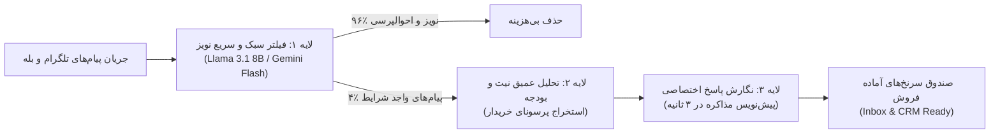

# سند طرح کسب‌وکار، مدل اقتصادی و پرونده جذب سرمایه (Pitch Deck & Business Plan)
## سامانه هوش مصنوعی رادار (Radar AI) — PriCoders
**نسخه:** ۱.۰ (پاییز ۱۴۰۵ / اواخر ۲۰۲۶)  
**چشم‌انداز:** موتور خودکار کشف سرنخ و شتاب‌دهنده نیت خرید در بستر شبکه‌های اجتماعی و پیام‌رسان‌ها  
**مخاطب سند:** هم‌بنیان‌گذاران، فرشتگان سرمایه‌گذار (Angel Investors) و صندوق‌های سرمایه‌گذاری جسورانه (VCs)

---

## ۱. خلاصه اجرایی (Executive Summary)

**رادار (Radar)** یک پلتفرم B2B SaaS بر پایه هوش مصنوعی مولد است که برای تیم‌های فروش، آژانس‌های بازاریابی و شرکت‌های خدمات نرم‌افزاری در ایران و منطقه خاورمیانه طراحی شده است. 

در اقتصاد دیجیتال ایران و بازارهای نوظهور، بیش از **۸۰ درصد از نیازها و مذاکرات واقعی B2B نه از طریق ایمیل‌های سرد یا لینکدین، بلکه در جوامع گفتگو، گروه‌های تلگرام و کانال‌های بله** مطرح می‌شوند. در این فضا، صدها مدیر و تصمیم‌گیرنده روزانه چالش‌ها و تقاضای خرید نرم‌افزار، خدمات یا کالای خود را اعلام می‌کنند؛ اما شناسایی این پیام‌ها از میان ده‌ها هزار پیام هرزنامه و گپ غیرکاری برای انسان ناممکن و به شدت زمان‌بر است.

رادار به صورت ۲۴ ساعته جریان پیام‌های متنی این جوامع را شنود کرده، نویزها را با فیلتر هوشمند پالایش می‌کند، میزان «نیت خرید» (Intent Score) را از ۰ تا ۱۰۰ محاسبه نموده و در کمتر از ۳ ثانیه یک پیشنهاد پاسخ شخصی‌سازی‌شده و متناسب با پرسونای محصول آماده می‌کند.

### شاخص‌های کلیدی در یک نگاه:
* **حاشیه سود ناخالص نرم‌افزاری (Gross Margin):** بیش از **۸۱.۲٪** بر روی پلن پایه
* **نرخ دلار مبنای تحقیق و توسعه:** ۲۶۵,۰۰۰ تومان به ازای هر دلار آمریکا (نرخ پاییز ۱۴۰۵)
* **هزینه تمام‌شده پردازش هوش مصنوعی (COGS):** کمتر از **۰.۵۰ دلار (۱۳۰,۰۰۰ تومان)** به ازای هر ۱۰,۰۰۰ پیام ورودی
* **قیمت‌گذاری پلن فعال (Starter):** **۶۹۰,۰۰۰ تومان / ماه** (سالانه: ۵۵۰,۰۰۰ تومان / ماه)
* **بازگشت سرمایه برای مشتری (ROI):** بیش از **۲۵ برابر** صرفه‌جویی مالی در مقایسه با استخدام کارشناس لیدجنریشن انسانی (۱۸ میلیون تومان در ماه)

---

## ۲. مسئله و فرصت بازار (The Problem)

### الف. شکست کانال‌های سنتی فروش سازمانی (Cold Outbound Failure)
1. **ایمیل مارکتینگ در ایران بی‌اثر است:** نرخ باز شدن ایمیل‌های تبلیغاتی سازمانی زیر ۵٪ بوده و اغلب به پوشه هرزنامه هدایت می‌شوند.
2. **لینکدین محدود و کند است:** به دلیل فیلترینگ و سرعت پایین، چرخه کشف لید در لینکدین هفته‌ها به طول می‌انجامد.
3. **نبض واقعی معاملات در پیام‌رسان‌ها می‌زند:** تلگرام و بله زیست‌بوم اصلی شرکت‌های ایرانی هستند؛ گروه‌های چند ده‌هزار نفره برنامه‌نویسان، حسابداران، بازرگانان، سئوکاران و مدیران محصول روزانه ده‌ها تقاضای خرید و پروژه مطرح می‌کنند.

### ب. ناهنجاری جریان اطلاعات و افت فرصت‌های فروش (Speed-to-Lead Problem)
* **داده‌های تحقیقات فروش جهانی (Harvard Business Review & Chili Piper):** اگر اولین تماس یا پاسخ به یک مشتری راغب ظرف ۵ دقیقه انجام شود، احتمال تبدیل آن به قرارداد **۲۱ برابر** بیشتر از تأخیر ۳۰ دقیقه‌ای است.
* **در گروه‌های کاری:** وقتی خریداری می‌پرسد: *«یک نرم‌افزار انبارداری خوب که به ووکامرس وصل بشه معرفی کنید؟»*، اولین فروشنده‌ای که در چند دقیقه پاسخی مستدل و غیرتبلیغاتی ارائه کند، معامله را تصاحب می‌کند.
* **هزینه گزاف انسان:** شرکت‌ها برای خواندن مداوم پیام‌های گروه‌ها ناچار به استخدام کارشناس فروش جزء (SDR) با حقوق ماهانه ۱۵ تا ۲۵ میلیون تومان هستند که به دلیل خستگی انسانی، بیش از ۷۰٪ فرصت‌ها را از دست می‌دهد.

---

## ۳. راه‌حل رادار و معماری هسته محصول (The Solution)

رادار سیستم تریاژ داده‌های متنی را در ۳ لایه پیاده‌سازی کرده است:



### قابلیت‌های هسته فعال (Live MVP in Production):
1. **پایش لحظه‌ای جوامع:** اتصال به کانال‌ها و سوپرگروه‌های کلیدی بدون تحمیل بار به سیستم کاربر.
2. **موتور نیت‌سنجی ۴ سطحی:**
   * **قصد خرید بالا (High Intent - ۷۵ تا ۱۰۰):** اعلام صریح بودجه، فوریت و نیاز به ابزار یا خدمات.
   * **آگاه از مشکل (Problem Aware - ۴۵ تا ۷۴):** طرح دردها و چالش‌های کاری بدون بیان نام مستقیم فروشنده.
   * **کنجکاو (Curious - ۲۰ تا ۴۴):** سؤالات مقایسه‌ای و عمومی.
   * **نامرتبط (Irrelevant - ۰ تا ۱۹):** سلام و احوال‌پرسی، پیام‌های خبری و اسپم.
3. **انطباق هوشمند با شناسنامه محصول (ICP Alignment):** هر کاربر ویژگی‌ها، مزایا و کلیدواژه‌های محصول خود را تنظیم می‌کند و مدل هوش مصنوعی پیام‌ها را بر اساس میزان تطابق ارزش‌های محصول امتیازدهی می‌کند.
4. **تولید خودکار پیش‌نویس پاسخ شخصی‌سازی‌شده:** تولید متنی مؤدبانه، حرفه‌ای و ارزش‌محور (نه اسپم فروشگاهی) که کارشناس فروش با یک کلیک آن را کپی کرده و در گروه ارسال می‌نماید.
5. **صندوق هوشمند و مدیریت وضعیت سرنخ:** امکان پیگیری، آرشیو و بایگانی سرنخ‌ها در پایگاه‌داده امن PocketBase.

---

## ۴. تحقیق و توسعه اقتصادی توکن‌ها و هزینه‌های عملیاتی (Token Unit Economics & COGS)

تحلیل عمیق مالی بر پایه نرخ واقعی دلار آزاد در تهران (**۲۶۵,۰۰۰ تومان**) و تعرفه توکن‌های مدل‌های زبان بزرگ (LLM):

### الف. مدل پردازش دومرحله‌ای (Two-Pass Token Optimization Architecture)
برای جلوگیری از هدررفت بودجه، پیام‌ها در دو گذر فیلتر می‌شوند:

| مرحله پردازش | مدل مورد استفاده | ورودی توکن | خروجی توکن | هزینه دلاری به ازای ۱ میلیون توکن |
| :--- | :--- | :--- | :--- | :--- |
| **گذر اول: تریاژ سریع نویز** | Gemini 2.0 Flash / Llama 3.1 8B | ~۴۰ توکن | ~۱۰ توکن (امتیاز و شناسه) | ورودی: $۰.۰۷۵ / خروجی: $۰.۳۰ |
| **گذر دوم: تحلیل عمیق و پاسخ** | Claude 3.5 Haiku / Qwen 2.5 14B | ~۵۰۰ توکن | ~۱۵۰ توکن (متن پاسخ) | ورودی: $۰.۱۵ / خروجی: $۰.۶۰ |

### ب. محاسبه دقیق هزینه پلن استارتر (۱۰,۰۰۰ پیام در ماه):
1. **گذر اول روی ۱۰,۰۰۰ پیام:**
   * ۴۰۰,۰۰۰ توکن ورودی = $۰.۰۳۰
   * ۱۰۰,۰۰۰ توکن خروجی = $۰.۰۳۰
   * **مجموع گذر اول:** **$۰.۰۶ دلار (~۱۶,۰۰۰ تومان)**
2. **گذر دوم روی پیام‌های واجد شرایط (فرض محافظه‌کارانه ۴٪ لید = ۴۰۰ پیام):**
   * ۲۰۰,۰۰۰ توکن ورودی = $۰.۰۳۰
   * ۶۰,۰۰۰ توکن خروجی = $۰.۰۳۶
   * **مجموع گذر دوم:** **$۰.۰۶۶ دلار (~۱۷,۵۰۰ تومان)**
3. **هزینه کل توکن‌های مصرفی (LLM Compute):** **$۰.۱۲۶ دلار (~۳۳,۵۰۰ تومان)**
4. **سرور، دیتابیس، پهنای باند و پراکسی‌های بات تلگرام/بله (سرشکن روی هر کاربر):** **~۹۶,۵۰۰ تومان ($۰.۳۶ دلار)**
5. **جمع کل هزینه تمام‌شده (COGS) پلن استارتر:** **۱۳۰,۰۰۰ تومان در ماه ($۰.۴۹ دلار)**

### ج. شاخص‌های اقتصادی سودآوری (Unit Economics Metrics):

```
+-----------------------------------------------------------+
| شاخص اقتصادی                    | پلن استارتر (Starter)   | پلن رشد (Growth)        |
+-----------------------------------------------------------+
| قیمت فروش ماهانه               | ۶۹۰,۰۰۰ تومان ($۲.۶۰)    | ۲,۱۹۰,۰۰۰ تومان ($۸.۲۶) |
| قیمت فروش با تخفیف سالانه       | ۵۵۰,۰۰۰ تومان ($۲.۰۷)    | ۱,۷۵۰,۰۰۰ تومان ($۶.۶۰) |
| هزینه تمام‌شده ماهانه (COGS)   | ۱۳۰,۰۰۰ تومان ($۰.۴۹)    | ۴۵۰,۰۰۰ تومان ($۱.۷۰)   |
| سود ناخالص ماهانه (Gross Profit)| ۵۶۰,۰۰۰ تومان ($۲.۱۱)    | ۱,۷۴۰,۰۰۰ تومان ($۶.۵۶) |
| حاشیه سود ناخالص (Gross Margin) | ۸۱.۲٪                   | ۷۹.۵٪                   |
| هزینه هر پیام برای مشتری       | ۶۹ تک‌تومان             | ۴۳.۸ تک‌تومان           |
+-----------------------------------------------------------+
```

> **دیدگاه بنیان‌گذار و سرمایه‌گذار:**  
> حاشیه سود ناخالص بیش از ۸۰٪ استاندارد طلایی (Gold Standard) شرکت‌های نرم‌افزاری برتر سیلیکون ولی است. حتی در صورت جهش ۵۰ درصدی نرخ ارز یا افزایش سهم مصرف توکن‌ها، حاشیه سود سامانه بالای ۶۵٪ باقی خواهد ماند که ریسک مالی سیستم را به صفر نزدیک می‌کند.

---

## ۵. اندازه بازار (Market Size: TAM, SAM, SOM)

### ۱. کل بازار بالقوه (TAM - Total Addressable Market):
* **تعریف:** کلیه کسب‌وکارهای ثبت‌شده و آنلاین فعال در بازار ایران که نیازمند فروش B2B و جذب مشتری سازمانی هستند (شرکت‌های فناوری، آژانس‌های دیجیتال، شرکت‌های بازرگانی، تولیدکنندگان تجهیزات صنعتی و خدمات پزشکی/مالی).
* **اندازه:** حدود **۱۵۰,۰۰۰ شرکت**.
* **ارزش بازار سالانه با نرخ پلن متوسط:** **۱۵۰,۰۰۰ × ۱۲,۰۰۰,۰۰۰ تومان = ۱,۸۰۰ میلیارد تومان (~۶.۸ میلیون دلار)**.

### ۲. بازار قابل‌دستیابی (SAM - Serviceable Available Market):
* **تعریف:** شرکت‌های فناورانه، استارتاپ‌ها، فریلنسرهای ارشد، آژانس‌های تبلیغاتی و نرم‌افزاری که جامعه هدف آن‌ها مستقیماً در کانال‌ها و گروه‌های تلگرام و بله حضور دارند.
* **اندازه:** حدود **۲۵,۰۰۰ شرکت و تیم فروش**.
* **ارزش بازار سالانه:** **۲۵,۰۰۰ × ۱۰,۰۰۰,۰۰۰ تومان = ۲۵۰ میلیارد تومان (~۹۵۰,۰۰۰ دلار)**.

### ۳. سهم بازار هدف‌گذاری‌شده در فاز اول (SOM - Serviceable Obtainable Market):
* **تعریف:** جذب ۵٪ از شرکت‌های حوزه فناوری اطلاعات، شرکت‌های نرم‌افزاری، آژانس‌های سئو و بازاریابی در ۲۴ ماه ابتدایی.
* **تعداد مشتری هدف:** **۱,۲۵۰ مشترک فعال B2B**.
* **درآمد سالانه مکرر هدف (ARR):** **۱,۲۵۰ × ۸,۰۰۰,۰۰۰ تومان = ۱۰ میلیارد تومان (~۳۸,۰۰۰ دلار درآمد خالص سالانه)**.

---

## ۶. استراتژی قیمت‌گذاری و مقایسه ارزش (Value Proposition vs. Alternatives)

چرا یک مدیرعامل یا مدیر فروش بلافاصله اشتراک ۶۹۰,۰۰۰ تومانی رادار را پرداخت می‌کند؟

```
+---------------------------------------------------------------------------------+
| سناریوی جایگزین                 | هزینه ماهانه         | اثربخشی و نقاط ضعف            |
+---------------------------------------------------------------------------------+
| استخدام نیروی انسانی (SDR)       | ۱۸,۰۰۰,۰۰۰ تومان     | روزی نهایتاً ۲۰۰ پیام می‌خواند؛ |
|                                 | + بیمه و سنوات      | خطا دارد؛ ۲۴ ساعته فعال نیست.  |
+---------------------------------------------------------------------------------+
| خرید پنل‌های پیامک و لیست دیتابیس| ۵,۰۰۰,۰۰۰ تومان      | بازدهی زیر ۰.۵٪؛ ایجاد مزاحمت  |
|                                 |                      | و آسیب جدی به اعتبار برند.     |
+---------------------------------------------------------------------------------+
| تبلیغات کلیکی یا اسپانسری تلگرام | ۱۰ تا ۵۰ میلیون تومان | هزینه ورودی بسیار بالا بدون    |
|                                 |                      | تضمین جذب مشتری سازمانی.       |
+---------------------------------------------------------------------------------+
| سامانه هوش مصنوعی رادار (Radar)  | ۶۹۰,۰۰۰ تومان        | پایش ۲۴ ساعته؛ ۱۰,۰۰۰ پیام؛   |
|                                 |                      | تولید پاسخ در ۳ ثانیه؛ ROI فوری|
+---------------------------------------------------------------------------------+
```

> **شاخص روان‌شناسی قیمت (Frictionless B2B Approval):**  
> رقم **۶۹۰,۰۰۰ تومان** در ساختار شرکت‌های ایرانی نیازمند مصوبه هیئت‌مدیره یا فرآیند پیچیده تدارکات نیست. هر مدیر فروش یا کارشناس بازاریابی با تنخواه‌گردان یا کارت شخصی خود نیز می‌تواند جهت تست ابزار آن را فعال نماید. این موضوع نرخ تبدیل سلف‌سرویس (Self-Serve Conversion) را به حداکثر می‌رساند.

---

## ۷. استراتژی ورود به بازار و جذب مشتری (Go-To-Market / GTM)

1. **مدل محصول‌محور (Product-Led Growth - PLG):**
   * **نسخه نمایشی تعاملی زنده روی لندینگ:** مشتری بدون نیاز به ثبت‌نام، در لندینگ با سیگنال‌های زنده بازی کرده و شیوه تشخیص نیت و تولید پاسخ را مشاهده می‌کند (کاهش شک اولیه مشتری).
   * **شبیه‌ساز هوشمند پیام‌ها:** کاربر در داشبورد می‌تواند هر پیام دلخواه از گروه‌های تلگرام را Paste کند و استدلال هوش مصنوعی را بی‌درنگ مشاهده نماید.
2. **شکار مشتری در زمین خودی (Eating Our Own Dog Food):**
   * سیستم رادار برای فروش خود رادار به کار گرفته می‌شود: پایش خودکار پیام‌هایی با مضمون *«چطوری لید پیدا کنم؟»*، *«نرم‌افزار مدیریت فروش چی پیشنهاد می‌دید؟»* در گروه‌های تلگرام استارتاپی و ارسال پیشنهاد تست رادار.
3. **همکاری استراتژیک با آژانس‌های مارکتینگ و توسعه‌دهندگان بات:**
   * ارائه پلن نمایندگی (White-label و Referral) با اختصاص ۲۰٪ پورسانت مستمر به آژانس‌هایی که رادار را برای مشتریان B2B خود مستقر می‌کنند.

---

## ۸. پیش‌بینی‌های مالی ۳ ساله (3-Year Financial Projections)

بر مبنای سناریوی واقع‌بینانه (Conservative Growth Model):

```
+-------------------------------------------------------------------------+
| شاخص مالی                        | سال اول (۱۴۰۶) | سال دوم (۱۴۰۷) | سال سوم (۱۴۰۸) |
+-------------------------------------------------------------------------+
| تعداد مشترکین فعال (Active MRR) | ۱۲۰ مشتری      | ۵۵۰ مشتری      | ۱,۶۰۰ مشتری    |
| سهم پلن استارتر / رشد           | ۸۵٪ / ۱۵٪      | ۷۰٪ / ۳۰٪      | ۶۰٪ / ۴۰٪      |
| میانگین درآمد ماهانه به ازای هر کاربر (ARPU) | ۸۹۰,۰۰۰ تومان | ۱,۱۴۰,۰۰۰ تومان | ۱,۲۹۰,۰۰۰ تومان|
| درآمد مکرر ماهانه در پایان سال (MRR) | ۱۰۶ میلیون ت.  | ۶۲۷ میلیون ت.  | ۲.۰۶ میلیارد ت.|
| درآمد کل سالانه (Gross Revenue) | ۸۲۰ میلیون ت.  | ۵.۱ میلیارد ت. | ۱۸.۵ میلیارد ت.|
| هزینه تمام‌شده سرور و مدل (COGS)| ۱۶۰ میلیون ت.  | ۹۸۰ میلیون ت.  | ۳.۴ میلیارد ت. |
| سود ناخالص سالانه (Gross Profit)| ۶۶۰ میلیون ت.  | ۴.۱ میلیارد ت. | ۱۵.۱ میلیارد ت.|
| حاشیه سود عملیاتی خالص (EBITDA) | ۴۵٪            | ۵۸٪            | ۶۴٪            |
+-------------------------------------------------------------------------+
```

---

## ۹. مزیت رقابتی و خندق دفاعی (Competitive Moat)

1. **مهندسی زمینه بومی و فهم ادبیات تلگرام/بله ایرانی:**  
   پیام‌های محاوره‌ای، اصطلاحات بازاری، استعاره‌ها و غلط‌های املایی رایج در گروه‌های ایرانی توسط پرامپت‌ها و ساختار اعتبارسنجی چندلایه رادار درک می‌شوند؛ مزیتی که ابزارهای عمومی خارجی فاقد آن هستند.
2. **پشتیبانی از بستر ملی و پیام‌رسان بله:**  
   اکثر ابزارهای خارجی دسترسی به پروتکل‌ها و API پیام‌رسان‌های ایرانی نظیر بله ندارند. رادار این گلوگاه را حل کرده است.
3. **مکانیزم دفاع در برابر حملات تزریق پرامپت (Adversarial Defense):**  
   کپسوله‌سازی دقیق تگ‌های XML (`<untrusted_community_message>`) و خنثی‌سازی هرگونه دستور مخرب پنهان در پیام‌های کاربران ناشناس.
4. **سرعت بی‌درنگ و عدم نیاز به راه‌اندازی پیچیده:**  
   راه‌اندازی در کمتر از ۲ دقیقه بدون نیاز به نصب زیرساخت یا آموزش پرسنل.

---

## ۱۰. طرح ارائه‌ی ۱۰ اسلایدی برای سرمایه‌گذاران (Pitch Deck Slide Outline)

### اسلاید ۱: عنوان و هویت (Title Slide)
* **تیتر:** رادار (Radar) — موتور هوشمند کشف سرنخ‌های B2B از قلب مکالمات شبکه‌های اجتماعی
* **زیرتیتر:** توسعه‌یافته توسط تیم PriCoders
* **شعار:** «اولین شرکتی باشید که به خریدار بالقوه پاسخ می‌دهد.»

### اسلاید ۲: مسئله (The Problem)
* بیش از ۸۰٪ معاملات B2B در پیام‌رسان‌ها (تلگرام و بله) شکل می‌گیرد.
* ۹۸٪ پیام‌های گروه‌ها نویز و هرزنامه است؛ یافتن خریدار واقعی شبیه جست‌وجوی سوزن در انبار کاه است.
* تأخیر بیش از ۵ دقیقه در پاسخ‌دهی، شانس بستن قرارداد را ۸۰٪ کاهش می‌دهد.
* استخدام کارشناس فروش برای پایش دستی، پرهزینه (۱۸+ میلیون تومان در ماه) و ناکارآمد است.

### اسلاید ۳: راه‌حل (The Solution)
* پایش ۲۴ ساعته جریان پیام‌ها بدون خستگی و وقفه.
* فیلتر هوشمند ۹۶٪ نویز با هوش مصنوعی سبک.
* امتیازدهی نیت خرید (۰ تا ۱۰۰) و انطباق با ویژگی‌های محصول در کمتر از ۳ ثانیه.
* نگارش خودکار پیام شروع مذاکره بدون لحن رباتیک.

### اسلاید ۴: محصول و دمو (Product Demo & Traction)
* نمایش لندینگ و داشبورد زنده رادار.
* مشاهده صندوق تریاژ سرنخ‌ها، کارت ماتریس ۴ سطحی و محاسبه شفاف هزینه به ازای هر پیام (زیر ۱۰ تومان).

### اسلاید ۵: اندازه بازار (Market Size)
* **TAM:** ۱,۸۰۰ میلیارد تومان (۱۵۰,۰۰۰ کسب‌وکار فعال B2B در ایران).
* **SAM:** ۲۵۰ میلیارد تومان (۲۵,۰۰۰ شرکت نرم‌افزاری، آژانس دیجیتال و فریلنسر سازمانی).
* **SOM:** ۱۰ میلیارد تومان در ۲۴ ماه (۱,۲۵۰ مشتری وفادار).

### اسلاید ۶: مدل درآمدی و اقتصاد اشتراک (Business Model & Unit Economics)
* مدل B2B SaaS بر پایه اشتراک ماهانه و سالانه.
* **پلن استارتر (Starter):** ۶۹۰,۰۰۰ تومان در ماه (۱۰,۰۰۰ پیام).
* **پلن رشد (Growth):** ۲,۱۹۰,۰۰۰ تومان در ماه (۵۰,۰۰۰ پیام + اتصال CRM).
* **حاشیه سود ناخالص:** بالای ۸۱٪ با اتکا به معماری گذر دوگانه توکن‌ها.

### اسلاید ۷: رقابت و خندق دفاعی (Competition & Moat)
* جدول مقایسه با ابزارهای خارجی (Brand24, Mention, Leadfeeder): ابزارهای خارجی قیمت دلاری نجومی دارند (۴۹ تا ۲۹۹ دلار)، زبان فارسی را نمی‌فهمند و به بله و تلگرام متصل نیستند.
* مقایسه با ربات‌های کلمه‌کلیدی قدیمی: ربات‌های تلگرامی قدیمی فقط کلمه را سرچ می‌کنند و صدها پیام اسپم تحویل می‌دهند؛ رادار «نیت خرید و استدلال بودجه» را می‌فهمد.

### اسلاید ۸: استراتژی ورود به بازار (Go-To-Market)
* رشد محصول‌محور (PLG) با دموهای تعاملی در صفحه فرود.
* استفاده از رادار برای جذب مشتریان خود رادار در تلگرام.
* شبکه همکاری با آژانس‌های دیجیتال مارکتینگ و مشاوران فروش سازمانی.

### اسلاید ۹: تیم مجری (Team: PriCoders)
* تیم فنی و محصولی متمرکز بر هوش مصنوعی مدرن، Full-Stack Architecture و توسعه ابزارهای نوآورانه نرم‌افزاری.
* توان اجرای سریع، مهندسی پرامپت اختصاصی و زیرساخت پایدار با حداقل مصرف منابع.

### اسلاید ۱۰: جذب سرمایه و چشم‌انداز (The Ask & Milestones)
* **سرمایه درخواستی (Seed Round):** ۳ میلیارد تومان در ازای ۱۵٪ سهام.
* **تخصیص منابع:**
  * ۵۰٪ بازاریابی و فروش B2B (CAC).
  * ۳۵٪ توسعه فنی، اتصال کانکتورهای اختصاصی و توسعه مدل‌های محلی.
  * ۱۵٪ هزینه‌های زیرساخت سرور و نقدینگی عملیاتی (Runway ۱۸ ماهه).
* **هدف مرحله بعدی:** رسیدن به ۵۰۰ مشتری فعال و MRR بالای ۴۵۰ میلیون تومان طی ۱۲ ماه.

---

## ۱۱. نتیجه‌گیری اجرایی (Founder & Investor Takeaway)

پروژه **رادار (Radar)** پاسخی است به یکی از دردناک‌ترین گلوگاه‌های فروش سازمانی در بازار ایران: **از دست رفتن مشتریانی که آماده پرداخت پول هستند اما صدای آن‌ها در شلوغی گروه‌های گفتگو گم می‌شود**.

با توجه به:
1. هزینه ناچیز توکن‌ها (کمتر از ۱۳۰,۰۰۰ تومان به ازای هر مشتری)
2. حاشیه سود استثنایی ۸۱٪
3. قیمت‌گذاری هوشمندانه و بدون اصطکاک (۶۹۰,۰۰۰ تومان)
4. محصول کاملاً آماده، پایدار و تست‌شده در فاز MVP

رادار پتانسیل تبدیل شدن به ابزار استاندارد و جدایی‌ناپذیر روی میز هر مدیر فروش در زیست‌بوم کسب‌وکارهای ایرانی را داراست.
