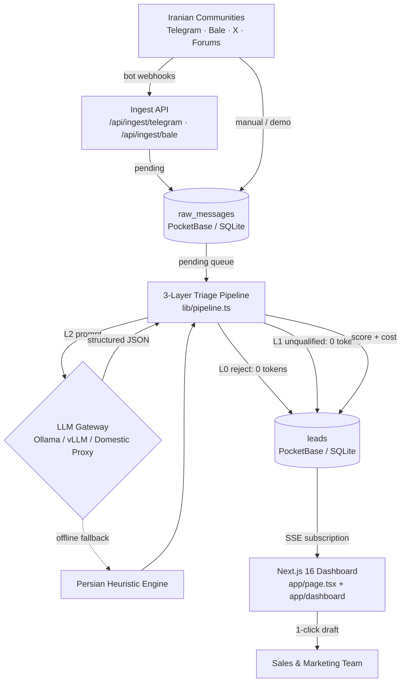

# Radar — Technical Reference (مرجع فنی جامع)

> Persian body, English headings and technical terms. Companion to `README.md`
> (user guide) and `docs/TechnicalDocumentation.md` (design philosophy).
> Last updated for the webhook-ingestion + 3-layer-pipeline release.

---

## Table of Contents

- [1. Overview](#1-overview--نمای-کلی)
- [2. System Architecture](#2-system-architecture--معماری-سیستم)
- [3. Tech Stack](#3-tech-stack--پشته-فناوری)
- [4. Data Model](#4-data-model--مدل-داده)
- [5. Triage Pipeline](#5-triage-pipeline--خط-تریاژ-سهلایه)
- [6. Ingestion](#6-ingestion--جمعآوری-پیام)
- [7. API Reference](#7-api-reference--مرجع-api)
- [8. Radar Assistant](#8-radar-assistant--دستیار-هوشمند)
- [9. Authentication & Security](#9-authentication--security--احراز-هویت-و-امنیت)
- [10. Configuration](#10-configuration--پیکربندی)
- [11. Frontend & Realtime](#11-frontend--realtime--رابط-کاربری-و-بهروزرسانی-زنده)
- [12. Deployment](#12-deployment--استقرار)
- [13. Operations Runbook](#13-operations-runbook--دستورالعمل-بهرهبرداری)
- [14. Project Structure](#14-project-structure--ساختار-پروژه)
- [15. Known Limitations & Roadmap](#15-known-limitations--roadmap--محدودیتها-و-نقشه-راه)

---

## 1. Overview — نمای کلی

رادار (Radar) یک موتور محلیِ کشف نیت خرید (Buying-Intent Engine) برای تیم‌های
فروش فعال در ایران است. پیام‌های جوامع فارسی (تلگرام، بله، ایکس، فروم‌ها) را
می‌خواند، نویز را با سه لایه فیلتر حذف می‌کند، به هر پیام امتیاز ۰ تا ۱۰۰
می‌دهد و پیش‌نویس پاسخ فارسی آماده ارسال تولید می‌کند — همه روی یک سرور،
بدون وابستگی به کلاد خارجی.

اعداد کلیدی پیاده‌سازی فعلی:

| شاخص | مقدار |
| --- | --- |
| لایه‌های تریاژ | ۳ (قطعی، غربال سریع، تحلیل عمیق) |
| سطوح نیت | `high_intent` ،`problem_aware` ،`curious` ،`irrelevant` |
| وضعیت پیام خام | `pending` ،`processed` ،`filtered` ،`error` |
| وضعیت سرنخ | `new` ،`approved` ،`contacted` ،`dismissed` |
| پلتفرم‌های منبع | `telegram` ،`bale` ،`twitter_x` ،`forum` |
| هزینه لایه ۰ و ۱ | صفر توکن (CPU خالص) |
| تایم‌اوت فراخوانی LLM | ۱۲ ثانیه، سپس fallback |

### نمونه داده‌های واقعی پردازش‌شده در بازار ایران (Live Signals Matrix)

برگرفته از نمونه‌های زنده و بنچ‌مارک شده در رابط کاربری سامانه رادار:

| شناسه و بستر | فرستنده و جامعه هدف | متن پیام ورودی | امتیاز و سطح نیت | تحلیل هوش مصنوعی | فوریت و بودجه | هزینه پردازش |
| :--- | :--- | :--- | :---: | :--- | :--- | :---: |
| `sig-1` (بله) | علیرضا فراهانی (مدیر عملیات فین‌تک) | «ما برای تیم ۲۰ نفرمون به شدت دنبال یه راهکار مطمئن اتوماسیون پیگیری لیدها در کانال‌ها هستیم. روزی ۳ ساعت وقت تیم فروش هدر میره. بودجه ماهانه آماده تا ۱۵ میلیون داریم. چه نرم‌افزاری پیشنهاد می‌دید؟» | ۹۴ (`high_intent`) | اعلام صریح اتلاف زمان روزانه (۳ ساعت)، ابعاد تیم فروش (۲۰ نفر)، سقف بودجه معین (۱۵ م.ت) و فوریت بالا در انتخاب سامانه. | فوری (۲۴ ساعت)<br/>۱۵,۰۰۰,۰۰۰ تومان ماهانه | ۴۲ تومان (~$0.0004) |
| `sig-2` (تلگرام) | سارا موحد (مدیر رشد) | «کسی تجربه استفاده از سرویس‌های ایرانی برای کشف مشتریان بالقوه در گروه‌ها داره؟ دنبال راهکاری هستیم که با نرم‌افزار دیدار یکپارچه بشه.» | ۸۲ (`high_intent`) | نیاز مشخص به کشف سرنخ در گروه‌های محلی، درخواست معرفی سرویس ایرانی و پیش‌شرط اتصال خودکار به CRM دیدار. | متوسط (۱ هفته)<br/>آماده مذاکره و خرید | ۳۸ تومان (~$0.00036) |
| `sig-3` (انجمن‌ها) | مهدی کاظمی (بنیان‌گذار استارتاپ) | «چطور می‌تونیم بدون تبلیغات کلیکی پرهزینه، اولین ۱۰۰ مشتری سازمانی نرم‌افزارمون رو در جوامع آنلاین پیدا کنیم؟» | ۶۵ (`problem_aware`) | آگاهی کامل از چالش کشف مشتری اولیه و اجتناب از هزینه‌های بالای تبلیغات سنتی؛ فرصت مشاوره و تبدیل به مشتری پایدار. | متوسط (۱ هفته)<br/>بودجه استارتاپی | ۳۵ تومان (~$0.00033) |

### مقایسه اقتصادی رادار با پیمایش سنتی توسط نیروی انسانی (SDR Economics)

| شاخص مقایسه‌ای | استخدام کارشناس فروش انسانی (SDR) | سامانه هوشمند رادار (Radar) | مزیت و صرفه‌جویی |
| :--- | :--- | :--- | :--- |
| **هزینه ماهانه مستقیم** | ۲۵ تا ۴۰ میلیون تومان حقوق و بیمه | ۱,۸۹۰,۰۰۰ تومان (پلن استارتر) | بیش از **۹۵٪ کاهش هزینه مستقیم** |
| **ساعات فعالیت و پایش** | حداکثر ۸ ساعت در روز (روزهای کاری) | ۲۴ ساعته، ۷ روز هفته بدون توقف | پوشش ۱۰۰٪ پیام‌های شبانه و تعطیلات |
| **سرعت کشف و پاسخ** | تا ۴ ساعت تأخیر در مشاهده پیام | تحلیل بلادرنگ در کمتر از ۳ ثانیه | پیشگیری از باختن فرصت به رقبا |
| **نرخ خطای تشخیص** | خطای بالا به دلیل خستگی ناشی از نویز ۸۰٪ کانال‌ها | غربالگری سه‌لایه‌ای دقیق با حذف کامل اسپم | تفکیک دقیق پیام‌های آماده خرید از احوال‌پرسی |
| **هزینه پردازش هر پیام** | سرشکن انسانی ~۲,۵۰۰ تومان | کمتر از ۹ تومان سرشکن (۳۸ تا ۴۲ تومان L2) | **۹۹٪ صرفه‌جویی مالی در هر پیام** |

---

## 2. System Architecture — معماری سیستم



مسیر داده همیشه یک‌طرفه است: `communities → raw_messages → leads → dashboard`.
هیچ مسیری از داشبورد به پلتفرم‌ها (ارسال خودکار پیام) وجود ندارد؛ ارسال پاسخ
همیشه با تصمیم انسانی انجام می‌شود (Human-in-the-loop).

نقش اجزا:

| جزء | فایل | مسئولیت |
| --- | --- | --- |
| Ingest API | `app/api/ingest/*/route.ts` + `lib/ingest.ts` | دریافت وب‌هوک، dedupe، ساخت `source`، درج `pending` |
| Triage Pipeline | `lib/pipeline.ts` | اجرای L0/L1/L2 و ثبت `lead` — تنها نقطه تریاژ |
| Layer 0/1 | `lib/prefilter.ts` | قوانین قطعی و غربال سریع، بدون توکن |
| Layer 2 | `lib/llm.ts` (`evaluateMessageWithLLM`) | پرامپت کامل + fallback启发式 |
| Worker | `scripts/worker.ts` | مصرف صف `pending` (one-shot؛ با timer تکرار می‌شود) |
| Schema bootstrap | `pocketbase/setup_schema.ts` | ساخت کالکشن‌ها + مهاجرت‌ها + seed محصول و منابع |
| Dashboard | `app/page.tsx`, `app/dashboard/page.tsx` | فید زنده روی SSE ساب‌اسکریپشن PocketBase |

---

## 3. Tech Stack — پشته فناوری

| لایه | فناوری |
| --- | --- |
| Runtime / Package manager | Bun 1.4+ |
| Framework | Next.js 16 (App Router, Turbopack) · React 19 |
| Language | TypeScript 5 (strict) |
| Styling | Tailwind CSS v4 + `app/globals.css` |
| Database & realtime | PocketBase (embedded SQLite) + SSE subscriptions |
| AI inference | OpenAI-compatible endpoint (Ollama/vLLM/domestic gateway) + heuristic fallback |
| Ingestion protocols | Telegram Bot API webhooks · Bale Bot API webhooks (`tapi.bale.ai`) |
| Typography | Ravi + Estedad (self-hosted, بدون CDN خارجی) |
| Icons | Inline SVG در `components/Icons.tsx` (بدون پکیج آیکون) |

قواعد معماری (از `AGENTS.md`): اول TypeScript خالص (بدون یوتیلیتی اضافه)، صفر
CDN خارجی، رابط کاملاً RTL با اعداد فارسی.

---

## 4. Data Model — مدل داده

چهار کالکشن در PocketBase. نوشتن مستقیم (create/update/delete) در همه
کالکشن‌های داده فقط برای superuser قابل نوشتن هستند (`createRule/updateRule/deleteRule = null`)؛
خواندن (list/view) برای داده‌های عمومی باز است. دسترسی رکوردهای کاربری در کالکشن `users`
منحصراً به خود کاربر محدود است (`id = @request.auth.id`). تمام تغییرات سیستمی از
سمت سرور با احراز superuser یا احراز کاربر انجام می‌شود.

### `users` — کاربران و هویت سازمانی (کالکشن Auth)

| فیلد | نوع | توضیح |
| --- | --- | --- |
| `email` | email (required, unique) | ایمیل سازمانی/ورود |
| `name` | text (required) | نام کاربر |
| `company` | text | نام شرکت یا سازمان |
| `role` | text | سمت سازمانی (مدیر فروش، بنیان‌گذار و ...) |
| `product_name` | text | نام تجاری محصول تحت پایش |
| `product_description` | text | شرح ارزش‌آفرینی محصول |
| `ideal_customer_profile` | text | پرسونای مشتری ایده‌آل (ICP) |
| `onboarding_completed` | bool | وضعیت تکمیل موفق فرآیند آنبوردینگ |

### `products` — شناسنامه محصول و ICP

| فیلد | نوع | توضیح |
| --- | --- | --- |
| `name` | text (required) | نام محصول |
| `tagline` | text | تگ‌لاین |
| `description` | text (required) | شرح — وارد پرامپت L2 می‌شود |
| `value_propositions` | json | مزیت‌ها — وارد پرامپت L2 می‌شود |
| `ideal_customer_profile` | text (required) | ICP — وارد پرامپت L2 می‌شود |
| `keywords` | json | کلیدواژه‌های پایش — ورودی غربال L1 |

### `sources` — کانال‌های تحت پایش

| فیلد | نوع | توضیح |
| --- | --- | --- |
| `name` | text (required) | مثل `Telegram: Group Title (-100123)` — وب‌هوک‌ها خودکار می‌سازند |
| `platform` | select | `telegram \| bale \| twitter_x \| forum` |
| `status` | select | `active \| paused` |

### `raw_messages` — پیام‌های خام ورودی

| فیلد | نوع | توضیح |
| --- | --- | --- |
| `source_id` | relation → `sources` | منبع (expand می‌شود تا پلتفرم معلوم شود) |
| `external_id` | text | شناسه یکتا در سطح پلتفرم (`tg:<chat>:<msg>`) — کلید dedupe |
| `author_handle` | text (required) | مثل `@username` |
| `content` | text (required) | متن پیام (حداکثر ۳۰۰۰ کاراکتر در ingest) |
| `thread_context` | text | کانتکست گفت‌وگو |
| `posted_at` | date | زمان ارسال در پلتفرم مبدأ |
| `status` | select | `pending → processed \| filtered \| error` |

### `leads` — رکوردهای ارزیابی‌شده

| فیلد | نوع | توضیح |
| --- | --- | --- |
| `raw_message_id` | relation → `raw_messages` (required) | پیام مبدأ |
| `product_id` | relation → `products` (required) | محصول مبنای ارزیابی |
| `intent_score` | number 0–100 (required) | امتیاز نیت |
| `intent_level` | select (required) | چهار سطح نیت |
| `reasoning` | text | استدلال فارسی |
| `matched_feature` | text | ماژول منطبق محصول (فارسی) |
| `suggested_reply` | text | پیش‌نویس پاسخ فارسی (برای `irrelevant` خالی) |
| `input_tokens` / `output_tokens` | number | حسابداری توکن (برای L0/L1 صفر) |
| `estimated_cost_usd` | number | هزینه دلاری (برای L0/L1 صفر) |
| `lead_status` | select | چرخه حیات: `new → approved/contacted/dismissed` |

رابطه‌ها: `PRODUCTS ||--o{ LEADS` ،`RAW_MESSAGES ||--o{ LEADS` ،`SOURCES ||--o{ RAW_MESSAGES`.

---

## 5. Triage Pipeline — خط تریاژ سه‌لایه

نقطه ورود واحد: `triagePendingMessage(pb, rawMsg, product)` در
`lib/pipeline.ts`. همه مصرف‌کننده‌ها (worker، `/api/analyze`،
`/api/simulate`، هر دو وب‌هوک) از همین تابع استفاده می‌کنند تا رفتارها واگرا
نشوند. برای متن‌های ثبت‌نشده (ad-hoc) نسخه بدون persistence با نام
`triageAdHocMessage` وجود دارد.

### Layer 0 — فیلتر قطعی (`lib/prefilter.ts::prefilterMessage`)

کمتر از ۱ میلی‌ثانیه CPU، صفر توکن. خروجی `pass` یا `reject` با کد دلیل:

| کد | شرط | امتیاز ثبت‌شده |
| --- | --- | --- |
| `empty` | متن خالی | ۵ |
| `too_short` | کمتر از ۱۲ کاراکتر (`LAYER0_MIN_LENGTH`) | ۵ |
| `link_only` | فقط لینک، بدون متن | ۵ |
| `advertisement` | الگوی تبلیغ/عضویت/سیگنال/ارز (زیر ۱۲۰ کاراکتر) | ۵ |
| `injection` | الگوی تزریق پرامپت (`ignore previous instructions` و مشابه) | **۰** |

سپس dedupe محتوایی ۲۴ ساعته (`isDuplicateContent`): هش SHA-256 متن نرمال‌شده
(حذف نیم‌فاصله، یکدست‌سازی فاصله و حروف) با حداکثر ۲۰۰ رکورد اخیر مقایسه
می‌شود؛ رکورد جاری از مقایسه مستثنا است. تکراری‌ها با امتیاز ۵ ثبت می‌شوند.

### Layer 1 — غربال سریع (`screenIntent`)

بولی و بدون LLM: آیا پیام سیگنال خرید، درد کاری یا تطابق کلیدواژه دارد؟
دسته‌ها: `buying_signal` (نشانگرهای خرید/قیمت/جایگزین)، `pain_signal`
(مودیان/تحریم/اکسل/قطعی)، `keyword_match` (≥۲ کلیدواژه، یا ۱ کلیدواژه در متن
بلند)، `general_question` (سؤالی و بلند). بقیه با امتیاز ۱۲ و بدون مصرف توکن
رد می‌شوند.

### Layer 2 — تحلیل عمیق (`evaluateMessageWithLLM`)

پرامپت کامل شناسنامه محصول + ICP با کپسوله‌سازی XML (`<untrusted_community_message>`)
و سلسله‌مراتب مرزی دستورات؛ خروجی JSON سخت‌گیرانه؛ `temperature: 0.1`؛
تایم‌اوت ۱۲ ثانیه؛ سقف هم‌زمانی ۳ (`llmConcurrencyLimiter`). در هر خطا،
پاسخ نامعتبر یا timeout، موتور heuristic فارسی (`heuristicPersianEvaluator`)
جایگزین می‌شود — همان موتوری که آفلاین کامل کار می‌کند. خروجی‌ها sanitize
می‌شوند (`sanitizeSuggestedReply`: حذف تگ، خنثی‌سازی `javascript:` و مشابه،
سقف ۱۲۰۰ کاراکتر) و `reasoning`/`matched_feature` به فارسی تضمین می‌شوند
(`ensurePersianText`).

### حسابداری هزینه (`lib/pricing.ts`)

به‌ازای هر پیام: توکن ورودی/خروجی (واقعی از `usage` یا تخمین فارسی
`estimatePersianTokens`: ~۰٫۶۲ توکن به‌ازای هر کاراکتر فارسی) ضربدر نرخ‌های
`INPUT/OUTPUT_TOKEN_COST_PER_MILLION`، با معادل ریالی/تومانی برای داشبورد.
L0/L1 همیشه صفر ثبت می‌کنند.

---

## 6. Ingestion — جمع‌آوری پیام

### وب‌هوک‌های بات (مسیر اصلی لایو)

| مسیر | پلتفرم | هدر secret |
| --- | --- | --- |
| `POST /api/ingest/telegram` | Telegram Bot API | `X-Telegram-Bot-Api-Secret-Token` |
| `POST /api/ingest/bale` | Bale Bot API (`tapi.bale.ai`، سازگار با اسکیمای تلگرام) | `X-Bale-Secret-Token` |

هر دو `X-Webhook-Secret` را هم به‌عنوان fallback می‌پذیرند و برای push دستی /
تست، Bearer معتبر (`RADAR_API_KEY`) کافی است. ثبت وب‌هوک:

```bash
curl "https://api.telegram.org/bot<TELEGRAM_BOT_TOKEN>/setWebhook?url=https://<domain>/api/ingest/telegram&secret_token=<TELEGRAM_WEBHOOK_SECRET>"
# Bale: setWebhook به /api/ingest/bale با BALE_WEBHOOK_SECRET
```

پیش‌نیازها: بات ساخته‌شده، عضویت بات در سوپرگروه/کانال هدف (تلگرام: Privacy
Mode خاموش)، و HTTPS عمومی (Caddy در DEPLOY.sh تأمین می‌کند).

جریان هر درخواست (`lib/ingest.ts`):

1. احراز secret/Bearer و rate limit (۱۲۰ req/min به‌ازای IP).
2. استخراج پیام از `message | edited_message | channel_post` (متن یا کپشن)؛
   آپدیت‌های غیرمتنی (استیکر، عضویت، نظرسنجی) و پیام بات‌ها با
   `{"ignored": true}` تأیید و نادیده گرفته می‌شوند.
3. `findOrCreateSource`: یک ردیف `source` به‌ازای هر چت
   (`Telegram: <title> (<id>)`، وضعیت `active`).
4. Dedupe ارسال مجدد روی `external_id` (`tg:<chat>:<msgId>`) — تکراری‌ها با
   `{"deduped": true}` برمی‌گردند و دوباره تریاژ نمی‌شوند.
5. درج `raw_messages` با وضعیت `pending` و تریاژ فوری سه‌لایه (مثل simulate).
   پاسخ شامل `layer` تصمیم‌گیرنده است.

### مسیرهای دستی و نمایشی

- `POST /api/simulate` — تزریق یکی از ۲۶ پیام نمایشی فارسی و تریاژ فوری.
- `POST /api/analyze` — تریاژ یک `raw_message` موجود یا متن ad-hoc (بدون ثبت).
- `bun run seed` — بارگذاری ۲۶ پیام نمایشی (۵ high-intent، ۵ problem-aware،
  ۱۶ نویز) فقط برای دمـو؛ هرگز در production.

---

## 7. API Reference — مرجع API

همه مسیرها `force-dynamic` هستند. احراز (جز موارد ذکرشده): سشن کوکی یا Bearer.

| متد و مسیر | احراز | Rate limit | ورودی | خروجی |
| --- | --- | --- | --- | --- |
| `POST /api/analyze` | ✅ | ۱۵/min/IP (پلن) | `raw_message_id` یا `content` + `author_handle?`، `thread_context?`، `platform?`، `product_id?` | `{success, layer?, lead?, evalResult?/evaluation?}` |
| `POST /api/simulate` | ✅ | پلن کاربر (سهمیه روزانه) | `{index?}` | `{success, layer, lead (expand), evalResult}` |
| `POST /api/leads/fetch-initial` | کوکی سشن | سهمیه پلن | — | اسکن ۳ پیام اولیه بازار برای کاربر، تریاژ و ذخیره پایدار در پاکت‌بیس |
| `POST /api/leads/status` | کوکی سشن | ۶۰/min/IP | `{leadId, status, notes?}` | ذخیره خودکار وضعیت و یادداشت در پاکت‌بیس و اعتبارسنجی مالکیت داده |
| `POST /api/settings` | ✅ | — | فیلدهای محصول (اعتبارسنجی کامل) | ذخیره پایدار محصول اختصاصی و همگام‌سازی پروفایل کاربر |
| `POST /api/bot/cron` | secret/Bearer/سشن | کنترل فرکانس | — | اجرای چرخه اسکنر خودکار ساعتی برای کاربران فعال طبق سقف پلن |
| `GET /api/bot/status` | کوکی سشن | — | — | وضعیت فعال/غیرفعال بات ساعتی، سقف پیام در ساعت و زمان آخرین اجرا |
| `POST /api/bot/toggle` | کوکی سشن | — | `{active: boolean}` | فعال یا متوقف‌کردن بات اسکنر ساعتی برای کاربر جاری در دیتابیس |
| `POST /api/ingest/telegram` | secret/Bearer | ۱۲۰/min/IP | Telegram update JSON | `{success, layer, lead, evalResult}` / `{ignored}` / `{deduped}` |
| `POST /api/ingest/bale` | secret/Bearer | ۱۲۰/min/IP | Bale update JSON | همان بالا |
| `POST /api/assistant` | ❌ | ❌ | `{message, context?}` | `{id, role, content, timestamp}` |
| `POST /api/auth/register` | — | — | `{name, email, password, passwordConfirm}` | ایجاد کاربر با پلن free، ست‌کردن کوکی‌ها، هدایت به `/onboarding` |
| `POST /api/auth/login` | — | — | `{email, password}` یا `{password}` ادمین | اعتبارسنجی دوگانه، بارگذاری سوابق قبلی، هدایت به `/leads` یا `/onboarding` |
| `POST /api/auth/logout` | — | — | — | پاک‌کردن کوکی‌های `radar_session` و `radar_onboarded` |
| `GET /api/auth/session` | کوکی | — | — | وضعیت نشست، هویت کاربر، پلن و پرچم `has_fetched_initial` |
| `POST /api/onboarding` | کوکی سشن | — | فیلدهای شرکت، سمت، محصول و ICP | ایجاد محصول اختصاصی در پاکت‌بیس، عدم تزریق داده ماک، هدایت به `/leads` |

اعتبارسنجی ورودی‌ها در `lib/validation.ts` (سقف طول، strip کاراکترهای
کنترلی، allowlist پلتفرم‌ها). سقف‌ها: `content` ≤ ۳۰۰۰، `thread_context` ≤
۱۵۰۰، `author_handle` ≤ ۱۰۰ کاراکتر.

---

## 8. Radar Assistant — دستیار هوشمند

`POST /api/assistant` یک راهنمای گفت‌وگویی داخل داشبورد است (نه عامل خودمختار):
پرامپت سیستمی ثابت + کانتکست فضای کاری (تعداد لیدها، صفحه فعال)، خروجی تمیز
بدون مارک‌داون (`cleanOutput`). نکته‌های فنی مهم:

- به‌صورت پیش‌فرض به OpenRouter می‌رود (`LLM_BASE_URL` اگر ست نباشد) و **fallback
  ندارد** — در اختلال اینترنت بین‌الملل ۵۰۲ برمی‌گرداند.
- در پاسخ‌گویی به فارسی/انگلیسی زبان کاربر را دنبال می‌کند.
- ⚠️ یافته‌های امنیتی (بخش ۹) را ببینید: این مسیر بدون احراز و بدون rate limit
  است و یک کلید fallback هاردکدشده در سورس دارد.

---

## 9. Authentication & Security — احراز هویت و امنیت

- **احراز هویت چندسازمانی (SaaS Multi-User Auth):**
  - ثبت‌نام کاربر جدید (`/register`) با اعتبارسنجی نام، ایمیل یکتا و رمز عبور (حداقل ۸ کاراکتر) در کالکشن `users` پاکت‌بیس.
  - ورود اختصاصی کاربران با ایمیل/رمز عبور (`/login`) به همراه پشتیبانی از ورود اضطراری مدیر سیستم با رمز `RADAR_ADMIN_PASSWORD` یا رمز سوپریوزر دیتابیس.
  - فرآیند آنبوردینگ اجباری سازمانی (`/onboarding`): ضبط نام شرکت، سمت سازمانی، نام محصول، شرح ارزش‌آفرینی و پرسونای مشتری ایده‌آل (ICP) پیش از دسترسی به کارتابل لیدها.
- **نشست کاربر و الگوی دو کوکی (Dual-Cookie Session):**
  - **`radar_session`:** توکن استاندارد JWT پاکت‌بیس یا توکن امضاشده HMAC ادمین (`radar:<timestamp>`)، ۳۰ روزه با پرچم‌های `HttpOnly`, `SameSite=Lax`, `Path=/`, و `Secure` در production.
  - **`radar_onboarded`:** کوکی `HttpOnly` با مقدار `1` یا `0` برای تشخیص فوری وضعیت آنبوردینگ در لایه Edge بدون سربار کوئری به دیتابیس.
- **مسیریابی و محافظت لبه در Next.js 16 (`proxy.ts`):**
  - حفاظت از روت‌های `/leads`، `/dashboard` و `/settings` (ریدایرکت خودکار کاربران مهمان به `/login?from=...`).
  - محافظت دوطرفه از `/onboarding`: هدایت کاربران مهمان به `/login` و کاربران تکمیل‌شده به `/leads` جهت جلوگیری از هرگونه حلقه بازگشتی (Redirect Loop).
- **تجربه کاربری و جهت ورودی‌های حساس (LTR Inputs):**
  - ورودی‌های ایمیل و رمز عبور مجهز به ویژگی نیتیو `dir="ltr"` و کلاس‌های `[direction:ltr] text-left` همراه با پدینگ استاندارد آیکون چشم (`pl-10 pr-3.5`) برای تراز صحیح و عدم تداخل زبان فارسی/انگلیسی.
- **API key:** `RADAR_API_KEY` (Bearer) برای worker و pushهای برنامه‌ای؛
- **تفکیک داده چندمستأجری و ذخیره خودکار در پاکت‌بیس (Multi-Tenant Auto-Save):**
  - فیلد رابطه `user_id` روی کالکشن‌های `leads`، `raw_messages` و `products` جهت اطمینان از ایزولاسیون کامل داده میان کاربران مختلف.
  - کاربران بازگشتی پس از ورود تنها سرنخ‌ها و داده‌های اختصاصی محصول خود را مشاهده می‌کنند (`filter: user_id = "${user.id}"`).
  - تمامی تغییرات در داشبورد (تغییر وضعیت سرنخ به `approved`, `contacted`, `dismissed`، یادداشت‌های پیگیری مشتری، ویرایش محصول و ICP) بلافاصله در دیتابیس لوکال SQLite پاکت‌بیس Auto-Save شده و نشانگر همگام‌سازی لحظه‌ای در بالای کارتابل نمایش داده می‌شود.
- **بات اسکنر خودکار ساعتی (Autonomous Hourly Harvester Bot):**
  - ماژول `lib/botScheduler.ts` متصل به چرخه راه‌اندازی سرور از طریق `instrumentation.ts`.
  - اسکن و کشف خودکار پیام‌های جامعه کاربری در پس‌زمینه در هر ساعت بدون نیاز به کلیک دستی کاربر.
  - رعایت سقف ساعتی پلن کاربری (رایگان: ۱۰ پیام/ساعت، استارتر: ۳۰ پیام/ساعت، رشد: ۸۰ پیام/ساعت، سازمانی: ۲۰۰ پیام/ساعت).
  - امکان فعال/متوقف‌سازی بات به ازای هر کاربر از طریق سوئیچ وضعیت در بنر کارتابل (`/api/bot/toggle`).
- **کنترل نرخ و سهمیه‌بندی بر اساس پلن (Plan-Based Rate Limiting):**
  - تعریف پلن‌های `free`، `starter`، `growth` و `enterprise` با سقف درخواست در دقیقه و سهمیه روزانه پایش پیام‌ها در `lib/rateLimit.ts`.
  - هدایت کاربران جدید پس از آنبوردینگ به کارتابل خالی بدون تزریق داده‌های ساختگی (Mock Data) و امکان اسکن تعاملی اولیه با دکمه اختصاصی.
- **وب‌هوک‌ها:** مقایسه زمان‌ثابت secret در هدر اختصاصی هر پلتفرم.
- **سطح دیتابیس:** تفکیک هویت کاربران در `users` با قانون `id = @request.auth.id`؛ سایر کالکشن‌های داده با `create/update/delete = null` (فقط سوپریوزر سروری).
- **دفاع تزریق پرامپت (۴ لایه):** کپسوله‌سازی XML پیام غیرقابل‌اعتماد،
  دستور صریح نادیده‌گرفتن دستورات داخل پیام، امتیاز ۰ و `irrelevant` خودکار
  در صورت تزریق (هم در LLM و هم در heuristic و L0)، و sanitize خروجی.
- **CSP** در `next.config.ts`: `connect-src` فقط `self` + مبدأ PocketBase؛ به‌همراه
  `frame-ancestors 'none'` ،HSTS ،`X-Frame-Options: DENY` و غیره.
- **Rate limiting** حافظه‌ای sliding-window برای همه مسیرهای حساس.

### ⚠️ یافته‌های امنیتی باز و وضعیت برطرف‌سازی

1. **کلید OpenRouter هاردکدشده** در `app/api/assistant/route.ts:51` به‌عنوان
   fallback (`sk-or-v1-...`). این کلید باید revoke و از سورس حذف شود (فقط از
   env خوانده شود) و تاریخچه گیت بررسی/پاک‌سازی شود.
2. **`POST /api/assistant` بدون احراز هویت و بدون rate limit** است — پیشنهاد: افزودن سقف نرخی مثل simulate.
3. ✅ **مسیر `POST /api/leads/status` ایمن‌سازی شد**: اکنون احراز هویت سشن کاربر، بررسی عدم دسترسی به لیدهای سایر مستأجران، و سقف ۶۰ درخواست در دقیقه را اعمال می‌کند.
4. مغایرت مستندات: پرامپت دستیار امتیاز نیت را ۱ تا ۱۰ توصیف می‌کند درحالی‌که
   سیستم ۰ تا ۱۰۰ است.

---

## 10. Configuration — پیکربندی

| متغیر | پیش‌فرض | توضیح |
| --- | --- | --- |
| `POCKETBASE_URL` | `http://127.0.0.1:8090` | آدرس سروری PocketBase (داخلی) |
| `NEXT_PUBLIC_POCKETBASE_URL` | `http://127.0.0.1:8090` | آدرس مرورگری PocketBase — در production باید مبدأ عمومی باشد (در build bake می‌شود) |
| `POCKETBASE_ADMIN_EMAIL` | `admin@leadradar.local` | ایمیل superuser |
| `POCKETBASE_ADMIN_PASSWORD` | — | رمز superuser (حداقل ۱۶ کاراکتر) |
| `RADAR_ADMIN_PASSWORD` | fallback به رمز PB و سپس `"BuildX"` | رمز `/login` — در production حتماً ست شود |
| `RADAR_API_KEY` | — | کلید Bearer برای worker/وب‌هوک‌های دستی |
| `TELEGRAM_BOT_TOKEN` / `TELEGRAM_WEBHOOK_SECRET` | — | بات تلگرام و secret وب‌هوک |
| `BALE_BOT_TOKEN` / `BALE_WEBHOOK_SECRET` | — | بات بله و secret وب‌هوک |
| `LLM_BASE_URL` | `http://localhost:11434/v1` | اندپوینت OpenAI-compatible (تریاژ) |
| `LLM_API_KEY` | `dummy` | کلید اندپوینت (در صورت نیاز) |
| `LLM_MODEL` | `llama3.1` | مدل تریاژ |
| `OPENROUTER_API_KEY` | fallback به `LLM_API_KEY` | کلید دستیار (فعلاً هاردکد هم دارد — بخش ۹) |
| `INPUT/OUTPUT_TOKEN_COST_PER_MILLION` | `0.15` / `0.60` | نرخ دلاری توکن |

---

## 11. Frontend & Realtime — رابط کاربری و به‌روزرسانی زنده

- صفحات: `/` (ویترین/لندینگ)، `/dashboard` (فید زنده + KPI + فیلتر پلتفرم)،
  `/settings` (محصول/کلیدواژه/ICP، پشت لاگین)، `/login`، `/landing`.
- فید زنده با ساب‌اسکریپشن SSE پاکت‌بیس (`pb.collection("leads").subscribe("*")`)
  بدون رفرش دستی؛ کلاینت مرورگر در `lib/pocketbase.ts` یکتا نگه داشته می‌شود
  تا ساب‌اسکریپشن حفظ شود (`autoCancellation(false)`).
- KPIها: کل پیام‌های پایش‌شده، درصد حذف نویز، لیدهای واجد، هزینه توکن (دلار)،
  هزینه به‌ازای لید با تخمین ریالی/تومانی و اعداد فارسی.
- چرخه حیات لید (`new/approved/contacted/dismissed`) و کپی یک‌کلیکه پیش‌نویس
  پاسخ فارسی.

---

## 12. Deployment — استقرار

معماری production (تک‌سرور، مطابق `DEPLOY.sh`):

```text
Internet → Caddy (TLS, 80/443)
  ├─ https://<domain>      → Next.js 127.0.0.1:3000
  └─ https://pb.<domain>   → PocketBase 127.0.0.1:8090 (SQLite در pb_data/)
timer هر ۳ دقیقه → radar-worker (one-shot)
اختیاری: Ollama/vLLM (بدون آن، heuristic فارسی کار را نگه می‌دارد)
```

استقرار تک‌دستوری (سرورهای Debian-based، با sudo):

```bash
git clone <repo-url> /opt/radar && cd /opt/radar
sudo bash DEPLOY.sh --domain radar.example.com
```

اسکریپت: نصب Bun/Caddy/باینری لینوکسی PocketBase، ساخت `.env`، superuser و
schema (بدون seed)، پچ idempotent در CSP، بیلد production، یونیت‌های
`radar-pb`/`radar-web`/`radar-worker.{service,timer}` با کاربر غیرریشه‌ای
`radar`، vhostهای Caddy با TLS خودکار، و health-check محلی و عمومی. اجرای
مجدد = به‌روزرسانی، نه تکرار.

چک‌لیست production: مبدأ عمومی PB در `NEXT_PUBLIC_...`، پوشش CSP، بیلد روی
سرور بعد از نهایی‌شدن `.env`، `RADAR_ADMIN_PASSWORD` اختصاصی، HTTPS اجباری،
بکاپ شبانه `pb_data/` (کل دیتابیس همین دایرکتوری است)، فایروال فقط ۸۰/۴۴۳.

---

## 13. Operations Runbook — دستورالعمل بهره‌برداری

| کار | دستور |
| --- | --- |
| ثبت وب‌هوک تلگرام | `curl "https://api.telegram.org/bot<TOKEN>/setWebhook?url=https://<domain>/api/ingest/telegram&secret_token=<SECRET>"` |
| بررسی وب‌هوک | `getWebhookInfo` در همان API |
| اجرای دستی تریاژ | `bun run worker` (صف `pending`) |
| bootstrap اسکیما/مهاجرت | `bun run setup:pb` (idempotent؛ از جمله افزودن `filtered`) |
| دموی نمایشی | `bun run seed` سپس `bun run worker` (فقط dev) |
| ارزیابی تک‌پیام | `POST /api/analyze` با `content` یا `raw_message_id` |
| بکاپ فوری دیتابیس | `tar -czf pb-backup-$(date +%F).tar.gz pb_data/` (سرویس PB را لحظه‌ای نگه دارید یا از snapshots پاکت‌بیس استفاده کنید) |
| مشاهده لاگ‌ها | `journalctl -u radar-web -f` ،`radar-pb` ،`radar-worker` |

---

## 14. Project Structure — ساختار پروژه

```text
radar/
├── DEPLOY.sh                   # استقرار تک‌دستوری production (Debian)
├── proxy.ts                    # پروکسی لبه Next.js 16 و حفاظت روت‌ها
├── app/
│   ├── page.tsx                # لندینگ / ویترین عمومی
│   ├── leads/page.tsx          # کارتابل اختصاصی سرنخ‌ها (محافظت‌شده)
│   ├── dashboard/page.tsx      # فید زنده لیدها + KPI (محافظت‌شده)
│   ├── settings/page.tsx       # مدیریت محصول و ICP (پشت لاگین)
│   ├── login/page.tsx          # ورود اختصاصی کاربران با ورودی LTR
│   ├── register/page.tsx       # ثبت‌نام کاربر جدید
│   ├── onboarding/page.tsx     # فرآیند آنبوردینگ مشخصات شرکت و ICP
│   └── api/
│       ├── ingest/telegram/route.ts  # وب‌هوک تلگرام
│       ├── ingest/bale/route.ts      # وب‌هوک بله
│       ├── analyze/route.ts    # تریاژ تک‌پیام (موجود یا ad-hoc)
│       ├── simulate/route.ts   # تزریق نمایشی + تریاژ فوری
│       ├── leads/status/route.ts     # تغییر وضعیت لید
│       ├── settings/route.ts   # به‌روزرسانی محصول
│       ├── assistant/route.ts  # دستیار گفت‌وگو
│       ├── onboarding/route.ts # ذخیره اطلاعات آنبوردینگ
│       └── auth/*/route.ts     # register/login/logout/session
├── components/                 # Icons ،Navbar ،MetricsHeader ،LeadCard ،assistant/ ،agents/
├── lib/
│   ├── pipeline.ts             # خط تریاژ سه‌لایه (نقطه ورود واحد)
│   ├── prefilter.ts            # قوانین L0 + غربال L1
│   ├── ingest.ts               # درج وب‌هوک، dedupe، ساخت source
│   ├── llm.ts                  # کلاینت LLM + fallback heuristic فارسی
│   ├── pricing.ts              # موتور هزینه توکن (دلار + ریال)
│   ├── pocketbase.ts           # تایپ‌ها + کلاینت + احراز superuser
│   ├── auth.ts                 # سشن HMAC + API key + timing-safe compare
│   ├── validation.ts           # اعتبارسنجی ورودی‌ها
│   ├── rateLimit.ts            # سقف نرخ + سقف هم‌زمانی LLM
│   └── cn.ts                   # ترکیب کلاس (خالص)
├── scripts/
│   ├── worker.ts               # مصرف صف pending (one-shot)
│   └── seed_demo.ts            # ۲۶ پیام نمایشی فارسی
├── pocketbase/
│   ├── pocketbase              # باینری محلی (git-ignored)
│   └── setup_schema.ts         # اسکیما + مهاجرت + seed پایه
├── docs/                       # BusinessPlan ،TechnicalDocumentation ،TECHNICAL_REFERENCE
├── graphify-out/               # گراف دانش پروژه
└── public/fonts/               # فونت‌های خودمیزبان Ravi/Estedad
```

---

## 15. Known Limitations & Roadmap — محدودیت‌ها و نقشه راه

محدودیت‌های فعلی:

- اینجست واقعی فقط تلگرام/بله (وب‌هوک)؛ X و فروم‌ها fetcher ندارند (seed نمایشی).
- Dedupe محتوایی ۲۴ ساعته روی ۲۰۰ رکورد اخیر محدود است (کران‌دار و ارزان، نه دقیقِ کامل).
- `screenIntent` در L1 محافظه‌کار است: پیام کنجکاو واقعی به L2 می‌رود (هزینه کم، recall بالا) — برای کاهش هزینه می‌توان آستانه را سخت‌گیرانه‌تر کرد.
- دستیار (`/api/assistant`) بدون fallback آفلاین و با یافته‌های امنیتی بخش ۹.
- Rate limit حافظه‌ای است (با restart ریست می‌شود؛ برای چند نمونه‌ای باید Redis/مشترک شود — خلاف قاعده تک‌سرور فعلی).

نقشه راه پیشنهادی: fetcherهای X/فروم، صف‌بندی پایدار worker (به‌جای polling)،
سخت‌افزاری‌کردن آستانه L1 با بازخورد فروش (تصویب/رد لیدها)، رفع یافته‌های
بخش ۹، و بکاپ خودکار `pb_data` داخل `DEPLOY.sh`.
