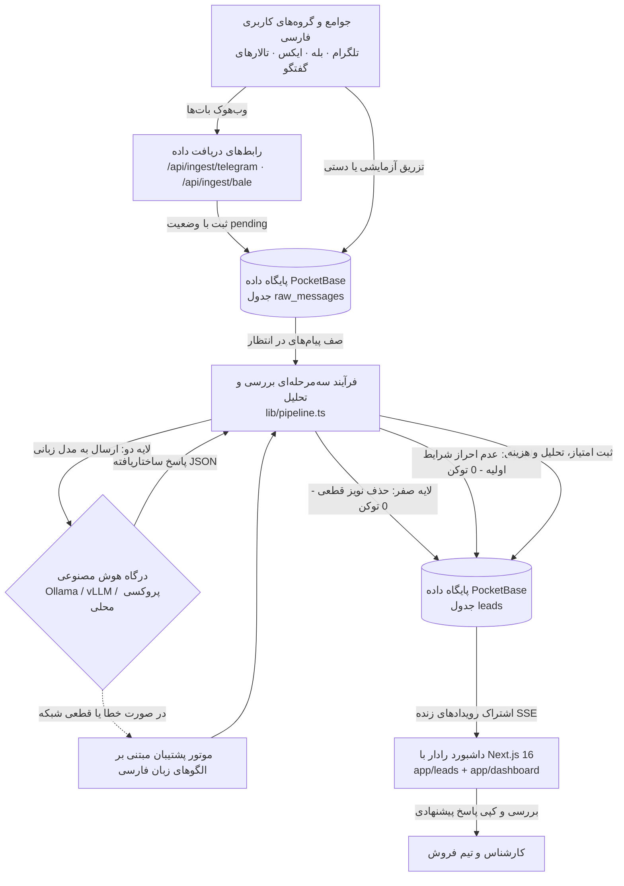

# مستندات فنی جامع سامانه رادار

> این سند، مرجع فنی و راهنمای جامع معماری سامانه **رادار** است که برای مهندسان نرم‌افزار، معماران سیستم و مدیران فنی تدوین شده است. در این سند، تمامی جزئیات پیاده‌سازی، ساختار داده‌ها، فرآیند ارزیابی پیام‌ها، رابط‌های برنامه‌نویسی، تدابیر امنیتی و شیوه استقرار سامانه با دقت فنی کامل تشریح شده است.

---

## فهرست مطالب

- [۱. معرفی و نمای کلی سامانه](#۱-معرفی-و-نمای-کلی-سامانه)
- [۲. معماری سامانه و جریان داده‌ها](#۲-معماری-سامانه-و-جریان-داده‌ها)
- [۳. فناوری‌های به‌کاررفته](#۳-فناوری‌های-به‌کاررفته)
- [۴. ساختار داده‌ها و پایگاه داده](#۴-ساختار-داده‌ها-و-پایگاه-داده)
- [۵. فرآیند سه‌مرحله‌ای بررسی و تحلیل پیام‌ها](#۵-فرآیند-سه‌مرحله‌ای-بررسی-و-تحلیل-پیام‌ها)
- [۶. دریافت و ورود داده‌ها](#۶-دریافت-و-ورود-داده‌ها)
- [۷. راهنمای رابط‌های برنامه‌نویسی (API Reference)](#۷-راهنمای-رابط‌های-برنامه‌نویسی-api-reference)
- [۸. دستیار هوشمند تعاملی](#۸-دستیار-هوشمند-تعاملی)
- [۹. احراز هویت، تفکیک داده‌ها و امنیت](#۹-احراز-هویت-تفکیک-داده‌ها-و-امنیت)
- [۱۰. تنظیمات و متغیرهای محیطی](#۱۰-تنظیمات-و-متغیرهای-محیطی)
- [۱۱. رابط کاربری و به‌روزرسانی لحظه‌ای](#۱۱-رابط-کاربری-و-به‌روزرسانی-لحظه‌ای)
- [۱۲. استقرار و راه‌اندازی در محیط عملیاتی](#۱۲-استقرار-و-راه‌اندازی-در-محیط-عملیاتی)
- [۱۳. راهنمای راهبری و نگهداری (Operations Runbook)](#۱۳-راهنمای-راهبری-و-نگهداری-operations-runbook)
- [۱۴. ساختار پروژه و فایل‌ها](#۱۴-ساختار-پروژه-و-فایل‌ها)
- [۱۵. محدودیت‌های فعلی و نقشه راه توسعه](#۱۵-محدودیت‌های-فعلی-و-نقشه-راه-توسعه)

---

## ۱. معرفی و نمای کلی سامانه

**رادار** یک سامانه نرم‌افزاری محلی و خودمیزبان برای شناسایی، سنجش و اولویت‌بندی نشانه‌های خرید شرکتی (B2B Buying-Intent Engine) در بسترهای گفت‌وگوی فارسی‌زبان است. در بازار تجاری و فناوری ایران، بخش عمده‌ای از نیازمندی‌ها، تقاضاهای فوری خرید نرم‌افزار، جایگزینی ابزارهای خارجی به دلیل تحریم یا فیلترینگ و دردهای کاری تصمیم‌گیرندگان، در سوپرگروه‌ها و کانال‌های تلگرام، پیام‌رسان بله و انجمن‌های تخصصی مطرح می‌شود.

پایش دستی این محیط‌ها به دلیل حجم بالای پیام‌های نامربوط، آگهی‌ها و احوال‌پرسی‌های روزمره (بیش از ۸۰٪ حجم کل پیام‌ها) برای تیم‌های فروش و بازاریابی بسیار زمان‌بر و خسته‌کننده است. رادار با پیاده‌سازی یک فرآیند غربالگری سه‌مرحله‌ای، پیام‌های بی‌ارزش را بدون مصرف منابع پردازشی گران‌قیمت یا توکن‌های هوش مصنوعی حذف می‌کند، پیام‌های باارزش را با مدل‌های زبانی تحلیل کرده و به هر فرصت امتیازی بین ۰ تا ۱۰۰ اختصاص می‌دهد. در نهایت، سامانه یک پاسخ پیشنهادی حرفه‌ای و متناسب با فرهنگ تجاری ایران تدوین می‌کند تا کارشناس فروش بتواند با یک کلیک وارد مذاکره شود.

تمامی بخش‌های رادار روی یک سرور مستقل و بدون کمترین وابستگی به سرویس‌های ابری خارجی اجرا می‌شوند.

### شاخص‌های کلیدی پیاده‌سازی

| شاخص | مقدار پیاده‌سازی‌شده | توضیح فنی |
| :--- | :--- | :--- |
| **تعداد لایه‌های ارزیابی** | ۳ مرحله (قواعد قطعی، غربال اولیه، تحلیل عمیق) | لایه‌های صفر و یک بدون مصرف توکن اجرا می‌شوند. |
| **سطوح قصد خرید** | `high_intent` ،`problem_aware` ،`curious` ،`irrelevant` | تفکیک پیام‌ها به چهار دسته مشخص تجاری |
| **وضعیت‌های پیام خام** | `pending` ،`processed` ،`filtered` ،`error` | چرخه حیات پیام در جدول `raw_messages` |
| **وضعیت‌های سرنخ فروش** | `new` ،`approved` ،`contacted` ،`dismissed` | فرآیند اقدام و پیگیری فروش توسط کاربر |
| **بسترهای منبع پیام** | `telegram` ،`bale` ،`twitter_x` ،`forum` | منابع ورودی پشتیبانی‌شده در مدل داده |
| **هزینه پردازش در لایه‌های ۰ و ۱** | صفر توکن (پردازش صرفاً روی CPU) | حذف بیش از ۸۰٪ نویز با هزینه محاسباتی نزدیک به صفر |
| **مهلت زمانی پاسخ هوش مصنوعی** | ۱۲ ثانیه | پس از این مدت، سامانه بلافاصله به موتور پشتیبان سوئیچ می‌کند. |

---

## ۲. معماری سامانه و جریان داده‌ها

معماری رادار به گونه‌ای طراحی شده است که جریان انتقال داده همواره **یک‌طرفه و امن** باشد. هیچ پیامی به صورت خودکار و بدون نظارت انسانی به گروه‌ها یا کانال‌های عمومی ارسال نمی‌شود و تصمیم‌گیری نهایی برای برقراری ارتباط بر عهده کارشناس فروش است (Human-in-the-Loop).



### نقش و مسئولیت بخش‌های اصلی سامانه

| بخش | مسیر فایل منبع | شرح مسئولیت و عملکرد |
| :--- | :--- | :--- |
| **رابط‌های دریافت داده** | `app/api/ingest/*/route.ts` و `lib/ingest.ts` | دریافت وب‌هوک‌ها، بررسی امضای امنیتی، پیشگیری از پیام‌های تکراری و ثبت پیام در صف |
| **فرآیند ارزیابی پیام‌ها** | `lib/pipeline.ts` | هدایت پیام از لایه صفر تا لایه دو و ثبت خروجی نهایی در جدول سرنخ‌ها |
| **لایه صفر و یک** | `lib/prefilter.ts` | فیلتر قواعد قطعی، بررسی طول متن و تطبیق سریع الگوهای نیاز بدون مصرف توکن |
| **لایه دو (تحلیل عمیق)** | `lib/llm.ts` (`evaluateMessageWithLLM`) | ارسال پرامپت کپسوله‌شده به مدل زبانی و هدایت به موتور پشتیبان در شرایط اضطراری |
| **اسکنر خودکار ساعتی** | `lib/botScheduler.ts` | پردازش دوره‌ای پیام‌های بازار در پس‌زمینه سرور بر مبنای سهمیه پلن کاربران |
| **پردازشگر پس‌زمینه** | `scripts/worker.ts` | تخلیه و پردازش پیام‌های صف در زمان اجرای مستقل |
| **راه‌اندازی ساختار دیتابیس** | `pocketbase/setup_schema.ts` | ساخت جداول، اعمال دسترسی‌های امنیتی و مهاجرت فیلدهای جدید |
| **رابط کاربری و کارتابل** | `app/leads/page.tsx` و `app/dashboard/page.tsx` | نمایش زنده سرنخ‌ها با اشتراک SSE، مدیریت وضعیت و اعمال فیلترها |

---

## ۳. فناوری‌های به‌کاررفته

سامانه رادار بر پایه پشته‌ای مدرن و سبک پیاده‌سازی شده است تا بتواند با کمترین منابع سروری و بدون افت کارایی به فعالیت ادامه دهد:

| لایه سامانه | فناوری و ابزار | توضیحات فنی |
| :--- | :--- | :--- |
| **محیط اجرا و مدیریت بسته‌ها** | Bun 1.4+ | سرعت بالا در اجرای TypeScript و اسکریپت‌های سیستمی |
| **چارچوب نرم‌افزاری وب** | Next.js 16 (App Router) و React 19 | استفاده از کامپایلر Turbopack و پروکسی لبه |
| **زبان برنامه‌نویسی** | TypeScript 5 (Strict Mode) | تضمین امنیت نوع داده‌ها در تمامی بخش‌های سامانه |
| **طراحی و استایل رابط کاربری** | Tailwind CSS v4 و Vanilla CSS | استایل‌دهی بر مبنای طراحی تیره اختصاصی |
| **پایگاه داده و لایه بلادرنگ** | PocketBase (موتور داخلی SQLite در حالت WAL) | دیتابیس خودمیزبان سبک با پشتیبانی نیتیو از SSE |
| **موتور هوش مصنوعی** | درگاه سازگار با استانداردهای OpenAI (Ollama یا vLLM) | امکان اتصال به مدل‌های سبک محلی مانند Gemma یا Llama |
| **موتور پشتیبان محلی** | موتور قاعده‌محور مبتنی بر الگوهای زبان فارسی | اجرای آفلاین و بدون توکن در کمتر از ۳ میلی‌ثانیه |
| **پروتکل‌های ورودی پیام** | وب‌هوک‌های Telegram Bot API و Bale Bot API | دریافت امن با اعتبارسنجی توکن‌های محرمانه |
| **فونت و تایپوگرافی** | فونت‌های محلی راوی (Ravi) و استعداد (Estedad) | بدون هرگونه فراخوانی از CDNهای خارجی |
| **آیکون‌ها** | مؤلفه‌های برداری درون‌خطی SVG در `components/Icons.tsx` | بدون افزودن وابستگی‌های سنگین خارجی |

---

## ۴. ساختار داده‌ها و پایگاه داده

پایگاه داده رادار بر بستر **PocketBase** پیاده‌سازی شده است. تمامی رکوردهای عملیاتی با دسترسی‌های امنیتی محدود شده‌اند؛ به این معنا که ایجاد، ویرایش و حذف رکوردها در جداول داده صرفاً توسط پروسه سرور (با دسترسی Superuser) امکان‌پذیر است (`createRule/updateRule/deleteRule = null`). دسترسی به رکوردهای کاربری در جدول `users` نیز کاملاً تفکیک‌شده و محدود به خود کاربر احرازشده است (`id = @request.auth.id`).

### ۱. جدول `users` (کاربران و هویت سازمانی)

| نام فیلد | نوع داده | وضعیت | شرح و کاربرد |
| :--- | :--- | :---: | :--- |
| `id` | text | خودکار | شناسه یکتای کاربر در پایگاه داده |
| `email` | email | الزامی | ایمیل کاری جهت ورود به سامانه (غیرتکراری) |
| `name` | text | الزامی | نام و نام خانوادگی کاربر |
| `company` | text | اختیاری | نام شرکت یا سازمان کاربر |
| `role` | text | اختیاری | سمت سازمانی (مدیر محصول، مدیر فروش و ...) |
| `product_name` | text | اختیاری | نام محصول اصلی تحت پایش کاربر |
| `product_description` | text | اختیاری | شرح ارزش‌آفرینی و ویژگی‌های محصول |
| `ideal_customer_profile`| text | اختیاری | شرح پرسونای مشتری ایده‌آل (ICP) |
| `onboarding_completed` | bool | اختیاری | نشانگر وضعیت تکمیل موفق فرآیند آنبوردینگ |
| `plan` | select | اختیاری | سطح اشتراک کاربر: `free`، `starter`، `growth`، `enterprise` |
| `product_id` | text | اختیاری | شناسه محصول اختصاصی متصل به کاربر |
| `has_fetched_initial` | bool | اختیاری | آیا اسکن و دریافت پیام‌های اولیه توسط کاربر انجام شده است |
| `bot_active` | bool | اختیاری | وضعیت فعال بودن اسکنر خودکار ساعتی برای این کاربر |
| `last_bot_run` | date | اختیاری | زمان آخرین اجرای موفق اسکنر خودکار برای کاربر |

### ۲. جدول `products` (شناسنامه محصول و پرسونای مشتری)

| نام فیلد | نوع داده | وضعیت | شرح و کاربرد |
| :--- | :--- | :---: | :--- |
| `id` | text | خودکار | شناسه محصول |
| `user_id` | relation | اختیاری | ارجاع به شناسه کاربر مالک محصول (تفکیک چندمستأجری) |
| `name` | text | الزامی | نام محصول یا خدمت تجاری |
| `tagline` | text | اختیاری | شعار تجاری کوتاه |
| `description` | text | الزامی | توضیحات کامل محصول (به پرامپت تحلیل اضافه می‌شود) |
| `value_propositions` | json | اختیاری | فهرست مزیت‌های رقابتی کلیدی محصول |
| `ideal_customer_profile`| text | الزامی | تعریف دقیق مشتری هدف (ICP) |
| `keywords` | json | اختیاری | کلیدواژه‌های پایش و غربالگری در لایه یک |

### ۳. جدول `sources` (کانال‌ها و منابع تحت پایش)

| نام فیلد | نوع داده | وضعیت | مقادیر و شرح |
| :--- | :--- | :---: | :--- |
| `id` | text | خودکار | شناسه منبع |
| `name` | text | الزامی | عنوان گروه یا کانال (به صورت خودکار توسط وب‌هوک ساخته می‌شود) |
| `platform` | select | الزامی | نوع پلتفرم: `telegram`، `bale`، `twitter_x`، `forum` |
| `status` | select | الزامی | وضعیت فعالیت: `active`، `paused` |

### ۴. جدول `raw_messages` (پیام‌های خام ورودی)

| نام فیلد | نوع داده | وضعیت | شرح و کاربرد |
| :--- | :--- | :---: | :--- |
| `id` | text | خودکار | شناسه پیام خام |
| `source_id` | relation | اختیاری | ارجاع به منبع پیام در جدول `sources` |
| `external_id` | text | اختیاری | شناسه پیام در بستر مبدأ جهت جلوگیری از پردازش تکراری |
| `author_handle` | text | الزامی | شناسه کاربری فرستنده پیام (مانند `@username`) |
| `content` | text | الزامی | متن پیام خام (حداکثر ۳۰۰۰ کاراکتر) |
| `thread_context` | text | اختیاری | متن پیام‌های قبلی یا زمینه گفتگو |
| `posted_at` | date | اختیاری | زمان انتشار پیام در پلتفرم مبدأ |
| `status` | select | الزامی | وضعیت پردازش: `pending`، `processed`، `filtered`، `error` |
| `user_id` | relation | اختیاری | ارجاع به کاربر دریافت‌کننده (جهت تفکیک کامل داده‌ها) |

### ۵. جدول `leads` (سرنخ‌های ارزیابی‌شده فروش)

| نام فیلد | نوع داده | وضعیت | مقادیر و شرح |
| :--- | :--- | :---: | :--- |
| `id` | text | خودکار | شناسه یکتای سرنخ |
| `raw_message_id` | relation | الزامی | ارجاع به پیام خام مبدأ در جدول `raw_messages` |
| `product_id` | relation | الزامی | ارجاع به محصول ارزیابی‌شده در جدول `products` |
| `user_id` | relation | اختیاری | ارجاع به کاربر مالک سرنخ جهت تفکیک کارتابل |
| `intent_score` | number | اختیاری | امتیاز شدت تمایل خرید از ۰ تا ۱۰۰ (مقدار ۰ معتبر است) |
| `intent_level` | select | الزامی | سطح نیت: `high_intent`، `problem_aware`، `curious`، `irrelevant` |
| `reasoning` | text | اختیاری | استدلال تحلیلی هوش مصنوعی به زبان فارسی روان |
| `matched_feature` | text | اختیاری | قابلیت منطبق محصول با نیاز کاربر به زبان فارسی |
| `suggested_reply` | text | اختیاری | متن پاسخ پیشنهادی جهت ارسال به مشتری |
| `input_tokens` | number | اختیاری | تعداد توکن‌های ورودی پرامپت |
| `output_tokens` | number | اختیاری | تعداد توکن‌های تولیدشده در پاسخ |
| `estimated_cost_usd` | number | اختیاری | برآورد هزینه پردازش پیام به دلار |
| `lead_status` | select | الزامی | وضعیت پیگیری: `new`، `approved`، `contacted`، `dismissed` |
| `notes` | text | اختیاری | یادداشت‌های تکمیلی و پیگیری کارشناس فروش (Auto-Saved) |

---

## ۵. فرآیند سه‌مرحله‌ای بررسی و تحلیل پیام‌ها

قلب تپنده رادار، فرآیند ارزیابی تدریجی پیام‌ها در `lib/pipeline.ts` است. تمامی مبادی ورودی سامانه (وب‌هوک‌ها، شبیه‌ساز زنده، اسکنر خودکار و اندپوینت‌های مستقیم) پیام‌های خود را از طریق تابع واحد `triagePendingMessage` ارزیابی می‌کنند تا هیچ‌گونه دوگانگی رفتاری رخ ندهد. برای ارزیابی‌های گذرا بدون ذخیره‌سازی، تابع `triageAdHocMessage` در دسترس است.

```text
[پیام ورودی خام]
       │
       ▼
┌────────────────────────────────────────────────────────┐
│ لایه صفر: فیلتر قطعی و حذف پیام‌های تکراری              │
│ • بررسی طول متن (حداقل ۱۲ کاراکتر)                     │
│ • حذف پیام‌های حاوی لینک خالی یا آگهی‌های اسپم          │
│ • شناسایی و خنثی‌سازی الگوهای تزریق پرامپت (امتیاز ۰)   │
│ • کنترل عدم تکرار در ۲۴ ساعت گذشته با هش SHA-256       │
│ • مصرف توکن: ۰ | هزینه مالی: ۰ تومان                    │
└────────────────────────────────────────────────────────┘
       │ (در صورت تأیید)
       ▼
┌────────────────────────────────────────────────────────┐
│ لایه یک: غربالگری اولیه نیت خرید                       │
│ • جستجوی نشانه‌های صریح خرید (buying_signal)           │
│ • شناسایی دردهای عملیاتی و گلایه‌ها (pain_signal)       │
│ • تطبیق سریع با کلیدواژه‌های تعریف‌شده محصول           │
│ • مصرف توکن: ۰ | هزینه مالی: ۰ تومان                    │
└────────────────────────────────────────────────────────┘
       │ (در صورت واجد شرایط بودن)
       ▼
┌────────────────────────────────────────────────────────┐
│ لایه دو: تحلیل عمیق هوش مصنوعی                         │
│ • پرامپت کامل کپسوله‌شده XML با شناسنامه محصول و ICP    │
│ • فراخوانی مدل زبانی با فرمت سخت‌گیرانه JSON           │
│ • تعیین امتیاز ۰ تا ۱۰۰، استدلال و تدوین پاسخ پیشنهادی   │
│ • پشتیبانی کامل از موتور جایگزین در صورت قطعی شبکه     │
│ • مصرف توکن: ~۱,۱۰۰ ورودی + ~۲۵۰ خروجی (~۴۰ تومان)      │
└────────────────────────────────────────────────────────┘
```

### جزئیات مراحل ارزیابی

#### ۱. لایه صفر: فیلتر قطعی و حذف داده‌های تکراری (`lib/prefilter.ts`)
این مرحله با پردازش مستقیم CPU در زمانی کمتر از ۱ میلی‌ثانیه و بدون کوچک‌ترین مصرف توکن اجرا می‌شود:
- **کنترل طول متن:** پیام‌های با طول کمتر از ۱۲ کاراکتر (`LAYER0_MIN_LENGTH`) با عنوان پیام خیلی کوتاه رد می‌شوند.
- **حذف آگهی‌ها و لینک‌های خالی:** الگوهای عضویت اجباری در کانال‌ها، سیگنال‌های ارز دیجیتال و لینک‌های تبلیغاتی حذف می‌گردند.
- **مقابله با تزریق دستور (Prompt Injection):** عبارات پرخطر نظیر دستورات نادیده‌گرفتن دستورالعمل‌های پیشین شناسایی شده و پیام با امتیاز قطعی ۰ و دسته‌بندی `irrelevant` رد می‌شود.
- **حذف داده‌های تکراری ۲۴ ساعته (`isDuplicateContent`):** متن پیام پس از نرمال‌سازی (یکدست‌سازی فاصله‌ها، نیم‌فاصله‌ها و حروف فارسی)، هش SHA-256 شده و با ۲۰۰ رکورد اخیر مقایسه می‌شود تا پیام‌های تکراری کانال‌ها بدون صرف هزینه کنار گذاشته شوند.

#### ۲. لایه یک: غربالگری اولیه نیت خرید (`screenIntent`)
یک موتور بولی سبک بدون هوش مصنوعی است که وجود حداقل یکی از معیارهای زیر را ارزیابی می‌کند:
- **نشانه‌های صریح خرید (`buying_signal`):** الگوهایی مانند *«قصد خرید داریم»*، *«نرم‌افزار چی پیشنهاد می‌دید»*، *«استعلام قیمت»*.
- **دردهای کاری و چالش‌های عملیاتی (`pain_signal`):** الگوهای بیان چالش مانند *«سامانه مودیان کلافه‌مون کرده»*، *«اکسل دستی خسته‌کننده شده»*، *«تحریم درگاه»*.
- **تطابق با کلیدواژه‌های محصول (`keyword_match`):** انطباق حداقل دو کلیدواژه، یا یک کلیدواژه در متون با طول بیش از ۸۰ کاراکتر.
پیام‌هایی که هیچ نشانه‌ای از نیاز تجاری نداشته باشند، با امتیاز ۱۲ به عنوان پیام فاقد سیگنال ثبت می‌شوند و به مرحله بعد نمی‌روند.

#### ۳. لایه دو: تحلیل عمیق هوش مصنوعی (`evaluateMessageWithLLM`)
پیام‌های راه‌یافته به این مرحله داخل تگ‌های ایزوله‌شده `<untrusted_community_message>` در پرامپت قرار می‌گیرند. مدل هوش مصنوعی با در نظر گرفتن مشخصات محصول و پرسونای مشتری (ICP)، پیام را تحلیل کرده و خروجی را با دمای پایین (`temperature: 0.1`) در قالب ساختاریافته JSON تحویل می‌دهد.
- **تایم‌اوت پاسخ:** مهلت دریافت پاسخ حداکثر ۱۲ ثانیه است.
- **محدودیت هم‌زمانی:** حداکثر ۳ پردازش هم‌زمان (`llmConcurrencyLimiter`) برای جلوگیری از فشار به منابع سرور.
- **تضمین خروجی فارسی (`ensurePersianText`):** عبارات خروجی مانند استدلال و قابلیت منطبق تمیزکاری شده و اصطلاحات خام انگلیسی ترجمه می‌شوند.
- **پاک‌سازی پاسخ پیشنهادی (`sanitizeSuggestedReply`):** حذف پیشوندهای غیرضروری و کاراکترهای مخرب با سقف طول ۱۲۰۰ کاراکتر.

### حسابداری و مدیریت هزینه توکن‌ها (`lib/pricing.ts`)
رادار به ازای هر پیام پردازش‌شده، آمار توکن‌های مصرفی را از خروجی مدل استخراج می‌کند. در صورت عدم ارسال متادیتا توسط درگاه یا استفاده از موتور پشتیبان، فرمول دقیق توکن‌های فارسی (`estimatePersianTokens`: میانگین ۰.۶۲ توکن به ازای هر کاراکتر فارسی) مبنای محاسبه قرار می‌گیرد.
- نرخ پایه دلاری توکن‌ها: ۰.۱۵ دلار به ازای هر ۱ میلیون توکن ورودی و ۰.۶۰ دلار به ازای هر ۱ میلیون توکن خروجی.
- نرخ معادل تومانی در داشبورد بر مبنای نرخ تبدیل واقعی محاسبه شده و برای لایه‌های صفر و یک همواره عدد صفر درج می‌گردد.

### موتور پشتیبان محلی (`heuristicPersianEvaluator`)
در صورت قطع ارتباط اینترنت بین‌الملل، بروز خطای درگاه هوش مصنوعی یا پایان مهلت ۱۲ ثانیه‌ای، رادار فرآیند را متوقف نمی‌کند؛ بلکه پیام بلافاصله توسط موتور پشتیبان محلی ارزیابی می‌شود. این موتور با تکیه بر بیش از ۳۰ الگوی پیشرفته عبارات باقاعده (Regex) زبان تجاری فارسی، سطح نیاز را تشخیص داده و پاسخی منطبق بر شناسنامه محصول تولید می‌کند.

---

## ۶. دریافت و ورود داده‌ها

### وب‌هوک‌های پیام‌رسان‌ها (مسیر اصلی دریافت پیام)

| آدرس وب‌هوک | پلتفرم هدف | هدر بررسی امضای امنیتی |
| :--- | :--- | :--- |
| `POST /api/ingest/telegram` | ربات تلگرام (Telegram Bot API) | `X-Telegram-Bot-Api-Secret-Token` |
| `POST /api/ingest/bale` | ربات پیام‌رسان بله (Bale Bot API) | `X-Bale-Secret-Token` |

هر دو وب‌هوک هدر جایگزین `X-Webhook-Secret` و کلید دسترسی برنامه‌نویسی `RADAR_API_KEY` در هدر `Authorization: Bearer` را نیز می‌پذیرند. فرآیند پردازش وب‌هوک‌ها در `lib/ingest.ts` به شرح زیر است:
۱. اعتبارسنجی توکن امنیتی با مقایسه زمان‌ثابت (`timingSafeEqual`) و کنترل سقف نرخ درخواست (۱۲۰ درخواست در دقیقه به ازای هر IP).
۲. استخراج متن پیام از بخش‌های `message`، `edited_message` یا `channel_post`. پیام‌های ربات‌ها (`is_bot: true`) و پیام‌های غیرمتنی (استیکر، تغییرات عضویت، نظرسنجی) نادیده گرفته شده و پاسخ `{"ignored": true}` بازگردانده می‌شود.
۳. ساخت یا بازیابی خودکار رکورد منبع در جدول `sources` متناظر با گروه یا کانال مبدأ (`findOrCreateSource`).
۴. کنترل عدم تکرار درخواست وب‌هوک با شناسه یکتای پیام (`tg:<chatId>:<messageId>`). پیام‌های تکراری با پاسخ `{"deduped": true}` بدون ارزیابی مجدد خاتمه می‌یابند.
۵. ثبت پیام خام در جدول `raw_messages` و اجرای فوری فرآیند ارزیابی سه‌مرحله‌ای.

### بات اسکنر خودکار ساعتی (`lib/botScheduler.ts`)
علاوه بر امکان تزریق آزمایشی پیام توسط کاربر، رادار مجهز به یک پردازشگر پس‌زمینه خودکار است:
- در فواصل زمانی یک‌ساعته در سرور اجرا می‌شود.
- کاربران فعال دارای محصول پیکربندی‌شده را استخراج می‌کند.
- متناسب با سقف ساعتی پلن هر کاربر (رایگان: ۱۰ پیام/ساعت، استارتر: ۳۰ پیام/ساعت، رشد: ۸۰ پیام/ساعت، سازمانی: ۲۰۰ پیام/ساعت)، پیام‌های جدید را وارد فرآیند سه‌مرحله‌ای ارزیابی کرده و با انتساب شناسه کاربر (`user_id`) در پایگاه داده PocketBase ذخیره می‌نماید.
- کاربر در داشبورد می‌تواند وضعیت این بات را به صورت اختصاصی فعال یا غیرفعال کند (`/api/bot/toggle`).

---

## ۷. راهنمای رابط‌های برنامه‌نویسی (API Reference)

تمامی اندپوینت‌های رادار به صورت پویا (`force-dynamic`) پردازش می‌شوند و ورودی‌های متنی با قوانین امنیتی `lib/validation.ts` پاک‌سازی می‌گردند.

| متد و مسیر | شیوه احراز هویت | محدودیت نرخ درخواست | ساختار داده ورودی | ساختار پاسخ و عملکرد |
| :--- | :---: | :---: | :--- | :--- |
| `POST /api/analyze` | نشست کوکی یا Bearer | سقف پلن کاربر | `{content, author_handle?, thread_context?, platform?, product_id?}` | تحلیل پیام و بازگرداندن نتیجه غربالگری و ارزیابی هوش مصنوعی |
| `POST /api/simulate` | نشست کوکی | سهمیه روزانه پلن | `{index?}` | تزریق یک پیام آزمایشی به کارتابل کاربر جاری و اجرای فرآیند بررسی و اولویت‌بندی |
| `POST /api/leads/fetch-initial` | نشست کوکی | سهمیه پلن کاربر | — | اسکن اولیه بازار برای کاربر جدید، ارزیابی و ذخیره مستقیم در پایگاه داده PocketBase |
| `POST /api/leads/status` | نشست کوکی | ۶۰ درخواست در دقیقه | `{leadId, status, notes?}` | ذخیره خودکار وضعیت و یادداشت پیگیری در پایگاه داده PocketBase با کنترل مالکیت داده |
| `POST /api/settings` | نشست کوکی | — | فیلدهای محصول (نام، ICP، کلیدواژه‌ها، مزایا) | ذخیره تغییرات محصول و همگام‌سازی پروفایل کاربر در پایگاه داده PocketBase |
| `POST /api/bot/cron` | توکن یا سشن ادمین | زمان‌بندی‌شده | — | فراخوانی چرخه اسکن خودکار ساعتی برای تمامی مستأجران فعال |
| `GET /api/bot/status` | نشست کوکی | — | — | گزارش وضعیت فعالیت بات، سقف ساعتی و زمان آخرین اجرا برای کاربر جاری |
| `POST /api/bot/toggle` | نشست کوکی | — | `{active: boolean}` | تغییر وضعیت فعال/غیرفعال بودن بات اسکنر ساعتی برای کاربر جاری |
| `POST /api/ingest/telegram` | Secret یا Bearer | ۱۲۰ درخواست در دقیقه | ساختار استاندارد وب‌هوک تلگرام | دریافت پیام، بررسی تکرار، ایجاد منبع و ارزیابی بلادرنگ |
| `POST /api/ingest/bale` | Secret یا Bearer | ۱۲۰ درخواست در دقیقه | ساختار استاندارد وب‌هوک بله | پردازش پیام‌های دریافتی از پیام‌رسان بله |
| `POST /api/assistant` | بدون احراز (آزاد) | بدون محدودیت | `{message, context?}` | مکالمه با دستیار متنی راهنمای کاربری در داشبورد |
| `POST /api/auth/register` | عمومی | ۵ درخواست در دقیقه | `{name, email, password, passwordConfirm}` | ثبت‌نام کاربر جدید با پلن رایگان، برقراری سشن و ریدایرکت به آنبوردینگ |
| `POST /api/auth/login` | عمومی | ۱۰ درخواست در دقیقه | `{email, password}` یا رمز ادمین | بررسی رمز عبور، برقراری سشن و بازگرداندن سوابق قبلی کاربر |
| `POST /api/auth/logout` | عمومی | — | — | ابطال کوکی‌های `radar_session` و `radar_onboarded` |
| `GET /api/auth/session` | کوکی | — | — | استعلام وضعیت احراز هویت، اطلاعات حساب کاربری و پرچم‌های فعال |
| `POST /api/onboarding` | نشست کوکی | — | فیلدهای شرکت، سمت سازمانی، محصول و ICP | ایجاد محصول مستقل برای کاربر، تنظیم پرچم آنبوردینگ و ورود به کارتابل |

---

## ۸. دستیار هوشمند تعاملی

اندپوینت `POST /api/assistant` یک راهنمای گفت‌وگویی داخل داشبورد است که به کاربران در درک قابلیت‌های رادار، تفسیر امتیاز سرنخ‌ها و نگارش پاسخ‌ها کمک می‌کند:
- پرامپت سیستمی اختصاصی با دریافت بستر و شرایط کاری (Context) شامل تعداد سرنخ‌ها، فیلترهای فعال و صفحه جاری.
- زبان پاسخ متناسب با زبان ورودی کاربر تنظیم می‌شود.
- متصل به درگاه OpenRouter؛ در صورت اختلال در دسترسی اینترنت بین‌الملل، خطای ۵۰۲ بازمی‌گرداند.
- ⚠️ نکات امنیتی این بخش در فصل ۹ مورد بررسی قرار گرفته است.

---

## ۹. احراز هویت، تفکیک داده‌ها و امنیت

### ۱. معماری احراز هویت چندمستأجری (Multi-Tenant Authentication)
- **ثبت‌نام و کنترل رمز عبور:** ثبت‌نام کاربران در جدول `users` با بررسی عدم تکراری بودن ایمیل و اعتبارسنجی پیچیدگی رمز عبور (حداقل ۸ کاراکتر) صورت می‌پذیرد.
- **فرآیند آنبوردینگ اجباری:** کاربران بلافاصله پس از ثبت‌نام به صفحه `/onboarding` هدایت می‌شوند و تا زمان تکمیل اطلاعات شرکت و محصول، اجازه دسترسی به کارتابل سرنخ‌ها را ندارند.
- **ورود دوگانه:** سامانه علاوه بر ورود استاندارد کاربران با ایمیل و رمز، از ورود مدیر ارشد با رمز عبور سیستمی `RADAR_ADMIN_PASSWORD` جهت اقدامات نگهداری پشتیبانی می‌کند.

### ۲. مدیریت نشست و الگوی دوکوکی (Dual-Cookie Session)
- **کوکی `radar_session`:** توکن استاندارد JWT پاکت‌بیس یا توکن امضاشده HMAC مدیر سیستم با طول عمر ۳۰ روز (`Max-Age=2592000`) به صورت `HttpOnly`، `SameSite=Lax` و با پرچم `Secure` در محیط پروداکشن تنظیم می‌شود.
- **کوکی `radar_onboarded`:** کوکی امن جهت تشخیص وضعیت آنبوردینگ کاربر در لایه لبه بدون نیاز به کوئری سنگین دیتابیس.

### ۳. محافظت از مسیرها در لایه لبه با Next.js 16 (`proxy.ts`)
- مسیرهای `/leads`، `/dashboard` و `/settings` محافظت‌شده هستند و کاربران احرازشده به مسیر مقصد هدایت می‌شوند.
- هدایت متقابل در `/onboarding`: کاربران مهمان به صفحه ورود و کاربران تکمیل‌شده به کارتابل سرنخ‌ها ریدایرکت می‌شوند تا از بروز هرگونه حلقه بازگشتی (Redirect Loop) پیشگیری شود.

### ۴. تفکیک کامل داده‌ها و ذخیره‌سازی خودکار در دیتابیس (PocketBase Auto-Save)
- **ایزولاسیون داده‌ها با `user_id`:** رکوردهای `leads`، `raw_messages` و `products` به شناسه کاربر متصل هستند. هر کاربر پس از ورود منحصراً داده‌های مرتبط با محصول خود را مشاهده می‌کند.
- **عدم تزریق داده‌های ساختگی:** حساب‌های کاربری جدید با کارتابل خالی باز می‌شوند و کاربر با کلیک بر روی دکمه اختصاصی، نخستین پیام‌های بازار را واکشی و در دیتابیس ذخیره می‌کند.
- **ذخیره خودکار تغییرات:** تمامی اقدامات کاربری (تغییر وضعیت سرنخ، نوشتن یادداشت، به‌روزرسانی تنظیمات محصول) بلافاصله در پایگاه داده محلی پاکت‌بیس ثبت شده و نشانگر وضعیت همگام‌سازی لحظه‌ای در بالای کارتابل نمایش داده می‌شود.

### ۵. کنترل سهمیه و نرخ درخواست بر مبنای پلن کاربری (`lib/rateLimit.ts`)
| پلن کاربری | سقف درخواست در دقیقه | سقف ارزیابی روزانه | سقف تزریق آزمایشی | سقف اسکنر ساعتی |
| :--- | :---: | :---: | :---: | :---: |
| **رایگان (`free`)** | ۱۵ درخواست | ۱۰۰ پیام در روز | ۳۰ پیام در روز | ۱۰ پیام در ساعت |
| **استارتر (`starter`)** | ۶۰ درخواست | ۱,۵۰۰ پیام در روز | ۳۰۰ پیام در روز | ۳۰ پیام در ساعت |
| **رشد (`growth`)** | ۱۸۰ درخواست | ۵,۰۰۰ پیام در روز | ۱,۰۰۰ پیام در روز | ۸۰ پیام در ساعت |
| **سازمانی (`enterprise`)** | ۵۰۰ درخواست | ۲۵,۰۰۰ پیام در روز | ۵,۰۰۰ پیام در روز | ۲۰۰ پیام در ساعت |

*مدیر ارشد سیستم (`userId === "admin"`) از تمامی محدودیت‌های سهمیه‌بندی معاف است.*

### ۶. تدابیر امنیتی و هدرهای پاسخ
- **جهت ورودی‌های حساس (LTR Inputs):** فیلدهای پسورد و ایمیل با ویژگی `dir="ltr"` پیاده‌سازی شده‌اند تا تراز متن و کلیدهای نمایش رمز بدون تداخل نمایش داده شوند.
- **امنیت تحلیل زمانی:** مقایسه کلیدهای API و پسوردها با الگوریتم زمان‌ثابت `timingSafeEqual`.
- **سیاست امنیت محتوا (CSP):** در فایل `next.config.ts`، ارتباطات خارجی به مبدأ خود سرور و پورت دیتابیس محدود شده و فریم‌بندی صفحه با `frame-ancestors 'none'` مسدود است.

### ⚠️ وضعیت یافته‌های امنیتی و اقدامات اصلاحی
۱. **کلید OpenRouter در سورس:** در `app/api/assistant/route.ts` یک کلید پیش‌فرض قرار گرفته که باید به متغیرهای محیطی منتقل شود.
۲. **مسیر `/api/assistant`:** فاقد محدودیت نرخ درخواست است و در فاز بعدی باید به محدودکننده سهمیه متصل شود.
۳. ✅ **ایمن‌سازی مسیر وضعیت سرنخ‌ها (`/api/leads/status`):** اکنون با احراز هویت سشن کاربر، کنترل مالکیت داده چندمستأجری و سقف ۶۰ درخواست در دقیقه محافظت می‌شود.

---

## ۱۰. تنظیمات و متغیرهای محیطی

تنظیمات سامانه در فایل `.env` یا متغیرهای سیستمی سرور پیکربندی می‌شوند:

| متغیر محیطی | مقدار پیش‌فرض | شرح و راهنمای تنظیم |
| :--- | :--- | :--- |
| `POCKETBASE_URL` | `http://127.0.0.1:8090` | آدرس دسترسی سروری به پایگاه داده داخلی |
| `NEXT_PUBLIC_POCKETBASE_URL` | `http://127.0.0.1:8090` | آدرس عمومی پایگاه داده برای اشتراک رویدادهای زنده مرورگر |
| `POCKETBASE_ADMIN_EMAIL` | `admin@leadradar.local` | ایمیل حساب Superuser پایگاه داده |
| `POCKETBASE_ADMIN_PASSWORD` | — | رمز عبور Superuser دیتابیس (حداقل ۱۶ کاراکتر) |
| `RADAR_ADMIN_PASSWORD` | `"BuildX"` | رمز عبور ورود اضطراری مدیر سیستم به داشبورد |
| `RADAR_API_KEY` | — | کلید دسترسی برنامه‌نویسی برای ارسال وب‌هوک و ورکرها |
| `TELEGRAM_BOT_TOKEN` | — | توکن ربات تلگرام دریافت‌شده از BotFather |
| `TELEGRAM_WEBHOOK_SECRET` | — | امضای محرمانه ارسالی تلگرام در هدر وب‌هوک |
| `BALE_BOT_TOKEN` | — | توکن ربات پیام‌رسان بله دریافت‌شده از بازوی بله |
| `BALE_WEBHOOK_SECRET` | — | امضای محرمانه ارسالی بله در هدر وب‌هوک |
| `LLM_BASE_URL` | `http://localhost:11434/v1` | آدرس درگاه مدل زبانی سازگار با استاندارد OpenAI |
| `LLM_API_KEY` | `dummy` | کلید احراز هویت درگاه مدل زبانی |
| `LLM_MODEL` | `llama3.1` | شناسه مدل زبانی مورد استفاده جهت ارزیابی و تحلیل پیام‌ها |
| `INPUT_TOKEN_COST_PER_MILLION` | `0.15` | تعرفه دلاری هر ۱ میلیون توکن ورودی |
| `OUTPUT_TOKEN_COST_PER_MILLION`| `0.60` | تعرفه دلاری هر ۱ میلیون توکن خروجی |

---

## ۱۱. رابط کاربری و به‌روزرسانی لحظه‌ای

- **صفحات اصلی سامانه:**
  - `/` — صفحه معرفی و لندینگ پیج عمومی
  - `/leads` — کارتابل اختصاصی مدیریت سرنخ‌های فروش (نیازمند لاگین)
  - `/dashboard` — پیشخوان تحلیلی و فید زنده جریان پیام‌ها (نیازمند لاگین)
  - `/settings` — مدیریت مشخصات محصول، پرسونای مشتری و کلیدواژه‌ها (نیازمند لاگین)
  - `/login` و `/register` — احراز هویت ورود و ثبت‌نام
  - `/onboarding` — فرآیند تکمیل اطلاعات شرکت و محصول هدف
- **ارتباط زنده با پایگاه داده (SSE):** دریافت آنی سرنخ‌های جدید از طریق اشتراک در رویدادهای PocketBase (`pb.collection("leads").subscribe("*")`) بدون نیاز به رفرش دستی صفحه.
- **کارت‌های شاخص‌های کلیدی (KPIs):** نمایش لحظه‌ای مجموع پیام‌ها، درصد غربالگری نویز، سرنخ‌های واجد شرایط، هزینه مصرفی توکن به دلار و معادل سرشکن‌شده به تومان.
- **مدیریت وضعیت و یادداشت‌ها:** امکان تغییر وضعیت سرنخ به `approved`، `contacted` یا `dismissed` و نگارش یادداشت‌های پیگیری با ذخیره خودکار در دیتابیس.

---

## ۱۲. استقرار و راه‌اندازی در محیط عملیاتی

### معماری استقرار در سرور عملیاتی (تک‌سرور مستقل)

```text
اینترنت عمومی کاربران → وب‌سرور Caddy (مدیریت خودکار گواهی TLS / پورت‌های 80 و 443)
  ├─ https://radar.yourdomain.ir     → برنامه Next.js روی آدرس 127.0.0.1:3000
  └─ https://pb.radar.yourdomain.ir  → پایگاه داده PocketBase روی آدرس 127.0.0.1:8090
سرویس زمان‌بندی‌شده سرور → اسکنر پس‌زمینه خودکار (lib/botScheduler.ts)
درگاه محلی پردازش هوش مصنوعی → Ollama یا vLLM (یا استفاده از موتور پشتیبان آفلاین)
```

### استقرار خودکار با اسکریپت `DEPLOY.sh`
سامانه دارای اسکریپت راه‌اندازی کامل ویژه سرورهای اوبونتو و دبیان است:
```bash
git clone <آدرس-مخزن-گیت> /opt/radar && cd /opt/radar
sudo bash DEPLOY.sh --domain radar.yourdomain.ir
```
این اسکریپت مراحل زیر را به صورت خودکار و بدون نیاز به دخالت دستی انجام می‌دهد:
۱. نصب پیش‌نیازها شامل ران‌تایم Bun، وب‌سرور Caddy و دریافت باینری رسمی PocketBase.
۲. ایجاد کاربر سیستمی مجزا با حداقل سطح دسترسی (`radar`).
۳. پیکربندی سرویس‌های سیستمی Systemd (`radar-pb.service` و `radar-web.service`).
۴. ساخت ساختار جداول دیتابیس و اعتبارسنجی اتصال Superuser.
۵. کامپایل نهایی پروداکشن برنامه با Turbopack.
۶. پیکربندی وب‌سرور Caddy به همراه صدور خودکار گواهی امنیتی SSL (Let's Encrypt).

---

## ۱۳. راهنمای راهبری و نگهداری (Operations Runbook)

| اقدام عملیاتی | دستور اجرایی یا نحوه انجام | شرح کاربرد |
| :--- | :--- | :--- |
| **تنظیم وب‌هوک تلگرام** | `curl "https://api.telegram.org/bot<TOKEN>/setWebhook?url=https://<DOMAIN>/api/ingest/telegram&secret_token=<SECRET>"` | اتصال کانال تلگرام به سامانه |
| **بررسی وضعیت وب‌هوک** | `curl "https://api.telegram.org/bot<TOKEN>/getWebhookInfo"` | استعلام آخرین وضعیت و خطاهای وب‌هوک |
| **اجرای دستی اسکنر** | `curl -X POST https://<DOMAIN>/api/bot/cron -H "Authorization: Bearer <ADMIN_PASS>"` | اجرای یک دوره اسکن و ارزیابی دستی |
| **راه‌اندازی ساختار دیتابیس** | `bun run setup:pb` | اعمال تغییرات ساختار جداول و مهاجرت‌ها |
| **پشتیبان‌گیری فوری از دیتابیس** | `tar -czf pb-backup-$(date +%F).tar.gz pb_data/` | نسخه پشتیبان کامل از دیتابیس SQLite |
| **مشاهده گزارش‌های سیستمی** | `journalctl -u radar-web -f` و `journalctl -u radar-pb -f` | پایش رویدادها و خطاهای سرور |

---

## ۱۴. ساختار پروژه و فایل‌ها

```text
radar/
├── DEPLOY.sh                   # اسکریپت راه‌اندازی خودکار سرور عملیاتی
├── proxy.ts                    # پروکسی لایه لبه Next.js 16 جهت حفاظت از مسیرها
├── instrumentation.ts          # راه‌اندازی بات اسکنر پس‌زمینه در زمان شروع سرور
├── app/
│   ├── page.tsx                # صفحه لندینگ و معرفی عمومی
│   ├── leads/page.tsx          # کارتابل اختصاصی مدیریت سرنخ‌های فروش
│   ├── dashboard/page.tsx      # پیشخوان تحلیلی، فید زنده و کنترل بات ساعتی
│   ├── settings/page.tsx       # صفحه ویرایش مشخصات محصول و پرسونای مشتری
│   ├── login/page.tsx          # صفحه ورود کاربران با ورودی‌های استاندارد
│   ├── register/page.tsx       # صفحه ثبت‌نام کاربر جدید
│   ├── onboarding/page.tsx     # فرآیند آنبوردینگ مشخصات شرکت و محصول
│   └── api/
│       ├── ingest/telegram/    # اندپوینت دریافت وب‌هوک تلگرام
│       ├── ingest/bale/        # اندپوینت دریافت وب‌هوک بله
│       ├── bot/                # رابط‌های کنترل، استعلام و اجرای بات ساعتی
│       ├── leads/fetch-initial/# واکشی پیام‌های اولیه برای کاربران جدید
│       ├── leads/status/       # تغییر وضعیت و ذخیره یادداشت سرنخ در دیتابیس
│       ├── analyze/            # ارزیابی پیام با فرمت ورودی مستقیم
│       ├── simulate/           # تزریق پیام آزمایشی جهت ارزیابی در کارتابل
│       ├── settings/           # به‌روزرسانی مشخصات محصول در دیتابیس
│       ├── assistant/          # دستیار گفت‌وگویی راهنمای کاربری
│       └── auth/               # مسیرهای نشست، ثبت‌نام، ورود و خروج
├── components/                 # مؤلفه‌های بصری، کارت سرنخ، آیکون‌ها و ناوبری
├── lib/
│   ├── pipeline.ts             # فرآیند سه‌مرحله‌ای بررسی و تحلیل پیام‌ها (نقطه ورود واحد)
│   ├── prefilter.ts            # قواعد لایه صفر و غربالگری لایه یک
│   ├── botScheduler.ts         # موتور اسکنر خودکار ساعتی پیام‌های بازار
│   ├── ingest.ts               # دریافت پیام، کنترل تکرار و ساخت منابع
│   ├── llm.ts                  # کلاینت هوش مصنوعی و موتور پشتیبان محلی
│   ├── pricing.ts              # محاسبه دقیق هزینه توکن‌ها به دلار و تومان
│   ├── pocketbase.ts           # تعاریف داده، کلاینت دیتابیس و نشست ادمین
│   ├── auth.ts                 # مدیریت نشست، کوکی‌ها و اعتبارسنجی امنیتی
│   ├── validation.ts           # اعتبارسنجی ورودی‌ها و پاک‌سازی عبارات
│   ├── rateLimit.ts            # سهمیه‌بندی پلن‌ها و کنترل هم‌زمانی مدل
│   └── cn.ts                   # ابزار ادغام کلاس‌های استایل
├── scripts/
│   ├── worker.ts               # پروسه پردازشگر پیام‌های صف
│   └── seed_demo.ts            # پیام‌های آزمایشی محیط دمو
├── pocketbase/
│   ├── pocketbase              # باینری محلی پایگاه داده
│   └── setup_schema.ts         # تعریف جداول، دسترسی‌ها و مهاجرت فیلدها
├── docs/                       # مستندات فنی، طرح تجاری و اسلایدهای ارائه
└── public/fonts/               # قلم‌های محلی راوی و استعداد
```

---

## ۱۵. محدودیت‌های فعلی و نقشه راه توسعه

### محدودیت‌های نسخه فعلی
۱. **پایش بسترهای گفتگو:** دریافت پیام‌ها در حال حاضر از طریق وب‌هوک رسمی ربات تلگرام و بله انجام می‌شود. برای پایش گروه‌هایی که ربات‌ها در آن‌ها دسترسی ندارند، نیاز به راه‌اندازی حساب کاربری خودکار (Userbot MTProto) است.
۲. **بررسی عدم تکرار پیام‌ها:** کنترل پیام‌های تکراری ۲۴ ساعته در لایه صفر روی ۲۰۰ پیام اخیر اعمال می‌شود تا سرعت پاسخ‌دهی دیتابیس در بالاترین سطح بماند.
۳. **پایداری دستیار هوشمند:** دستیار تعاملی متنی (`/api/assistant`) به درگاه خارجی متصل است و در زمان قطعی کامل اینترنت جهانی، امکان پاسخ‌دهی آفلاین ندارد.
۴. **محدودسازی نرخ در حافظه:** سقف نرخ درخواست‌ها روی حافظه موقت پروسه نگهداری می‌شود و با راه‌اندازی مجدد سرور بازنشانی می‌گردد.

### نقشه راه توسعه فنی (Roadmap)
- **کوتاه‌مدت (۱ تا ۲ ماه):**
  - اتصال وب‌هوک‌های خروجی برای ارسال مستقیم سرنخ‌های تأییدشده به نرم‌افزارهای CRM سازمانی (مانند دیدار و پیام‌گستر).
  - راه‌اندازی اطلاع‌رسانی پیامکی سریع برای سرنخ‌های با امتیاز بالای ۸۰ از طریق درگاه‌های پیامکی داخلی.
  - انتقال کلیدهای درگاه دستیار به متغیرهای محیطی و اعمال سقف نرخ درخواست بر روی آن.
- **میان‌مدت (۳ تا ۴ ماه):**
  - پیاده‌سازی خزنده اختصاصی Userbot برای پایش کانال‌ها و سوپرگروه‌های عمومی تلگرام بدون نیاز به عضویت ربات.
  - مهاجرت سیستم صف پیام‌ها به موتور پایدار بر پایه SQLite Queue جهت پشتیبانی از بارهای ترافیکی بسیار بالا.
- **بلندمدت (۵ تا ۶ ماه):**
  - تنظیم دقیق (Fine-tuning) یک مدل سبک زبانی ۳ تا ۸ میلیاردی روی داده‌های بومی تعاملات فروش در ایران جهت استقرار ۱۰۰٪ آفلاین روی کارت‌های گرافیکی داخلی شرکت‌ها.
