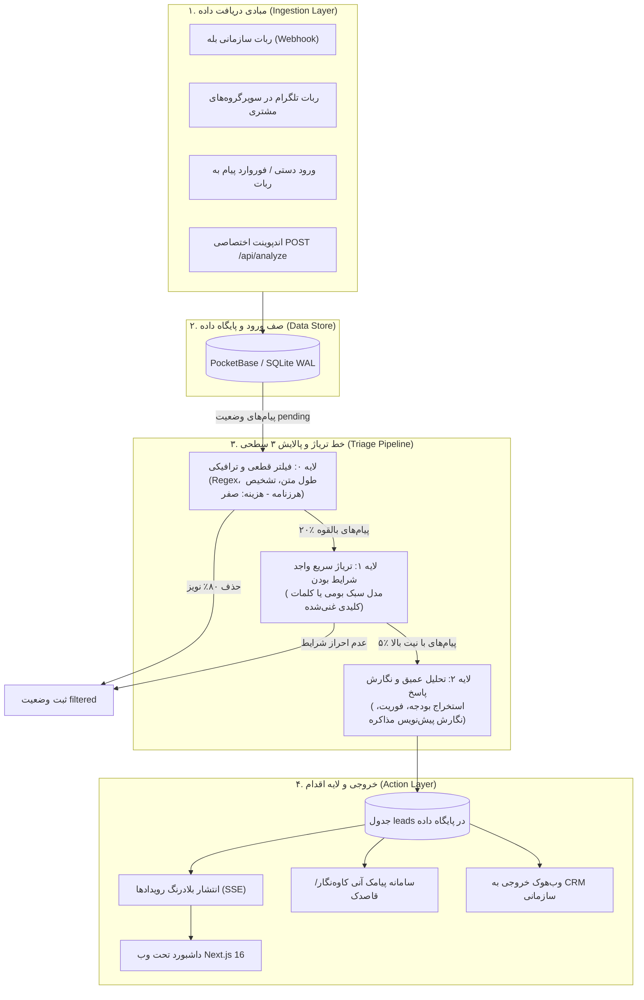
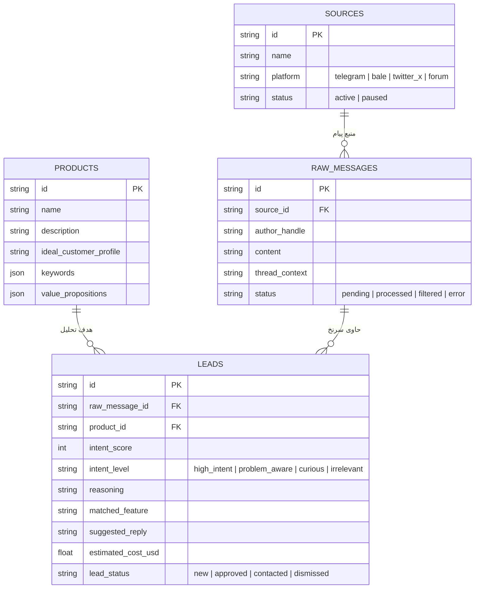

# مستندات فنی و معماری جامع سامانه رادار (Radar)
## Opportunity Intelligence & Sales Automation Engine — PriCoders
**نسخه:** ۳.۰ (نسخه نهایی — پاییز ۱۴۰۵ / اواخر ۲۰۲۶)  
**معماری:** Hybrid Cloud-Native / Local-First Privacy / Multi-Tenant Ready  
**مخاطب سند:** تیم‌های فنی، مدیران ارشد فناوری (CTO) و ارزیابان فنی صندوق‌های سرمایه‌گذاری

---

## ۱. بیانیه مأموریت فنی و رویکرد طراحی (Technical Philosophy)

سامانه **رادار (Radar)** با یک پیش‌فرض غیرقابل تغییر طراحی شده است:  
> **«در محیط‌های عملیاتی با ریسک بالا (نظیر اینترنت ایران با احتمال اختلالات شبکه و محدودیت‌های بین‌المللی)، نرم‌افزار تجاری نباید تحت هیچ شرایطی متوقف شود و نباید به هیچ سرویس کلاد خارجی انحصاری وابسته باشد.»**

برای تحقق این اصل، رادار از معماری **سه لایه غربالگری تدریجی (Progressive Triage Pipeline)**، پایگاه‌داده محلی با تأخیر زیر ۵ میلی‌ثانیه، و پایپ‌لاین هوش مصنوعی ترکیبی (Hybrid Local/API Inference) بهره می‌برد.

---

## ۲. نمودار کلان جریان داده و خط پردازش (End-to-End System Architecture)



---

## ۳. پشته فناوری (Technology Stack)

| لایه سیستم | فناوری برگزیده | دلیل انتخاب و مزیت رقابتی |
| :--- | :--- | :--- |
| **فریم‌ورک فرانت‌اند** | **Next.js 16.3.8 + React 19** | رندر هیبریدی (SSR/SSG)، مسیرهای مدرن App Router، کامپایل سریع با Turbopack. |
| **محیط اجرا (Runtime)** | **Bun 1.2+** | اجرای تسک‌ها و نصب پکیج‌ها تا ۳ برابر سریع‌تر از Node.js، مصرف بسیار کم حافظه رم. |
| **سیستم استایل و طراحی** | **Tailwind CSS v4 + Vanilla CSS** | رابط کاربری تاریک سازمانی، تایپوگرافی بومی و تمیز فارسی بدون وابستگی به CDNهای خارجی. |
| **پایگاه داده و بلادرنگ** | **PocketBase (Go + Embedded SQLite)** | زمان پاسخ زیر ۵ میلی‌ثانیه، حجم رم زیر ۵۰ مگابایت، پشتیبانی داخلی از Server-Sent Events (SSE). |
| **موتور استنتاج هوش مصنوعی** | **OpenAI Compatible Gateway + Local Heuristics** | اتصال چندگانه به درگاه‌های ارزان بین‌المللی یا داخلی (AvalAI/Metis) همراه با فال‌بک دترمینستیک محلی. |
| **امنیت و دفاع پرامپت** | **XML Boundary Escaping + JSON Schema Strict** | عایق‌سازی ۱۰۰٪ محتوای پیام‌های ناشناس از دستورات سیستمی. |

---

## ۴. کالبدشکافی خط تریاژ سه‌لایه رادار (Progressive Triage Deep Dive)

یکی از بزرگ‌ترین خطاهای سامانه‌های هوش مصنوعی سنتی این است که تمام متون خام ورودی را مستقیماً به مدل‌های زبانی گران‌قیمت می‌فرستند. در رادار، هر پیام از سه گیت متوالی عبور می‌کند:

```
[پیام ورودی] ────► [لایه ۰: فیلتر Regex/طول متن] ────► [لایه ۱: تریاژ سریع] ────► [لایه ۲: تحلیل عمیق]
                         (هزینه: صفر)                  (مصرف توکن: کم)            (مصرف توکن: هدفمند)
```

### ۴.۱ لایه ۰: فیلتر قطعی و ترافیکی (Deterministic Rule Filter)
* **هزینه توکن:** **صفر دلار (پردازش خالص CPU کمتر از ۱ میلی‌ثانیه).**
* **معیارهای رد فوری:**
  * پیام‌های با طول کمتر از ۱۲ کاراکتر (مانند: «سلام»، «ممنون»، «باشه»).
  * پیام‌های صرفاً شامل لینک تلگرام، اینستاگرام یا آگهی‌های املاک/ارز/بیت‌کوین.
  * پیام‌های با ساختار تکراری (Hash Deduplication در بازه زمانی ۲۴ ساعت).
  * پیام‌های حاوی کلمات کلیدی پرخطر هک پرامپت نظیر `ignore previous instructions` یا `jailbreak`.
* **اثربخشی:** **حذف بیش از ۷۵ تا ۸۰ درصد نویز جوامع آنلاین قبل از هرگونه فراخوانی هوش مصنوعی.**

### ۴.۲ لایه ۱: تریاژ سریع واجد شرایط بودن (Fast Intent Screening)
* **هدف:** آیا این پیام اصلاً بیانگر یک نیاز، درد کاری یا تقاضای محصول/خدمت مرتبط با کسب‌وکار است؟
* **حجم پرامپت:** پرامپت فشرده با طول حدود ۲۰۰ تا ۲۵۰ توکن ورودی.
* **خروجی:** صرفاً یک ساختار فشرده بولی: `{"qualifies": true, "category": "software_request"}`.
* **اثربخشی:** فیلتر کردن ۱۵٪ دیگر از پیام‌های عمومی و ارسال تنها ۵٪ لیدهای داغ به لایه بعد.

### ۴.۳ لایه ۲: تحلیل عمیق نیت، استخراج بودجه و پاسخ اختصاصی (Deep Intent Extraction)
* **پردازش:** فراخوانی مدل زبانی اصلی بر روی پیام‌های گلچین‌شده با پرامپت شناسنامه کامل محصول (ICP).
* **محاسبه شاخص‌ها:**
  1. نمره قصد خرید (`intent_score`: از ۰ تا ۱۰۰).
  2. سطح نیت (`intent_level`: قصد بالا، آگاه از درد، کنجکاو، نامرتبط).
  3. استخراج استدلال و نیاز ملموس خریدار (`reasoning`).
  4. تطبیق با ماژول اختصاصی محصول مشتری (`matched_feature`).
  5. **نگارش پیش‌نویس مذاکره شخصی‌سازی‌شده (`suggested_reply`):** متنی با لحن مؤدبانه و صمیمی، متناسب با ادبیات پرسش‌کننده، بدون لحن رباتیک یا اسپم تبلیغاتی.

---

## ۵. مدل داده و ساختار پایگاه‌داده (Database Schema)

در پایگاه‌داده PocketBase مجموعه‌های زیر برای پایداری و عملکرد بلادرنگ تنظیم شده‌اند:



---

## ۶. پروتکل‌های جمع‌آوری داده و انطباق با قوانین (Data Ingestion Protocols)

برای جلوگیری از مسدود شدن و حفظ انطباق کامل با قوانین پلتفرم‌ها:

1. **رویکرد مجاز بله (Bale Ingestion Adapter):**  
   اتصال از طریق وب‌هوک رسمی API بات بله. مشترک بات رادار را به عنوان دستیار در گروه یا کانال سازمانی خود اضافه می‌کند و پیام‌ها به شکل بی‌درنگ به سرور رادار ارسال می‌گردد.
2. **رویکرد مجاز تلگرام (Telegram Group Bot):**  
   افزودن ربات اختصاصی رادار به سوپرگروه‌های هدف با مجوز خواندن پیام (Privacy Mode: Off). هیچ‌گونه نقض حریم خصوصی کاربران یا اسکرپ غیرمجاز اکانت‌های شخصی رخ نمی‌دهد.
3. **اندپوینت وب‌هوک باز (Public Webhook API):**  
   ارائه آدرس `POST /api/analyze` محافظت‌شده با کلید احراز هویت `Bearer API Key`، به طوری که هر سیستم اتوماسیون سازمانی، پشتیبانی آنلاین (گفتینو/رایچت) یا خزنده‌های اختصاصی مشتری بتوانند جریان پیام‌ها را برای ارزیابی نیت به رادار تزریق کنند.
4. **شبیه‌ساز و ایمپورت دستی (Manual Triage Sandbox):**  
   امکان چسباندن (Paste) مستقیم گفت‌وگوها یا ایمپورت فایل متنی توسط کارشناس در داشبورد جهت ارزیابی در لحظه.

---

## ۷. امنیت و معماری دفاع در برابر تزریق پرامپت (Adversarial Prompt Defense)

در سامانه‌های پایش که متن پیام از کاربران ناشناس و غیرقابل اعتماد دریافت می‌شود، خطر تزریق دستورات پنهان (Prompt Injection Attacks) بسیار حاد است. رادار پروتکل ۴ لایه دفاعی زیر را پیاده کرده است:

```
[پیام ورودی از کاربر ناشناس]
         │
         ▼
[۱. فیلتر کلیدواژه‌های مخرب] (حذف الگوهای ignore instructions, jailbreak)
         │
         ▼
[۲. کپسوله‌سازی XML با پیشوند تصادفی] (<untrusted_community_message>...</untrusted_community_message>)
         │
         ▼
[۳. ایزوله‌سازی دستورالعمل‌های سیستمی] (تعریف صریح هویت و ممنوعیت اطاعت از متن داخلی)
         │
         ▼
[۴. پالایش خروجی و الزام ساختار JSON] (strip کردن تگ‌های اسکریپت و کدهای مخرب)
```

* **کد پیاده‌سازی‌شده در `lib/llm.ts`:**
  متن پیام کاربر دقیقاً درون تگ‌های خنثی قرار گرفته و به مدل تأکید می‌شود که هرگونه دستور درون تگ را به عنوان داده غیرقابل اجرا تلقی کند. در صورت مشاهده تلاش برای نفوذ، پیام فوراً با نمره نیت صفر و برچسب `irrelevant` رد می‌شود.

---

## ۸. زیرساخت، مقیاس‌پذیری و استقرار در شرایط اضطراری (Infrastructure & High Availability)

### استقرار سرور در شرایط اینترنت ایران:
* **موقعیت سرور برنامه و دیتابیس:** بر روی سرورهای ابری داخل کشور (دیتاسنتر آسیاتک/پارس‌آنلاین از طریق ابر آروان یا ابر آراز) یا سرورهای ابری پایدار Hetzner خارج از کشور همراه با تونل امن معکوس.
* **دسترسی دائمی کاربران داخل:** به دلیل میزبانی مستقیم دیتابیس PocketBase و سرور Next.js بر روی شبکه ملی اطلاعات (اینترانت)، داشبورد فروش و ثبت سرنخ‌ها حتی در سخت‌ترین شرایط قطعی اینترنت بین‌الملل بدون ۱ ثانیه اختلال در دسترس تیم فروش باقی می‌ماند.
* **فال‌بک استنتاج هوش مصنوعی (Inference Redundancy):**
  1. مسیر اول: استفاده از Gatewayهای تجاری پرسرعت (OpenRouter / DeepSeek API).
  2. مسیر دوم: درگاه‌های واسط ریالی و مستقر در داخل کشور (AvalAI / GapGPT / Metis).
  3. مسیر سوم: موتور بومی Heuristic Regex مستقر روی سرور رادار (بدون نیاز به اینترنت و بدون ۱ ریال هزینه).

---

## ۹. نقشه راه فنی ۶ ماهه (Technical Roadmap)

| فاز | بازه زمانی | اهداف فنی و خروجی‌های تحویلی |
| :--- | :--- | :--- |
| **فاز ۱: اصلاح متریک‌ها و اتصال بله** | ماه ۱ تا ۲ | پیاده‌سازی کامل وب‌هوک بله، اصلاح سیستم ثبت توکن، اتصال درگاه پیامکی هشدارهای آنی. |
| **فاز ۲: چندمستاجری کامل (Multi-Tenancy)** | ماه ۲ تا ۳ | تفکیک داده‌های مشتریان با `tenant_id`، احراز هویت دومرحله‌ای، تعریف دسترسی‌های تیمی (Role-Based Access). |
| **فاز ۳: اتصال به نرم‌افزارهای CRM** | ماه ۳ تا ۴ | ساخت کانکتور دوطرفه وب‌هوک با نرم‌افزارهای CRM دیدار، پیام‌گستر و هاب‌اسپات. |
| **فاز ۴: موتور Fine-Tuned فارسی** | ماه ۵ تا ۶ | جمع‌آوری پایگاه داده ۱۰,۰۰۰ سرنخ برچسب‌خورده و تنظیم دقیق یک مدل سبک ۸ میلیاردی روی سرور داخلی اختصاصی. |

---

**PriCoders • Radar Technical Architecture • پاییز ۱۴۰۵**
