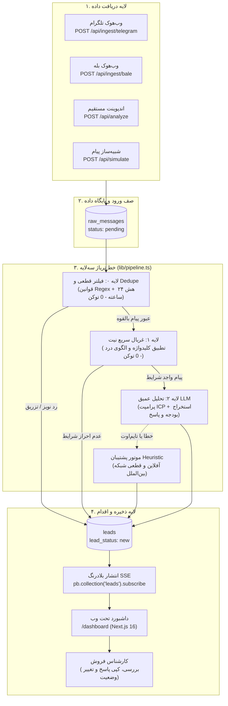

# مستندات فنی جامع سامانه رادار (Radar)
## موتور کشف نیت خرید B2B و تریاژ فرصت‌های فروش — PriCoders
**نسخه سند:** ۳.۱ (بازنگری فنی منطبق بر کد پیاده‌سازی‌شده — پاییز ۱۴۰۵ / اکتبر ۲۰۲۶)  
**معماری:** محلی و خودمیزبان (Zero Foreign Cloud Lock-in) / پردازش ۳ لایه‌ای تدریجی  
**مخاطب سند:** ارزیابان فنی، مدیران فناوری (CTO)، توسعه‌دهندگان و مهندسان هوش مصنوعی  

---

## ۱. معرفی Radar

### مسئله (Problem)
در اکوسیستم تجاری و فناوری ایران، رویکردهای مرسوم بازاریابی درون‌گرا (Inbound) و برون‌گرا (Outbound) با موانع اساسی زیرساختی و رفتاری روبه‌رو هستند:
* ایمیل مارکتینگ در معاملات بین‌شرکتی (B2B) نرخ بازگشایی زیر ۳٪ دارد و عملاً کارایی ندارد.
* پلتفرم‌های بین‌المللی مانند لینکدین به علت فیلترینگ گسترده، سرعت چرخه مذاکره پایینی دارند.
* بخش عمده‌ای از تصمیم‌گیرندگان، مدیران عامل، مدیران مالی و برنامه‌نویسان، تقاضاهای فوری خرید، نیازمندی به نرم‌افزارهای جایگزین و گلایه‌های کاری خود را در **سوپرگروه‌ها و کانال‌های تلگرام، پیام‌رسان بله و تالارهای گفتگوی تخصصی** مطرح می‌کنند.
* حجم پیام‌های روزمره در این جوامع بسیار بالاست (بیش از ۸۰٪ پیام‌ها نویز، سلام و احوال‌پرسی، آگهی و محتوای غیرمرتبط است). پایش دستی این پیام‌ها توسط نیروهای فروش (SDR) هم هزینه‌بر است و هم به دلیل خستگی انسانی، منجر به از دست رفتن فرصت‌های طلایی در دقایق اولیه می‌شود.

### راه‌حل (Solution)
**رادار (Radar)** یک موتور محلی و خودمیزبان برای کشف نیت خرید (Buying-Intent Engine) است. این سامانه پیام‌های ورودی از بسترهای تعاملی را دریافت کرده، نویزها را بدون مصرف منابع سنگین پردازشی حذف می‌کند، شدت نیاز و آمادگی خرید را از ۰ تا ۱۰۰ امتیازدهی می‌نماید و برای پیام‌های واجد شرایط، پیش‌نویس پاسخ شخصی‌سازی‌شده و مستدل به زبان فارسی تدوین می‌کند تا کارشناس فروش با یک کلیک مذاکره را آغاز کند.

### جایگاه محصول (Product Positioning)
رادار ابزار روابط عمومی (PR) یا تحلیل احساسات عمومی (مانند زلکا یا نیوزباکس) نیست؛ بلکه یک ابزار تخصصی **شتاب‌دهنده فروش سازمانی (B2B Revenue Acceleration)** است که صرفاً بر شناسایی سیگنال تقاضای تجاری و تبدیل آن به سرنخ فروش تمرکز دارد.

### هدف MVP (MVP Scope)
اثبات خط پردازش کامل و پایدار بدون وابستگی به کلاد خارجی:
۱. دریافت پیام‌ها از طریق وب‌هوک بات‌های بله و تلگرام، شبیه‌ساز زنده، و اندپوینت API.  
۲. فیلترینگ سه‌لایه‌ای نویز با هزینه صفر در مراحل اولیه و تحلیل عمیق در لایه نهایی.  
۳. ذخیره‌سازی داده‌ها در پایگاه داده محلی PocketBase و انتشار بلادرنگ روی داشبورد (SSE).  
۴. تولید پیش‌نویس پاسخ فارسی با مدل‌های زبانی سازگار با استاندارد OpenAI همراه با موتور پشتیبان محلی (Heuristic Regex).  

---

## ۲. معماری کلی

### نمای کلی سیستم
معماری رادار به گونه‌ای طراحی شده است که کلیه اجزای سامانه روی یک سرور لینوکسی مستقل (یا سیستم محلی) بدون نیاز به فایربیس، سوپابیس، ورسل یا CDNهای خارجی اجرا می‌شوند.



### جریان داده (Data Flow)
جریان داده همواره یک‌طرفه و امن است:
`محیط بیرونی → raw_messages → خط تریاژ سه‌لایه → leads → داشبورد → اقدام انسانی`  
سیستم هیچ‌گونه دسترسی مستقلی برای ارسال خودکار پیام در کانال‌ها ندارد؛ اصل **حضور انسان در چرخه (Human-in-the-Loop)** جهت حفظ اعتبار برند همواره رعایت می‌شود.

### اجزای اصلی و ارتباطات
| جزء | فناوری | فایل منبع | مسئولیت |
| :--- | :--- | :--- | :--- |
| **هسته تریاژ** | TypeScript خالص | `lib/pipeline.ts` | هماهنگ‌کننده لایه‌های ۰، ۱ و ۲ و ثبت نهایی لید |
| **پیش‌فیلتر و غربال** | Regex / CPU | `lib/prefilter.ts` | فیلتر قطعی هرزنامه‌ها و تطبیق سریع کلیدواژه‌ها |
| **موتور استنتاج** | REST Client | `lib/llm.ts` | فراخوانی مدل زبانی و فال‌بک بومی فارسی |
| **محاسبه هزینه** | فرمول ریاضی | `lib/pricing.ts` | حسابداری دقیق توکن‌ها و تبدیل به تومان بر اساس نرخ ارز |
| **پایگاه داده** | PocketBase (Go/SQLite) | `pocketbase/` | ذخیره‌سازی، احراز هویت ادمین، و انتشار رویدادهای زنده |
| **فرانت‌اند و داشبورد**| Next.js 16 / React 19 | `app/dashboard/` | نمایش فید زنده، کارت‌های KPI و کپی پاسخ |

---

## ۳. لایه دریافت داده (Data Ingestion)

### منابع ورودی (Sources)
سامانه رادار چهار بستر ارتباطی را مدل‌سازی کرده است: `telegram`، `bale`، `twitter_x`، و `forum`.

### وب‌هوک‌های پیاده‌سازی‌شده
۱. **وب‌هوک بات تلگرام (`POST /api/ingest/telegram`):**  
   * دریافت آپدیت‌های استاندارد تلگرام (`message`، `edited_message`، `channel_post`).
   * احراز هویت از طریق هدر `X-Telegram-Bot-Api-Secret-Token` با اعتبارسنجی زمان‌ثابت (`timingSafeEqual`).
   * حذف خودکار پیام‌های ربات‌ها (`is_bot: true`) و پیام‌های غیرمتنی (استیکر، تغییرات عضویت، نظرسنجی).
   * ساخت خودکار رکورد در مجموعه `sources` به‌ازای هر چت یا گروه (`findOrCreateSource`).
   * جلوگیری از پردازش تکراری با شناسه یکتای پلتفرم (`tg:<chatId>:<messageId>`).

۲. **وب‌هوک بات بله (`POST /api/ingest/bale`):**  
   * سازگار با اسکیمای تلگرام بر بستر سرورهای داخلی بله (`tapi.bale.ai`).
   * احراز هویت از طریق هدر `X-Bale-Secret-Token`.
   * استخراج شناسه، ایجاد رکورد منبع و ارسال مستقیم به صف تریاژ.

### وب‌هوک و API مستقیم
* **`POST /api/analyze`:** دریافت پیام از اتوماسیون‌های سازمانی یا سامانه‌های پشتیبانی با احراز هویت `Bearer API Key` یا نشست کوکی.
* **`POST /api/simulate`:** تزریق تعاملی پیام‌های شبیه‌سازی‌شده جهت ارزیابی در محیط دمو.

### ورکر پس‌زمینه (`scripts/worker.ts`)
یک پروسه مستقل که پیام‌های با وضعیت `pending` را در پایگاه داده استخراج کرده و از طریق خط تریاژ سه‌لایه پردازش می‌نماید. در محیط عملیاتی، این ورکر از طریق `systemd timer` هر ۳ دقیقه یک‌بار اجرا می‌شود.

### وضعیت فعلی اتصال منابع (واقعیت اجرایی)
* **تلگرام و بله:** پیاده‌سازی‌شده در قالب دریافت وب‌هوک رسمی بات.
* **توییتر (X) و فروم‌ها:** فاقد خزنده (Crawler) خودکار درون‌برنامه‌ای در مخزن فعلی؛ اطلاعات این دو بستر در حال حاضر از طریق بذر نمایشی (`scripts/seed_demo.ts`) یا ارسال دستی از طریق API وارد می‌شوند.

---

## ۴. پایگاه داده (Database)

سامانه از **PocketBase** بر پایه موتور جاسازی‌شده **SQLite در حالت WAL** استفاده می‌کند. کلیه عملیات‌های نوشتن (`create`, `update`, `delete`) در سطح پایگاه داده روی قوانین امنیتی بسته (`null`) تنظیم شده‌اند و تنها پروسه‌های سروری دارای دسترسی Superuser مجاز به تغییر داده‌ها هستند.

### ساختار مجموعه‌ها (Collections)

#### ۰. مجموعه `users` (کاربران و هویت سازمانی — کالکشن Auth)
| فیلد | نوع | الزامی | شرح |
| :--- | :--- | :---: | :--- |
| `email` | email | بله | ایمیل کاری جهت ورود به سامانه (یکتا در سطح دیتابیس) |
| `name` | text | بله | نام و نام‌خانوادگی کاربر |
| `company` | text | خیر | نام شرکت، استارتاپ یا سازمان کاربر (تکمیل در آنبوردینگ) |
| `role` | text | خیر | سمت سازمانی (مدیر فروش، بنیان‌گذار، کارشناس بازاریابی) |
| `product_name` | text | خیر | نام تجاری محصول یا خدمت تحت پایش کاربر |
| `product_description` | text | خیر | شرح ارزش‌آفرینی و وجه تمایز محصول |
| `ideal_customer_profile`| text | خیر | شرح پرسونای مشتری ایده‌آل و نیازمندی‌های مخاطب |
| `onboarding_completed` | bool | خیر | نشانگر وضعیت تکمیل موفق فرآیند آنبوردینگ |

*قوانین دسترسی (API Rules):* دسترسی مشاهده و ویرایش رکورد هر کاربر منحصراً به شناسه کاربری خودش (`id = @request.auth.id`) محدود است و هیچ کاربری مجاز به خواندن اطلاعات سازمان دیگری نیست.

#### ۱. مجموعه `products` (شناسنامه محصول و ICP)
| فیلد | نوع | الزامی | شرح |
| :--- | :--- | :---: | :--- |
| `name` | text | بله | نام محصول یا خدمت |
| `tagline` | text | خیر | شعار تبلیغاتی کوتاه |
| `description` | text | بله | توضیحات تفصیلی محصول |
| `value_propositions` | json | خیر | آرایه‌ای از مزیت‌های رقابتی کلیدی |
| `ideal_customer_profile` | text | بله | شرح پرسونای مشتری ایده‌آل (ICP) |
| `keywords` | json | خیر | فهرست کلیدواژه‌های پایش و فیلترینگ |

#### ۲. مجموعه `sources` (کانال‌های پایش)
| فیلد | نوع | الزامی | مقادیر مجاز / شرح |
| :--- | :--- | :---: | :--- |
| `name` | text | بله | عنوان گروه، کانال یا منبع |
| `platform` | select | بله | `telegram`, `bale`, `twitter_x`, `forum` |
| `status` | select | بله | `active`, `paused` |

#### ۳. مجموعه `raw_messages` (پیام‌های خام ورودی)
| فیلد | نوع | الزامی | شرح |
| :--- | :--- | :---: | :--- |
| `source_id` | relation | خیر | ارجاع به مجموعه `sources` |
| `external_id` | text | خیر | شناسه یکتا در پلتفرم مبدأ جهت Deduplication |
| `author_handle` | text | بله | شناسه کاربری نویسنده پیام |
| `content` | text | بله | متن کامل پیام (حداکثر ۳۰۰۰ کاراکتر) |
| `thread_context` | text | خیر | زمینه یا پیام‌های پیرامونی مکالمه |
| `posted_at` | date | خیر | زمان ارسال در پلتفرم مبدأ |
| `status` | select | بله | `pending`, `processed`, `filtered`, `error` |

#### ۴. مجموعه `leads` (سرنخ‌های ارزیابی‌شده)
| فیلد | نوع | الزامی | مقادیر مجاز / شرح |
| :--- | :--- | :---: | :--- |
| `raw_message_id` | relation | بله | ارجاع به پیام خام مبدأ |
| `product_id` | relation | بله | ارجاع به محصول ارزیابی‌شده |
| `intent_score` | number | بله | امتیاز نیت خرید از ۰ تا ۱۰۰ |
| `intent_level` | select | بله | `high_intent`, `problem_aware`, `curious`, `irrelevant` |
| `reasoning` | text | خیر | استدلال تحلیلی به زبان فارسی |
| `matched_feature` | text | خیر | ویژگی منطبق محصول به زبان فارسی |
| `suggested_reply` | text | خیر | متن پاسخ پیشنهادی مؤدبانه و صمیمی |
| `input_tokens` | number | خیر | تعداد توکن‌های ورودی پرامپت |
| `output_tokens` | number | خیر | تعداد توکن‌های خروجی مدل |
| `estimated_cost_usd`| number | خیر | هزینه دلاری محاسبه‌شده |
| `lead_status` | select | بله | چرخه حیات: `new`, `approved`, `contacted`, `dismissed` |

---

## ۵. موتور تحلیل هوشمند (Intelligence Engine)

### خط تریاژ سه‌لایه (Progressive Triage Pipeline)

```
[پیام ورودی خام]
       │
       ▼
┌────────────────────────────────────────────────────────┐
│ لایه ۰: فیلتر قطعی و Dedupe (lib/prefilter.ts)           │
│ • بررسی طول (حداقل ۱۲ کاراکتر)                           │
│ • حذف الگوهای تبلیغاتی و لینک خالص                     │
│ • فیلتر کلمات پرخطر تزریق پرامپت (امتیاز ۰)             │
│ • حذف پیام‌های تکراری ۲۴ ساعت گذشته با هش SHA-256       │
│ • مصرف توکن: ۰ | هزینه: ۰ تومان                         │
└────────────────────────────────────────────────────────┘
       │ (در صورت عبور)
       ▼
┌────────────────────────────────────────────────────────┐
│ لایه ۱: غربال سریع نیت (lib/prefilter.ts)              │
│ • شناسایی الگوهای خرید صریح (buying_signal)            │
│ • شناسایی دردهای عملیاتی و گلایه‌ها (pain_signal)       │
│ • تطبیق تراکم کلیدواژه‌های محصول (keyword_match)       │
│ • مصرف توکن: ۰ | هزینه: ۰ تومان                         │
└────────────────────────────────────────────────────────┘
       │ (در صورت احراز شرایط)
       ▼
┌────────────────────────────────────────────────────────┐
│ لایه ۲: تحلیل عمیق هوش مصنوعی (lib/llm.ts)              │
│ • پرامپت کپسوله‌شده XML با شناسنامه محصول و ICP        │
│ • مدل زبانی سازگار با OpenAI (Ollama/vLLM/OpenRouter) │
│ • استخراج امتیاز ۰-۱۰۰، استدلال و پاسخ پیشنهادی       │
│ • مصرف توکن: ~۱,۱۰۰ ورودی + ~۲۵۰ خروجی (۳۸ تا ۴۲ تومان) │
└────────────────────────────────────────────────────────┘
```

### پرامپت سیستمی و دستورالعمل مرزبندی (System Prompt)
* **هویت مدل:** تعریف صریح به عنوان مأمور تریاژ هوشمند فروش برای اکوسیستم تجاری ایران.
* **تزریق پویای اطلاعات:** نام محصول، شرح، مزیت‌ها، پرسونای مشتری و کلیدواژه‌ها.
* **سطوح نیت (Intent Classification):**
  * `high_intent` (۷۵ تا ۱۰۰): تقاضای صریح خرید، استعلام قیمت، درخواست معرفی نرم‌افزار، جایگزینی ابزارهای تحریمی.
  * `problem_aware` (۴۵ تا ۷۴): بیان چالش ملموس کاری (سامانه مودیان، اکسل دستی، قطعی درگاه) بدون درخواست صریح خرید.
  * `curious` (۲۰ تا ۴۴): سوالات عمومی و آموزشی درباره قوانین.
  * `irrelevant` (۰ تا ۱۹): احوال‌پرسی، پیام‌های اسپم، نرخ ارز و چت‌های متفرقه.
* **الزام زبانی ۱۰۰٪ فارسی:** خروجی استدلال و ویژگی منطبق باید بدون اصطلاحات خام انگلیسی و به فارسی روان باشد (`ensurePersianText`).
* **کپسوله‌سازی XML:** پیام کاربر داخل تگ‌های `<untrusted_community_message>` قرار گرفته و کاراکترهای کنترلی آن Escape می‌شوند.

---

## ۶. مدیریت هزینه هوش مصنوعی (Token & Cost Accounting)

### روش سنجش توکن‌ها (اندازه‌گیری واقعی در برابر تخمین)
۱. **سنجش واقعی:** در صورتی که درگاه API مقادیر `usage.prompt_tokens` و `usage.completion_tokens` را بازگرداند، ارقام دقیق گزارش‌شده مستقیماً ثبت می‌شوند.  
۲. **تخمین دقیق توکن‌های فارسی (`estimatePersianTokens`):**  
   زبان فارسی به علت استفاده از بازه کاراکتری یونیکد UTF-8 (`U+0600` تا `U+06FF`)، در الگوریتم‌های توکنایزر BPE به چند زیرکلمه شکسته می‌شود (~۲.۳ توکن به‌ازای هر کلمه فارسی یا ~۰.۶۲ توکن به‌ازای هر کاراکتر فارسی). در مواقعی که درگاه آمار مصرف را ارسال نکند یا در زمان اجرای موتور Heuristic، از این فرمول دقیق برای جلوگیری از کمتر نشان‌دادن هزینه‌ها استفاده می‌شود.

### محاسبه هزینه بر حسب دلار و تومان (`lib/pricing.ts`)
* **نرخ پایه دلاری توکن‌ها:**
  * ورودی: ۰.۱۵ دلار به ازای هر ۱ میلیون توکن (`INPUT_TOKEN_COST_PER_MILLION`)
  * خروجی: ۰.۶۰ دلار به ازای هر ۱ میلیون توکن (`OUTPUT_TOKEN_COST_PER_MILLION`)
* **نرخ تبدیل به تومان:**  
  بر مبنای نرخ واقعی بازار آزاد در ایران (`USD_TO_TOMAN_RATE = 105,000`).
* **ارقام بهای تمام‌شده پردازش خام:**
  * لایه ۰ و لایه ۱: **۰ تومان (صفر توکن)**
  * لایه ۲ (تحلیل عمیق): بین **۳۵ تا ۴۵ تومان** (حدود ۰.۰۰۰۳۵ تا ۰.۰۰۰۴۵ دلار)
  * **میانگین سرشکن در کل پیام‌های ورودی:** با حذف ۸۰٪ تا ۸۵٪ نویز در لایه‌های رایگان، میانگین هزینه کل پردازش به‌ازای هر پیام ورودی به سامانه **کمتر از ۹ تومان** تمام می‌شود.

---

## ۷. موتور پشتیبان و سناریوهای اضطراری (Heuristic Fallback)

### سناریوهای فعال‌سازی
موتور Heuristic بومی فارسی در شرایط زیر بلافاصله جایگزین فراخوانی LLM می‌شود:
۱. **تایم‌اوت شبکه:** پایان مهلت ۱۲ ثانیه‌ای درخواست به درگاه هوش مصنوعی.  
۲. **قطع اینترنت بین‌الملل / خطای سرور:** بازگشت کدهای غیر از ۲۰۰ یا بروز خطای شبکه.  
۳. **اشباع هم‌زمانی:** اشغال بودن ظرفیت ۳ درخواست هم‌زمان در `llmConcurrencyLimiter`.  
۴. **پاسخ ساختارنیافته:** در صورتی که مدل خروجی JSON معتبر بازنگرداند.  

### منطق ارزیابی محلی Heuristic
* بررسی بیش از ۳۰ الگوی عبارات باقاعده (Regex) زبان محاوره‌ای تجارت در ایران (مانند: *«دنبال نرم‌افزار»*، *«چی پیشنهاد میدین»*، *«سامانه مودیان کلافه‌مون کرده»*، *«اکسل دستی خسته شدیم»*).
* تطبیق تراکم کلیدواژه‌های تعریف‌شده در شناسنامه محصول.
* تخصیص امتیازات آماری متوازن و تدوین پاسخ آماده متناسب با نام فرستنده و ویژگی‌های محصول `حساب‌آنلاین پارس`.
* این موتور به صورت کاملاً آفلاین و با زمان اجرای کمتر از ۳ میلی‌ثانیه، پایداری ۱۰۰٪ سامانه را در زمان بحران تضمین می‌کند.

---

## ۸. امنیت، احراز هویت و آنبوردینگ (Security, Auth & Onboarding)

### ۱. معماری احراز هویت و مدیریت نشست‌های کاربر (SaaS Authentication)
سامانه رادار به یک سیستم احراز هویت تولیدی و کامل بر بستر کالکشن بومی `users` در پایگاه داده داخلی PocketBase مجهز است:
* **ثبت‌نام کاربر جدید (`/register`):** اعتبارسنجی نام، ایمیل یکتا و رمز عبور (حداقل ۸ کاراکتر) با کنترل تطابق تکرار رمز. پس از ساخت حساب، نشست فعال برقرار شده و کاربر بلافاصله به صفحه آنبوردینگ هدایت می‌شود (`onboarding_completed: false`).
* **آنبوردینگ سازمانی (`/onboarding`):** کاربر تا زمان تکمیل مشخصات شرکت، سمت سازمانی، نام محصول، شرح ارزش‌آفرینی و پرسونای مشتری ایده‌آل (ICP)، مجاز به ورود به صندوق سرنخ‌ها نیست. پس از اعتبارسنجی سروری و ذخیره در دیتابیس، پرچم `onboarding_completed` فعال شده و کاربر به `/leads` منتقل می‌شود.
* **ورود کاربران موجود (`/login`):** با ورود ایمیل و پسورد، وضعیت آنبوردینگ استعلام می‌گردد؛ کاربران تکمیل‌شده مستقیماً به `/leads` و کاربران با آنبوردینگ ناقص به `/onboarding` هدایت می‌شوند. قابلیت ورود اضطراری مدیر سیستم با رمز عبور سرور نیز جهت سازگاری حفظ شده است.
* **خروج از سیستم (`POST /api/auth/logout`):** کلیه کوکی‌های نشست باطل شده و دسترسی به روت‌های محافظت‌شده مسدود می‌گردد.

### ۲. مدیریت کوکی‌های امن و مسیریابی لبه (Edge Proxy Route Protection)
* **کوکی `radar_session`:** کوکی امن با ویژگی‌های `HttpOnly`, `SameSite=Lax`, `Path=/`, و `Secure` در حالت پروداکشن با طول عمر ۳۰ روز (`Max-Age=2592000`) حاوی توکن معتبر نشست (JWT پاکت‌بیس یا HMAC ادمین).
* **کوکی `radar_onboarded`:** کوکی `HttpOnly` مشخص‌کننده وضعیت آنبوردینگ کاربر (`1` یا `0`) که تصمیم‌گیری بلادرنگ در لایه Edge بدون کوئری دیتابیس را ممکن می‌سازد.
* **پروکسی لبه در Next.js 16 (`proxy.ts`):** 
  * روت‌های `/leads`، `/dashboard` و `/settings` کاملاً محافظت شده‌اند و درخواست‌های فاقد کوکی به `/login?from=...` ریدایرکت می‌شوند.
  * روت `/onboarding` دارای محافظت دوطرفه است: کاربران مهمان به `/login` و کاربران تکمیل‌شده به `/leads` هدایت می‌شوند تا از تشکیل حلقه‌های بازگشتی (Redirect Loop) جلوگیری شود.

### ۳. تجربه کاربری ورودی‌ها (LTR Inputs)
* کلیه ورودی‌های ایمیل و رمز عبور مجهز به ویژگی نیتیو `dir="ltr"` و استایل `[direction:ltr] text-left` هستند تا تایپ انگلیسی و نمایش نقاط رمز عبور به درستی از چپ تراز شوند و دکمه‌های نمایش/مخفی‌سازی رمز با پدینگ استاندارد در دسترس باشند.

### ۴. کلید API سازمانی و ایمنی تحلیل زمانی
* امکان استفاده از `RADAR_API_KEY` در هدر `Authorization: Bearer` با مقایسه مقاوم در برابر حملات تحلیل زمانی (`timingSafeEqual`) جهت ارتباطات برنامه‌نویسی و وب‌هوک‌های پس‌زمینه.

### ۵. اعتبارسنجی ورودی‌ها (`lib/validation.ts`)
* پاک‌سازی کاراکترهای کنترلی و بایت‌های نال (`\x00`).
* سقف مجاز محتوا: ۳۰۰۰ کاراکتر برای متن پیام، ۱۵۰۰ کاراکتر برای کانتکست، ۱۰۰ کاراکتر برای نام کاربری.

### ۳. دفاع چندلایه‌ای در برابر تزریق پرامپت (Prompt Injection)
* مسدودسازی الگوهای تزریق سیستمی در لایه ۰ پیش‌فیلتر.
* جداسازی محتوای غیرقابل اعتماد در پرامپت LLM با تگ‌های مرزی XML.
* خنثی‌سازی اسکریپت‌ها و پیشوندهای سیستمی در خروجی پاسخ با `sanitizeSuggestedReply`.

### ۴. محدودیت نرخ درخواست و هدرهای امنیتی
* اعمال محدودیت نرخ مبتنی بر آی‌پی در حافظه موقت (۱۵ درخواست در دقیقه برای `/api/analyze`، ۱۰ درخواست برای `/api/simulate`، ۱۲۰ درخواست برای وب‌هوک‌ها).
* اعمال هدرهای امنیتی CSP در `next.config.ts`، مسدودسازی iframe (`frame-ancestors 'none'`) و ارتقای اجباری پروتکل به HTTPS (HSTS).

---

## ۹. راه‌اندازی و استقرار پروژه

### متغیرهای محیطی کلیدی (`.env`)
```bash
# پایگاه داده داخلی PocketBase
POCKETBASE_URL=http://127.0.0.1:8090
NEXT_PUBLIC_POCKETBASE_URL=http://127.0.0.1:8090
POCKETBASE_ADMIN_EMAIL=admin@leadradar.local
POCKETBASE_ADMIN_PASSWORD=change_this_to_a_secure_admin_password_min_16_chars

# امنیت و API
RADAR_ADMIN_PASSWORD=super_secure_dashboard_password
RADAR_API_KEY=generate_a_random_32_byte_hex_token_here
TELEGRAM_WEBHOOK_SECRET=your_telegram_webhook_secret
BALE_WEBHOOK_SECRET=your_bale_webhook_secret

# درگاه هوش مصنوعی
LLM_BASE_URL=http://localhost:11434/v1
LLM_API_KEY=dummy
LLM_MODEL=llama3.1

# تعرفه محاسباتی توکن‌ها
INPUT_TOKEN_COST_PER_MILLION=0.15
OUTPUT_TOKEN_COST_PER_MILLION=0.60
```

### اجرای محیط توسعه (Development)
```bash
# ۱. نصب پیش‌نیازها با Bun
bun install

# ۲. اجرای باینری محلی PocketBase
bun run pb

# ۳. تنظیم ساختار پایگاه‌داده و داده‌های اولیه
bun run setup:pb

# ۴. اجرای وب‌سرور توسعه Next.js
bun dev
```

### استقرار خودکار در محیط عملیاتی (Production Deployment)
سامانه دارای اسکریپت استقرار کامل `DEPLOY.sh` ویژه سرورهای دبیان/اوبونتو است:
```bash
sudo bash DEPLOY.sh --domain radar.yourdomain.ir
```
این اسکریپت به صورت خودکار:
* سرویس وب‌سرور Caddy را با گواهی خودکار SSL راه‌اندازی می‌کند.
* سرویس‌های سیستمی `radar-pb.service`، `radar-web.service` و تایمر ورکر `radar-worker.timer` را ایجاد و فعال می‌نماید.
* کامپایل پروداکشن Next.js را با متغیرهای محیطی سرور انجام می‌دهد.

---

## ۱۰. وضعیت فعلی قابلیت‌ها (MVP Reality Matrix)

| قابلیت محصول | وضعیت پیاده‌سازی | شواهد در کد | یادداشت عملیاتی |
| :--- | :---: | :--- | :--- |
| **فیلترینگ سه‌لایه نویز** | **پیاده‌سازی کامل** | `lib/prefilter.ts` & `lib/pipeline.ts` | لایه‌های ۰ و ۱ بدون توکن، لایه ۲ عمیق |
| **امتیازدهی نیت خرید** | **پیاده‌سازی کامل** | `lib/llm.ts` | تفکیک ۰ تا ۱۰۰ در ۴ سطح تجاری |
| **پیش‌نویس پاسخ فارسی** | **پیاده‌سازی کامل** | `lib/llm.ts` & `LeadCard.tsx` | تولید پاسخ مؤدبانه با دکمه کپی یک‌کلیکه |
| **موتور پشتیبان آفلاین** | **پیاده‌سازی کامل** | `heuristicPersianEvaluator` | فعال در زمان قطع اینترنت یا خطای مدل |
| **حسابداری توکن و هزینه**| **پیاده‌سازی کامل** | `lib/pricing.ts` | محاسبه هزینه دلاری و معادل تومانی |
| **داشبورد بلادرنگ SSE** | **پیاده‌سازی کامل** | `app/dashboard/page.tsx` | اشتراک بی‌درنگ روی پایگاه داده PocketBase |
| **پیکربندی داینامیک ICP** | **پیاده‌سازی کامل** | `app/settings/page.tsx` | ذخیره اطلاعات محصول و کلیدواژه‌ها |
| **دستیار هوشمند تعاملی** | **پیاده‌سازی کامل** | `components/assistant/` | ارتباط با VoiceOrb در داشبورد |
| **وب‌هوک تلگرام** | **آماده اتصال وب‌هوک** | `app/api/ingest/telegram/` | دریافت پیام‌های بات با Secret Token |
| **وب‌هوک بله** | **آماده اتصال وب‌هوک** | `app/api/ingest/bale/` | سازگار با API پیام‌رسان بله |
| **خزنده خودکار تلگرام (Userbot)** | **برنامه‌ریزی‌شده** | وجود ندارد | در حال حاضر نیازمند وب‌هوک بات یا ارسال دستی است |
| **خزنده توییتر و فروم‌ها**| **برنامه‌ریزی‌شده** | وجود ندارد | ورودی فعلی از طریق دمو یا وب‌هوک API است |
| **اتصال مستقیم به CRM** | **برنامه‌ریزی‌شده** | وجود ندارد | ارسال به CRM در حال حاضر دستی است |

---

## ۱۱. محدودیت‌های فعلی سامانه (Current Limitations)

۱. **عدم وجود خزنده مستقل کاربر (Userbot Scraper):** پیام‌ها صرفاً در صورت عضویت بات اختصاصی در گروه یا ارسال پیام به وب‌هوک دریافت می‌شوند. پایش عمومی گروه‌هایی که ورود بات در آن‌ها مسدود است، نیازمند راه‌اندازی ماژول اکانت کاربر (MTProto Userbot) در فازهای بعدی است.  
۲. **کران‌دار بودن بررسی تکراری‌ها (Deduplication):** بررسی عدم تکرار در لایه ۰ به ۲۰۰ رکورد اخیر پیام‌ها محدود است تا سرعت اجرای روی دیتابیس افت نکند.  
۳. **تک‌مستاجری بودن نسخه پایه (Single-Tenant):** در نسخه فعلی MVP، تنها یک شرکت می‌تواند اطلاعات محصول خود را در `/settings` ذخیره کند و سیستم هنوز دارای پنل چندسازمانی با تفکیک داده‌ها بر اساس `tenant_id` نیست.  
۴. **وابستگی محدودسازی نرخ به حافظه موقت:** ساختار Rate Limiting کنونی بر بستر حافظه پروسه است و در صورت ری‌استارت سرور ریست می‌شود.  

---

## ۱۲. مسیر توسعه فنی (Technical Roadmap)

* **فاز ۱ (کوتاه‌مدت - ۲ ماه):**
  * پیاده‌سازی اتصال خروجی وب‌هوک برای ارسال لیدها به نرم‌افزارهای CRM ایرانی (دیدار و پیام‌گستر).
  * اتصال درگاه پیامکی (کاوه نگار / قاصدک) جهت ارسال آلرت فوری برای لیدهای با امتیاز بالای ۸۰.
  * برطرف‌سازی موارد امنیتی باز (حذف کلیدهای فال‌بک و افزودن احراز هویت به اندپوینت دستیار).
* **فاز ۲ (میان‌مدت - ۴ ماه):**
  * تبدیل ساختار داده به **چندمستاجری کامل (Multi-Tenancy)** با امکان ثبت همزمان چند محصول و پرسونای فروش.
  * ساخت ورکر اختصاصی صف‌بندی‌شده (BullMQ / SQLite Queue) برای مدیریت ترافیک‌های ورودی بسیار بالا.
  * اضافه کردن ماژول اسکرپرهای توزیع‌شده با مدیریت آی‌پی‌های داخلی.
* **فاز ۳ (بلندمدت - ۶ ماه):**
  * فاین‌تیون مدل سبک زبانی ۳ تا ۸ میلیاردی روی دیتاست اختصاصی مکالمات تجاری ایران جهت حذف کامل وابستگی به درگاه‌های خارجی و اجرای ۱۰۰٪ داخلی روی سرورهای پردازش گرافیکی بومی.
