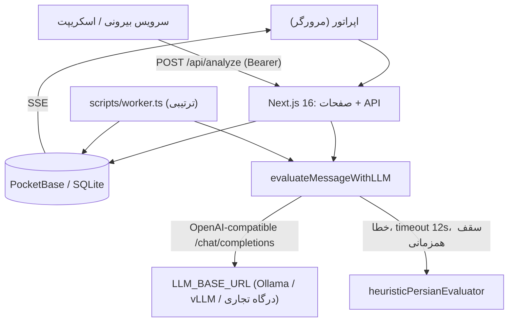
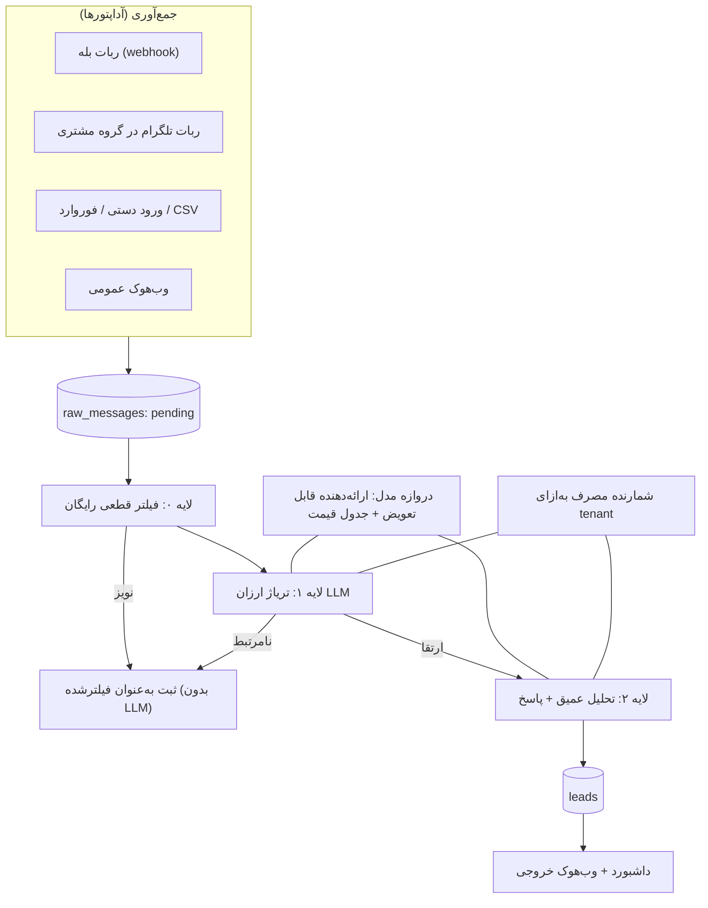

# مستندات فنی و معماری رادار (Radar)
## Opportunity Intelligence Engine — تیم PriCoders
**نسخه ۲.۰ • ۱۵ مهر ۱۴۰۵**
این سند وضعیت واقعی کد، معماری هدف و نقشه ساخت را جدا از هم می‌گوید. هر ادعا یا به فایل کد ارجاع دارد، یا صریحاً «طراحی هدف» است. اعداد مالی در [BusinessPlan.md](file:///run/media/parsa-naderi/Backup/Codes/Learning/WebPractices/Full-stack-base/Radar/docs/BusinessPlan.md) آمده‌اند.

---

## ۱. جایگاه محصول

رادار پیام‌های جوامع آنلاین را به فرصت فروش تبدیل می‌کند:

```
پیام خام → زمینه → نیت → فرصت → اقدام (انسان)
```

**اصل طراحی:** انسان در حلقه است. رادار پیش‌نویس می‌دهد، ارسال خودکار ندارد و نخواهد داشت (ریسک بن‌شدن مشتری و بدنامی در گروه‌ها).

---

## ۲. وضعیت پیاده‌سازی (واقعیت کد)

| بخش | وضعیت | مرجع |
| :--- | :-: | :--- |
| ارزیابی نیت با LLM سازگار با OpenAI | ✅ | [lib/llm.ts](file:///run/media/parsa-naderi/Backup/Codes/Learning/WebPractices/Full-stack-base/Radar/lib/llm.ts) |
| دفاع تزریق پرامپت (تگ XML، escape، پاک‌سازی خروجی) | ✅ | `buildPrompt`، `escapeXml`، `sanitizeSuggestedReply` |
| موتور جایگزین Regex فارسی | ✅ | `heuristicPersianEvaluator` |
| محدود کننده همزمانی (۳) و نرخ درخواست در حافظه | ✅ | [lib/rateLimit.ts](file:///run/media/parsa-naderi/Backup/Codes/Learning/WebPractices/Full-stack-base/Radar/lib/rateLimit.ts) |
| احراز هویت: رمز ادمین + کوکی امضاشده + کلید API | ✅ | [lib/auth.ts](file:///run/media/parsa-naderi/Backup/Codes/Learning/WebPractices/Full-stack-base/Radar/lib/auth.ts) |
| PocketBase: محصول، منبع، پیام خام، سرنخ | ✅ | [lib/pocketbase.ts](file:///run/media/parsa-naderi/Backup/Codes/Learning/WebPractices/Full-stack-base/Radar/lib/pocketbase.ts) |
| داشبورد، صندوق سرنخ، تنظیمات، دستیار، شبیه‌ساز | ✅ | `app/` و `components/` |
| پردازش دسته‌ای پیام‌های `pending` | 🟡 | [scripts/worker.ts](file:///run/media/parsa-naderi/Backup/Codes/Learning/WebPractices/Full-stack-base/Radar/scripts/worker.ts)؛ **ترتیبی** (یک پیام در هر لحظه)، بدون صف و تلاش مجدد |
| ثبت هزینه | 🟡 | جدول قیمت ناقص و نرخ تبدیل تومان اشتباه (بخش ۷) |
| جمع‌آوری خودکار از بله/تلگرام | ⛔ | وجود ندارد؛ فقط `POST /api/analyze` و داده نمونه |
| فیلتر چندلایه (لایه ۰ و ۱) | ⛔ | هر پیام یک بار پرامپت کامل می‌گیرد |
| چندمستاجری، کاربران، سهمیه، صورت‌حساب | ⛔ | همه‌جا `getList(1, 1)` اولین محصول را می‌گیرد |
| وب‌هوک خروجی / CRM، چندکاربره | ⛔ | نقشه راه |

---

## ۳. معماری

### ۳.۱ معماری فعلی [کد]



نکته: نسخه قبلی این سند زنجیره «OpenRouter ← Ollama ← Regex» را معماری می‌دانست. در کد فقط **یک** `LLM_BASE_URL` وجود دارد (می‌تواند OpenRouter یا Ollama باشد) و در شکست به Regex می‌رود. مسیریاب چندارائه‌دهنده ساخته نشده و در معماری هدف آمده است.

### ۳.۲ معماری هدف (طراحی)



---

## ۴. فناوری

| لایه | انتخاب | توضیح |
| :--- | :--- | :--- |
| وب | Next.js 16.3.8 + React 19 | توجه: این نسخه تغییرات شکستن‌دار دارد؛ راهنمای `node_modules/next/dist/docs/` معتبر است |
| استایل | Tailwind v4 + CSS | تم تاریک، فونت محلی |
| پایگاه داده | PocketBase (Go + SQLite) | سبک، SSE داخلی، احراز هویت داخلی |
| اجرا | Bun | نصب و اجرای سریع |
| LLM | هر سرویس سازگار با `/v1/chat/completions` | تنظیم با `LLM_BASE_URL`، `LLM_API_KEY`، `LLM_MODEL` |

---

## ۵. مدل داده (مطابق کد)

### `products` [lib/pocketbase.ts]
`name`، `tagline`، `description`، `value_propositions[]`، `ideal_customer_profile`، `keywords[]`

### `sources`
`name`، `platform` (`telegram` | `bale` | `twitter_x` | `forum`)، `status` (`active` | `paused`)

### `raw_messages`
`source_id`، `external_id`، `author_handle`، `content`، `thread_context`، `posted_at`، `status` (`pending` | `processed` | `error`)

### `leads`
`raw_message_id`، `product_id`، `intent_score`، `intent_level` (`high_intent` | `problem_aware` | `curious` | `irrelevant`)، `reasoning`، `matched_feature`، `suggested_reply`، `input_tokens`، `output_tokens`، `estimated_cost_usd`، `lead_status` (`new` | `approved` | `contacted` | `dismissed`)

> نسخه قبلی این سند نام‌هایی مثل `author_name`، `analyzed`، `intent_tier`، `analysis_cost` را آورده بود که در کد وجود ندارند. اینجا اصلاح شد.

### افزوده‌های لازم در معماری هدف

| افزوده | هدف |
| :--- | :--- |
| `tenant_id` روی همه مجموعه‌ها + قوانین دسترسی PocketBase | چندمستاجری |
| شاخص یکتا روی (`source_id`, `external_id`) | جلوگیری از پردازش تکراری |
| `raw_messages.status = filtered` و `filter_reason` | ثبت پیام‌های حذف‌شده توسط لایه ۰/۱ |
| `llm_calls`: `tenant_id`, `message_id`, `pass`, `model`, `tokens_in`, `tokens_out`, `cost_usd`, `latency_ms`, `ok` | حسابداری دقیق هر پاس |
| `usage_counters`: `tenant_id`, `period`, `analyzed_messages` | سهمیه پلن و صورت‌حساب |
| `retry_count`, `last_error` روی `raw_messages` | تلاش مجدد و صف خطا |
| `lead_feedback` (یا همان `lead_status` + دلیل رد) | برچسب برای ارزیابی |

---

## ۶. موتور نیت

**چهار سطح (در پرامپت پیاده‌سازی شده [کد]):**

| سطح | بازه |
| :--- | :-: |
| `high_intent` | 75 تا 100 |
| `problem_aware` | 45 تا 74 |
| `curious` | 20 تا 44 |
| `irrelevant` | 0 تا 19 |

> نسخه قبلی «وزن‌دهی ۳۰٪/۳۰٪/۲۵٪/۱۵٪» برای چهار معیار را آورده بود. در کد وزنی وجود ندارد و مدل با تعریف متنی هر سطح نمره می‌دهد. وزن‌دهی یک ایده طراحی برای آینده است و تا اثبات برتری روی مجموعه ارزیابی اجرا نمی‌شود.

**امتیاز و نتیجه** با `Math.min(100, Math.max(0, …))` و فهرست سفید سطوح اعتبارسنجی می‌شود؛ خروجی نامعتبر به `irrelevant` می‌رود.

---

## ۷. موتور LLM و هزینه

### ۷.۱ رفتار فعلی [کد: lib/llm.ts]

1. گرفتن مجوز از `llmConcurrencyLimiter` (سقف ۳). اگر پر باشد، بدون صدا زدن LLM به Regex می‌رود.
2. ساخت پرامپت (سیستم + کاربر) و ارسال با `temperature: 0.1` و `response_format: json_object`.
3. **timeout ثابت ۱۲ ثانیه**؛ هر خطا یا وضعیت غیر ۲۰۰ ← Regex فارسی.
4. پارس JSON؛ در شکست استخراج با Regex و در نهایت Regex فارسی.
5. هزینه از `usage` ارائه‌دهنده یا (اگر نبود) تخمین از طول متن.

### ۷.۲ اندازه پرامپت [اندازه‌گیری]

| بخش | اندازه |
| :--- | :-: |
| قالب سیستم | 3,095 کاراکتر |
| قالب کاربر | 388 کاراکتر |
| + محصول و متن پیام | تقریباً +700 کاراکتر |
| **تخمین توکن ورودی** | **1,000 تا 1,200** [فرض؛ با `usage.prompt_tokens` واقعی تأیید شود] |

هر پیام = **یک** فراخوانی با پرامپت کامل. این پایه هزینه فعلی است.

### ۷.۳ نقص‌ها و اشکال‌های شناخته‌شده

| # | مشکل | اثر | راه‌حل |
| :-: | :--- | :--- | :--- |
| 1 | `DEFAULT_PRICING_TIERS` فقط llama، qwen و deepseek دارد. مدل ناشناس به `default` ($0.15 / $0.60) می‌افتد | هزینه Gemini یا GPT غلط ثبت می‌شود (برای Flash-Lite ۵۰٪ بیشتر) | جدول قیمت قابل پیکربندی (env یا مجموعه `model_prices`) و خطا برای مدل ناشناس |
| 2 | `DOMESTIC_TOMAN_MULTIPLIER = 20,000,000` در [lib/pricing.ts](file:///run/media/parsa-naderi/Backup/Codes/Learning/WebPractices/Full-stack-base/Radar/lib/pricing.ts) «نرخ تبدیل» نیست؛ ضریب تعرفه خرده‌فروشی است | داشبورد ([LeadCard.tsx](file:///run/media/parsa-naderi/Backup/Codes/Learning/WebPractices/Full-stack-base/Radar/components/LeadCard.tsx)، [MetricsHeader.tsx](file:///run/media/parsa-naderi/Backup/Codes/Learning/WebPractices/Full-stack-base/Radar/components/MetricsHeader.tsx)) هزینه را ≈ **۷۵ برابر** نرخ واقعی دلار (۲۰,۰۰۰,۰۰۰ در برابر ۲۶۵,۰۰۰) و با حداقل ۵۰۰ تومان نشان می‌دهد | متغیر `USD_TO_TOMAN_RATE` برای هزینه واقعی؛ تعرفه تجاری جدا و با برچسب «قیمت فروش» |
| 3 | برای مسیر Regex، توکن‌ها ساختگی‌اند (`طول × 1.4 + 280`) و هزینه $0 نیست | گزارش مصرف ساختگی | ثبت `model_used` و `cost = 0` برای Regex و جداسازی در گزارش |
| 4 | `max_tokens` تنظیم نشده | خروجی طولانی می‌تواند هزینه را بالا ببرد | سقف 300 توکن برای لایه ۲ و 40 برای لایه ۱ |
| 5 | هزینه ثبت‌شده برای مدل میزبانی‌شده خودمان بی‌معناست (نرخ دلار به‌ازای میلیون توکن ندارد) | حسابداری نادرست | برای مدل خودمیزبان: هزینه مؤثر = هزینه ماهانه GPU ÷ توکن‌های پردازش‌شده |
| 6 | سه عدد متناقض «تومان به‌ازای هر پیام» در محصول: لندینگ «۹ تومان»، داشبورد ≥ ۵۰۰ تومان، هزینه واقعی ۸ تا ۵۶ تومان | از دست رفتن اعتماد | یک منبع حقیقت: `USD_TO_TOMAN_RATE`؛ لندینگ بر اساس آن |
| 7 | worker ترتیبی است و `llmConcurrencyLimiter` در آن عملاً استفاده نمی‌شود | ظرفیت ≈ ۰.۹ تا ۱.۷ میلیون پیام در ماه | worker موازی با همزمانی قابل تنظیم |
| 8 | تلاش مجدد، backoff و صف خطا وجود ندارد | از دست رفتن پیام در خطای موقت | بخش ۸.۴ |

> **ثبت برای ویرایش لندینگ:** [app/page.tsx](file:///run/media/parsa-naderi/Backup/Codes/Learning/WebPractices/Full-stack-base/Radar/app/page.tsx) عدد «۹ تومان» و «کمتر از ۱۰ تومان» را در چند نقطه دارد. این عدد فقط با سناریوی خوش‌بینانه دومرحله‌ای سازگار است. تا وقتی لایه‌ها ساخته و اندازه‌گیری نشده‌اند، متن باید «هزینه شفاف به‌ازای هر پیام» بدون عدد قطعی بگوید. این تغییر انجام نشده است و به تصمیم مالک محصول سپرده شده است.

### ۷.۴ فرمول هزینه

```
هزینه پاس = (توکن ورودی × نرخ ورودی + توکن خروجی × نرخ خروجی) ÷ 1,000,000
هزینه پیام = هزینه لایه ۱ + احتمال ارتقا × هزینه لایه ۲
هزینه تومان = هزینه دلار × USD_TO_TOMAN_RATE
```

### ۷.۵ هزینه به‌ازای ۱۰,۰۰۰ پیام (مرجع Flash-Lite: $0.10 / $0.40)

| معماری | هزینه |
| :--- | :-: |
| فعلی، یک‌مرحله‌ای (1,100 / 80) | **$1.42** (GPT-4o mini: $2.13) |
| سه‌لایه، خوش‌بینانه | $0.30 |
| سه‌لایه، **پایه** | **$0.53** |
| سه‌لایه، محافظه‌کارانه | $0.91 |

---

## ۸. معماری هدف: مشخصات

### ۸.۱ لایه ۰: فیلتر قطعی رایگان

بدون LLM و در حد میلی‌ثانیه. نمونه قواعد (قابل تنظیم و با لاگ دلیل):

- کوتاه‌تر از ۱۲ کاراکتر، فقط ایموجی یا استیکر.
- فقط لینک، یا پیام فوروارد تبلیغاتی.
- تکراری (هش متن نرمال‌شده در پنجره زمانی).
- الگوهای نویز موجود در `heuristicPersianEvaluator` (سلام، قیمت ارز، فوتبال و غیره).
- **پیام‌های حاوی الگوی تزریق پرامپت**: مستقیم به `irrelevant` با دلیل «تلاش دستکاری».

هدف: حذف ≈ ۳۰ تا ۴۰٪ پیام‌ها [فرض؛ باید اندازه‌گیری شود]. این بخش «واحد صورت‌حساب» را هم تعیین می‌کند (پیام تحلیل‌شده = عبور از لایه ۰).

### ۸.۲ لایه ۱: تریاژ ارزان

- پرامپت فشرده: یک خط معرفی محصول، یک خط ICP، حداکثر ۵ کلیدواژه، پیام.
- خروجی حداقلی: `{"relevant":bool,"score":int,"escalate":bool}`.
- هدف: ≈ 250 توکن ورودی و 25 خروجی [فرض].
- **قاعده سخت‌گیرانه:** برای کاهش ازدست‌رفتن سرنخ، آستانه ارتقا را طوری بگذاریم که **بازخوانی ≥ ۸۰٪** برای «قصد بالا + آگاه از مشکل» حفظ شود (ارتقای ۱۰ تا ۲۰٪ پیام‌ها).

### ۸.۳ لایه ۲: تحلیل عمیق

همان پرامپت و خروجی فعلی `llm.ts` (نمره، دلیل، ویژگی منطبق، پاسخ پیشنهادی). **ساختار پرامپت: بخش ثابت (سیستم، محصول) اول و پیام در آخر** تا کش پیشوند ارائه‌دهنده کار کند.

### ۸.۴ صف و تلاش مجدد

- worker موازی با `WORKER_CONCURRENCY` (پیش‌فرض ۴).
- تلاش مجدد با backoff نمایی تا ۳ بار؛ سپس `status=error` و `last_error`.
- ادعای پیام قبل از پردازش (`pending → processing`) برای جلوگیری از پردازش دوباره توسط چند worker.
- شاخص یکتا (`source_id`, `external_id`) برای ورود مجدد بی‌خطر (idempotent).
- مسیر Regex فقط **آخرین پناه** است؛ نتیجه آن با برچسب «تقریبی» ذخیره می‌شود و به سهمیه نمی‌شمارد.

### ۸.۵ مسیریاب مدل

- رابط واحد `LLMProvider { id, baseUrl, apiKey, model, price{in,out}, timeoutMs }` و فهرست اولویت‌دار.
- کلید قطع‌کننده مدار (circuit breaker) و انتخاب مدل جایگزین.
- اطلاعات قیمت از پیکربندی، نه از کد.

---

## ۹. جمع‌آوری داده (Ingestion)

### ۹.۱ اصل: داده متعلق به مشتری و با رضایت

| آداپتور | روش | وضعیت | ریسک و نکته |
| :--- | :--- | :-: | :--- |
| **بله** | ربات بله با webhook؛ مشتری ربات را به گروه خود اضافه می‌کند | اولویت ۱ | بررسی مجوزهای ربات در گروه و محدودیت‌های API بله |
| **تلگرام (Bot API)** | ربات در گروه مشتری (ادمین یا حالت حریم خصوصی خاموش) | اولویت ۱ | فقط گروه‌هایی که مشتری مدیرشان است |
| **ورود دستی / فوروارد / CSV** | چسباندن، فوروارد به ربات رادار، بارگذاری فایل | اولویت ۱ | بدون ریسک پلتفرم؛ جایگزین پشتیبان |
| **وب‌هوک عمومی** | `POST /api/analyze` موجود با کلید API | ✅ موجود | برای گفت‌وگوهای داخلی مشتری |
| **تلگرام (MTProto)** | سشن کاربر برای پایش کانال‌ها و گروه‌ها | **مسدود تا نظر حقوقی** | ریسک شرایط API (بخش ۹.۲)، بن، شماره و پراکسی |
| توییتر/X، فروم‌ها | خزنده یا API | نقشه راه | شرایط هر منبع جدا بررسی شود |

### ۹.۲ شرایط استفاده تلگرام

خلاصه تحقیق: شرایط API تلگرام استفاده از داده‌های پلتفرم را برای **آموزش، تنظیم دقیق، اعتبارسنجی، محک‌زنی یا توسعه و استقرار** مدل‌های AI/ML، مگر با رضایت صریح و مستمر کاربران، منع می‌کند [منبع؛ متن کامل بند مستقیماً خوانده نشد].

اقدامات:
1. **هرگز از پیام‌های تلگرام برای آموزش یا تنظیم دقیق مدل استفاده نشود.** در `llm_calls` و پیکربندی ارائه‌دهنده، ذخیره‌سازی و آموزش ارائه‌دهنده غیرفعال باشد (در صورت امکان).
2. نظر حقوقی مکتوب درباره اینکه «استنتاج LLM روی پیام‌های گروه مشتری» تحت «deploy» قرار می‌گیرد یا نه.
3. بله و ورود مستقیم مشتری، کانال اصلی تا روشن‌شدن موضوع.
4. هر آداپتور بدون قابلیت پایش عمومی گسترده شروع شود.

### ۹.۳ نگهداری و حریم خصوصی

- متن خام **۹۰ روز** (قابل تنظیم) و پس از آن حذف؛ سرنخ‌های تأییدشده تا حذف مشتری.
- ذخیره حداقلی هندل نویسنده؛ بدون شماره تلفن.
- امکان حذف درخواستی یک نویسنده.
- رمزگذاری پشتیبان‌ها.

---

## ۱۰. ظرفیت و زیرساخت

### ۱۰.۱ ظرفیت worker فعلی

با تأخیر ۱.۵ تا ۳ ثانیه برای هر فراخوانی و پردازش ترتیبی: **۱,۲۰۰ تا ۲,۴۰۰ پیام در ساعت ≈ ۰.۹ تا ۱.۷ میلیون پیام در ماه**. این برای حدود ۶۰ تا ۱۰۰ مشتری (میانگین ۱۶ هزار پیام) کافی است. فراتر از آن worker موازی لازم است. فراخوانی‌های لایه ۱ کوتاه‌ترند و ظرفیت را افزایش می‌دهند.

### ۱۰.۲ مراحل زیرساخت

| مرحله | مشتری | معماری | هزینه تقریبی (فرض) |
| :-: | :-: | :--- | :-: |
| ۱ | تا ۲۰ | یک سرور (Next.js + PocketBase + worker)، پشتیبان روزانه، پایش وضعیت | ≈ $15 |
| ۲ | ۲۰ تا ۱۵۰ | تفکیک برنامه و worker، دیسک NVMe، پشتیبان بیرونی (Litestream یا کپی `pb_data`)، لاگ | ≈ $70 |
| ۳ | ۱۵۰ تا ۱,۰۰۰ | چند worker، ارزیابی PocketBase در برابر Postgres (چندمستاجری و ناهمگام بودن نوشتن)، جداسازی ingestion | ≈ $250 |

**ملاحظات SQLite/PocketBase:** تک‌پردازشی و بدون HA. نوشتن حدود ۶ پیام در ثانیه در ۱,۰۰۰ مشتری برای SQLite در حالت WAL مشکل نیست، اما **بازیابی از خرابی** (پشتیبان و تمرین بازیابی) و **چندمستاجری** (قوانین دسترسی) باید پیش از مرحله ۲ حل شود.

### ۱۰.۳ توپولوژی میزبانی

| گزینه | شرح | مزیت | ریسک |
| :-: | :--- | :--- | :--- |
| **A** | برنامه در خارج از ایران + API ابری خارجی | ارزان‌ترین شروع | دسترسی و پرداخت API از ایران و تحریم [منبع]؛ تضاد با شعار «بدون وابستگی ابری خارجی» در README |
| **B** | برنامه داخل یا خارج + ارائه‌دهنده استنتاج داخلی یا مدل متن‌باز میزبانی‌شده با API سازگار OpenAI | هم‌راستا با برند، دسترسی پایدارتر | قیمت و کیفیت نامعلوم؛ **باید استعلام شود** |
| **C** | GPU اختصاصی (مثلاً GEX44-1، €232.30 در ماه + €114) | حاکمیت کامل | تساوی هزینه با API فقط حدود ۱۷۰ تا ۳۰۰ مشتری؛ کیفیت مدل ۸ میلیاردی روی فارسی عامیانه باید ارزیابی شود |

**توصیه:** کد از روز اول مستقل از ارائه‌دهنده (بخش ۸.۵) تا گزینه نهایی پس از **دروازه ۸ بیزینس پلن** انتخاب شود.

---

## ۱۱. امنیت

**موجود [کد]:** رمز ادمین از محیط (توصیه `.env.example`: حداقل ۱۶ کاراکتر؛ اجبار آن در کد بررسی نشده)، توکن نشست امضاشده با مقایسه زمان‌ثابت (`timingSafeEqual`)، کلید API Bearer، محدودیت ۱۵ درخواست در دقیقه به‌ازای IP در `/api/analyze`، اعتبارسنجی ورودی (`lib/validation.ts`)، هدرهای امنیتی در `next.config.ts`، دفاع تزریق پرامپت و پاک‌سازی خروجی.

**شکاف‌ها (برای چندمستاجری و تولید):**
- محدودیت نرخ فقط در حافظه یک فرایند است؛ برای چند نمونه به ذخیره مشترک نیاز دارد.
- ورود تک‌رمزی ادمین؛ به کاربران، نقش‌ها و ۲FA نیاز است.
- کلید API یکتا برای همه؛ برای هر مستاجر کلید جدا، چرخش و ابطال.
- ثبت رخداد امنیتی و هشدار.
- بررسی `pb_data` و `.env` در پشتیبان و گیت.

---

## ۱۲. چندمستاجری و صورت‌حساب (طراحی)

1. **تنانت‌بندی:** `tenant_id` روی `products`، `sources`، `raw_messages`، `leads`، `llm_calls`؛ قوانین دسترسی PocketBase یا لایه سرویس.
2. **پلن و سهمیه:** `plans` (سقف پیام تحلیل‌شده، تعداد منبع، کاربر، محصول)؛ شمارنده `usage_counters`.
3. **اندازه‌گیری:** هر پیام عبوری از لایه ۰ یک واحد مصرف است؛ پیام فیلترشده یا Regex واحد نیست.
4. **اضافه‌مصرف:** هشدار در ۸۰٪، توقف نرم در ۱۰۰٪، اضافه‌مصرف با نرخ تعریف‌شده.
5. **صورت‌حساب:** گام اول دستی (فاکتور و درگاه)، سپس خودکار. نرخ‌ها قابل بازنگری ماهانه (ریسک ارز).
6. **حساب هزینه به‌ازای tenant:** از `llm_calls` ← گزارش حاشیه واقعی هر مشتری (برای دیدن مشتریان زیان‌ده).

---

## ۱۳. اندازه‌گیری و ارزیابی (پایه اعتبارسنجی بیزینس)

### ۱۳.۱ متریک‌های لازم (در `llm_calls` و داشبورد داخلی)
توکن ورودی و خروجی هر پاس، هزینه، تأخیر، درصد عبور از هر لایه، درصد خطا، درصد استفاده از Regex، تعداد پیام تحلیل‌شده به‌ازای tenant.

### ۱۳.۲ مجموعه ارزیابی طلایی
- ۵۰۰ پیام واقعی (با رضایت) با برچسب دستی دو نفر، با توافق (kappa) ثبت‌شده.
- معیارها: دقت و بازخوانی هر سطح، **بازخوانی لایه ۱ برای دو سطح بالا ≥ ۸۰٪**، دقت «قصد بالا» ≥ ۷۰٪، حذف نویز ترکیبی ≥ ۹۰٪.
- اجرای هر مدل کاندید روی همان مجموعه و ثبت هزینه واقعی؛ جدول مقایسه برای انتخاب مدل.

### ۱۳.۳ حلقه بازخورد
`lead_status = approved / dismissed` در داشبورد برچسب ارزان است. هر ماه دقت واقعی از آن محاسبه می‌شود و قواعد لایه ۰ و پرامپت به‌روز می‌شود (بدون آموزش مدل روی داده تلگرام، بخش ۹.۲).

---

## ۱۴. نقشه راه ساخت

| فاز | مدت | محتوا | معیار پذیرش |
| :-: | :-: | :--- | :--- |
| **۰: اصلاح و اندازه‌گیری** | ۱ تا ۲ هفته | `llm_calls`، `USD_TO_TOMAN_RATE`، جدول قیمت مدل قابل پیکربندی، `max_tokens`، اصلاح نمایش هزینه (بخش ۷.۳)، اجرای ۵,۰۰۰ پیام و ثبت توکن واقعی | هزینه ثبت‌شده با صورت‌حساب ارائه‌دهنده ≤ ۵٪ اختلاف |
| **۱: معماری سه‌لایه** | ۲ تا ۳ هفته | لایه ۰ (استفاده مجدد از Regex)، لایه ۱، worker موازی، تلاش مجدد، شاخص یکتا | روی مجموعه طلایی: بازخوانی ≥ ۸۰٪ و هزینه ≤ سناریوی پایه |
| **۲: جمع‌آوری مجاز** | ۳ تا ۴ هفته | آداپتور بله، ربات تلگرام، ورود دستی/CSV؛ ثبت منابع مشتری | ۳ شریک طراحی با جریان زنده |
| **۳: چندمستاجری و سهمیه** | ۳ تا ۴ هفته | `tenant_id`، کاربران، سهمیه، شمارنده، صورت‌حساب دستی | دو مشتری مستقل بدون تداخل داده |
| **۴: رشد** | ۴ تا ۸ هفته | وب‌هوک خروجی/CRM، چندکاربره، چندمحصولی، پلن رشد | آزمون اتصال با یک CRM |
| **۵: میزبانی مدل** | پس از دروازه ۸ | ارزیابی ارائه‌دهنده داخلی یا GPU | تصمیم مبتنی بر جدول مقایسه و هزینه واقعی |

---

## ۱۵. تصمیم‌های باز

| # | پرسش | چه کسی تصمیم می‌گیرد | وابسته به |
| :-: | :--- | :--- | :--- |
| 1 | مدل و ارائه‌دهنده نهایی استنتاج | تیم فنی + مالی | استعلام قیمت و دسترسی؛ نتیجه ارزیابی طلایی |
| 2 | آیا پایش عمومی تلگرام (MTProto) انجام شود؟ | مؤسس + وکیل | نظر حقوقی |
| 3 | واحد صورت‌حساب و سقف دقیق پلن‌ها | محصول | اندازه‌گیری حجم واقعی گروه‌ها |
| 4 | قیمت نهایی | مؤسس | آزمایش قیمت پایلوت |
| 5 | عدد «تومان به‌ازای هر پیام» در لندینگ | مالک محصول | پایان فاز ۰ و ۱ |
| 6 | PocketBase یا Postgres در مرحله ۳ | تیم فنی | آزمون بار و نیاز به HA |

---

**PriCoders • Radar Opportunity Intelligence Engine • ۱۵ مهر ۱۴۰۵**
