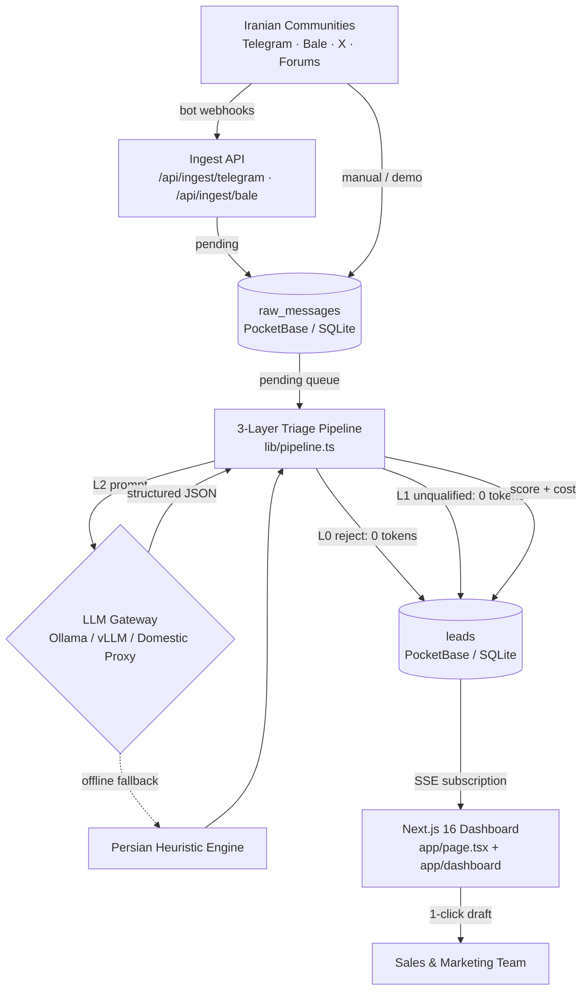

# سامانه رادار — مرجع فنی جامع و راهنمای پیاده‌سازی
## PriCoders — مهندسی نرم‌افزار و معماری سیستم‌های هوشمند
* **نوع مستند:** راهنمای فنی، مشخصات معماری داده‌ها، قراردادهای API و دستورالعمل نگهداری عملیاتی
* **مخاطبان:** معماران سیستم، توسعه‌دهندگان فول‌استک، مهندسان داده و مدیران استقرار سرور

---

## فهرست مطالب مرجع فنی

* [۱. نمای کلی و شاخص‌های کلیدی سامانه](#۱-نمای-کلی-و-شاخص‌های-کلیدی-سامانه)
* [۲. معماری کلان سیستم و جریان داده](#۲-معماری-کلان-سیستم-و-جریان-داده)
* [۳. پشته فناوری و ابزارهای توسعه](#۳-پشته-فناوری-و-ابزارهای-توسعه)
* [۴. مدل داده و ساختار مجموعه‌های پایگاه داده](#۴-مدل-داده-و-ساختار-مجموعه‌های-پایگاه-داده)
* [۵. خط تریاژ سه‌لایه و منطق پردازش هوشمند](#۵-خط-تریاژ-سه‌لایه-و-منطق-پردازش-هوشمند)
* [۶. فرآیند جمع‌آوری پیام‌ها و زمان‌بند خودکار پس‌زمینه](#۶-فرآیند-جمع‌آوری-پیام‌ها-و-زمان‌بند-خودکار-پس‌زمینه)
* [۷. مرجع کامل رابط‌های برنامه‌نویسی کاربردی (API)](#۷-مرجع-کامل-رابط‌های-برنامه‌نویسی-کاربردی-api)
* [۸. دستیار هوشمند و راهنمای کارتابل](#۸-دستیار-هوشمند-و-راهنمای-کارتابل)
* [۹. احراز هویت، امنیت داده‌ها و حریم خصوصی](#۹-احراز-هویت-امنیت-داده‌ها-و-حریم-خصوصی)
* [۱۰. متغیرهای محیطی و راهنمای پیکربندی](#۱۰-متغیرهای-محیطی-و-راهنمای-پیکربندی)
* [۱۱. رابط کاربری، استریم بلادرنگ و ثبت خودکار تعاملات](#۱۱-رابط-کاربری-استریم-بلادرنگ-و-ثبت-خودکار-تعاملات)
* [۱۲. استقرار در محیط عملیاتی و تنظیمات سرور](#۱۲-استقرار-در-محیط-عملیاتی-و-تنظیمات-سرور)
* [۱۳. دستورالعمل بهره‌برداری و نگهداری سیستم](#۱۳-دستورالعمل-بهره‌برداری-و-نگهداری-سیستم)
* [۱۴. ساختار فایل‌ها و سلسله‌مراتب پروژه](#۱۴-ساختار-فایل‌ها-و-سلسله‌مراتب-پروژه)
* [۱۵. محدودیت‌های شناخته‌شده و نقشه راه توسعه](#۱۵-محدودیت‌های-شناخته‌شده-و-نقشه-راه-توسعه)

---

## ۱. نمای کلی و شاخص‌های کلیدی سامانه

رادار یک موتور مستقل و محلی برای کشف نیت‌های تجاری خرید و برون‌سپاری در بازارهای ایرانی است. این سامانه پیام‌های منتشرشده در جوامع آنلاین (پیام‌رسان‌های بله، تلگرام، شبکه ایکس و فروم‌های تخصصی) را پایش می‌کند، نویزهای عمومی و هرزنامه‌ها را طی یک خط تریاژ سه‌لایه حذف می‌نماید، به هر پیام یک امتیاز نیت از ۰ تا ۱۰۰ تخصیص می‌دهد و در نهایت، پیش‌نویس پاسخ فنی و فارسی آماده ارسال را تدوین می‌کند. تمامی این مراحل بر بستر یک سرور مستقل و بدون وابستگی حیاتی به سرویس‌های ابری خارجی به انجام می‌رسد.

### شاخص‌های کلیدی معماری و کد مخزن:
* **لایه‌های تفکیک و تریاژ:** ۳ لایه مجزا (لایه صفر: فیلتر قطعی و پیش‌گیرانه، لایه یک: غربال‌گری سریع مبتنی بر نشانگرها، لایه دو: ارزیابی عمیق با هوش مصنوعی).
* **سطوح دسته‌بندی نیت تجاری:** ۴ سطح استاندارد شامل `high_intent` (نیت خرید فوری)، `problem_aware` (دارای چالش کاری و نیازمند راهکار)، `curious` (کنجکاو و مقایسه‌گر)، و `irrelevant` (پیام نامرتبط و نویز).
* **وضعیت پیام خام در چرخه حیات:** وضعیت‌های `pending` (در انتظار پردازش)، `processed` (تریاژ و پردازش‌شده)، `filtered` (رد شده در لایه‌های صفر یا یک)، و `error` (خطای سیستمی).
* **وضعیت سرنخ در کارتابل فروش:** وضعیت‌های `new` (سرنخ تازه)، `approved` (تأییدشده توسط مدیر)، `contacted` (ارتباط برقرارشده)، و `dismissed` (رد شده توسط کارشناس).
* **بسترهای پایش آنلاین:** پیام‌رسان‌های بله، تلگرام، شبکه ایکس و تالارهای گفت‌وگوی وب.
* **هزینه پردازش در لایه‌های صفر و یک:** صفر توکن (استفاده خالص از پردازنده محلی در کسری از میلی‌ثانیه).
* **مهلت زمانی فراخوانی مدل زبانی:** ۱۲ ثانیه با پشتیبانی خودکار از موتور قوانین محلی در صورت بروز خطا.

### تحلیل مقایسه‌ای اقتصاد رادار با روش‌های سنتی:
* **کاهش هزینه مستقیم:** هزینه اشتراک پایه رادار (۱,۸۹۰,۰۰۰ تومان در ماه) در مقایسه با هزینه استخدام نیروی انسانی فروش (۲۵ تا ۴۰ میلیون تومان ماهانه)، کاهش هزینه‌ای فراتر از ۹۵ درصد را برای تیم‌ها رقم می‌زند.
* **سرعت واکنش و کشف فرصت:** زمان پایش دستی توسط انسان معمولاً بین ۲ تا ۴ ساعت تأخیر دارد، در حالی که رادار در کمتر از ۳ ثانیه سیگنال خرید را استخراج کرده و پیش‌نویس پاسخ را ارائه می‌دهد.
* **دقت تشخیص و حذف خطای انسانی:** انسان در مواجهه با نویز ۸۰ درصدی گروه‌ها دچار خستگی می‌شود، اما خط تریاژ رادار هرزنامه‌ها و پیام‌های نامربوط را به طور کامل و بدون اتلاف وقت کارشناسان کنار می‌گذارد.

---

## ۲. معماری کلان سیستم و جریان داده



جریان داده در رادار همواره یک‌طرفه و امن است: `ورودی پیام‌ها → ذخیره پیام خام → خط تریاژ سه‌لایه → ثبت پایدار سرنخ → کارتابل وب`. هیچ پیامی به صورت خودکار و بدون نظارت انسان به گروه‌ها ارسال نمی‌شود؛ بلکه پاسخ‌ها در قالب پیش‌نویس آماده در اختیار کارشناس فروش قرار می‌گیرند تا اصل «حضور انسان در چرخه تصمیم‌گیری» به دقت حفظ گردد.

### تفکیک وظایف ماژول‌های اصلی:
* **درگاه دریافت پیام (`lib/ingest.ts`):** مسئول دریافت به‌روزرسانی‌های وب‌هوک، اعتبارسنجی کلیدهای مخفی، کنترل نرخ درخواست‌ها، ایجاد شناسنامه منبع و درج پیام با وضعیت در انتظار.
* **خط تریاژ سه‌لایه (`lib/pipeline.ts`):** موتور مرکزی پردازش پیام‌ها که لایه‌های صفر، یک و دو را اجرا کرده و نتایج را در قالب رکوردهای نهایی ثبت می‌کند.
* **فیلترهای پیش‌گیرانه (`lib/prefilter.ts`):** ارزیابی عبارات باقاعده، فیلتر هرزنامه‌ها و مقابله با تزریق پرامپت در لایه صفر و یک بدون مصرف توکن.
* **زمان‌بند خودکار پس‌زمینه (`lib/botScheduler.ts`):** پایش پیوسته پیام‌های بازار متناسب با سقف ساعتی پلن هر کاربر و انتقال بلادرنگ نتایج به پایگاه داده.

---

## ۳. پشته فناوری و ابزارهای توسعه

* **چارچوب سمت وب:** Next.js 16 (App Router) مبتنی بر React 19، با اجرای کدها روی ران‌تایم سریع Bun.
* **پایگاه داده و احراز هویت:** پایگاه داده سبک و پرسرعت PocketBase با موتور ذخیره‌سازی محلی SQLite، مجهز به احراز هویت چندمستأجری و قابلیت استریم زنده از طریق اشتراک Server-Sent Events (SSE).
* **مدل‌های زبانی هوش مصنوعی:** پشتیبانی همزمان از مدل‌های محلی (Ollama و vLLM با مدل‌های LLaMA 3.1 و Qwen 2.5) و درگاه‌های پردازش ابری با خروجی ساختاریافته JSON.
* **پروکسی لبه و مسیریابی:** ماژول `proxy.ts` در محیط Node.js/Bun جهت حفاظت از مسیرهای نیازمند نشست، انتقال کوکی‌های نشست و مسدودسازی دسترسی‌های غیرمجاز.
* **طراحی بصری و قلم‌ها:** طراحی کامپوننت‌محور با رنگ‌بندی مینیمال تیره (مشکی خالص `#000000` و خاکستری زینگ `#27272a`) با قلم فارسی Ravi تعبیه‌شده به صورت خودمیزبان بدون نیاز به فونت‌های اینترنتی.

---

## ۴. مدل داده و ساختار مجموعه‌های پایگاه داده

پایگاه داده رادار بر بستر ۴ مجموعه اصلی سازمان‌دهی شده است:

### ۱. مجموعه محصولات (`products`)
مشخصات و کاتالوگ محصول شرکت که مبنای تطبیق نیاز مشتری و ارزیابی سرنخ‌ها قرار می‌گیرد:
* `name` (متنی، اجباری): نام تجاری محصول یا خدمت.
* `description` (متنی): شرح تفصیلی کاربردها و مزایای رقابتی محصول.
* `category` (متنی): صنعت یا دسته‌بندی تجاری (نرم‌افزار حسابداری، خدمات سئو، مشاوره مالیاتی).
* `target_audience` (متنی): پرسونای مخاطب هدف و اندازه شرکت‌های مد نظر.
* `keywords` (آرایه متنی): کلیدواژه‌های اصلی برای غربال‌گری لایه یک (حداقل ۵ تا ۱۰ کلمه کلیدی).
* `features` (آرایه متنی): فهرست ماژول‌ها و ویژگی‌های کلیدی جهت اتصال به استدلال خرید.
* `is_active` (بولی): پرچم فعال بودن محصول برای تریاژ خودکار.

### ۲. مجموعه منابع پیام (`sources`)
کانال‌ها، گروه‌ها و درگاه‌هایی که پیام‌های ورودی از آن‌ها دریافت می‌شوند:
* `platform` (انتخابی، اجباری): یکی از گزینه‌های `telegram`، `bale`، `twitter_x`، یا `forum`.
* `identifier` (متنی، اجباری): شناسه یکتا مانند شناسه عددی چت یا آیدی کانال.
* `name` (متنی): عنوان نمایشی منبع (مانند «گروه توسعه‌دهندگان لاراول ایران»).
* `status` (انتخابی): وضعیت منبع (`active`، `paused`، یا `error`).

### ۳. مجموعه پیام‌های خام (`raw_messages`)
تمام پیام‌های ورودی دریافت شده پیش از تصمیم‌گیری نهایی:
* `source_id` (رابطه با `sources`): شناسه منبع ورودی.
* `external_id` (متنی): کلید یکتا برای پیشگیری از پیام‌های تکراری (`tg:<chat>:<msg>`).
* `author_handle` (متنی، اجباری): آیدی یا نام فرستنده پیام در پیام‌رسان.
* `content` (متنی، اجباری): متن کامل پیام تا سقف ۳,۰۰۰ کاراکتر.
* `thread_context` (متنی): کانتکست گفت‌وگو یا پیام ریپلای‌شده تا سقف ۱,۵۰۰ کاراکتر.
* `posted_at` (تاریخ): زمان انتشار پیام در پلتفرم مبدأ.
* `status` (انتخابی): وضعیت چرخه تریاژ شامل `pending`، `processed`، `filtered`، و `error`.

### ۴. مجموعه سرنخ‌های ارزیابی‌شده (`leads`)
خروجی نهایی خط تریاژ که در کارتابل فروش نمایش داده می‌شود:
* `raw_message_id` (رابطه با `raw_messages`): پیام مرجع که سرنخ از آن استخراج شده است.
* `product_id` (رابطه با `products`): محصولی که ارزیابی بر مبنای آن انجام شده است.
* `user_id` (رابطه با `users`): کاربر مالک رکورد جهت حفظ استقلال و ایزولاسیون داده‌ها در ساختار چندمستأجری.
* `intent_score` (عددی از ۰ تا ۱۰۰): امتیاز نیت تجاری محاسبه‌شده.
* `intent_level` (انتخابی): یکی از ۴ سطح نیت تجاری.
* `reasoning` (متنی): استدلال فارسی هوش مصنوعی درباره چرایی انتخاب یا رد پیام.
* `matched_feature` (متنی): ماژولی از محصول که مستقیماً پاسخگوی نیاز مشتری است.
* `suggested_reply` (متنی): پیش‌نویس پاسخ فنی و مودبانه فارسی جهت ارسال توسط تیم فروش.
* `input_tokens` و `output_tokens` (عددی): شمارش توکن‌های مصرفی جهت حسابداری دقیق هزینه‌ها.
* `estimated_cost_usd` (عددی): هزینه دلاری پردازش پیام.
* `lead_status` (انتخابی): وضعیت پیگیری شامل `new`، `approved`، `contacted`، و `dismissed`.
* `notes` (متنی): یادداشت‌های پیگیری کارشناس فروش با قابلیت ذخیره خودکار در پایگاه داده.

---

## ۵. خط تریاژ سه‌لایه و منطق پردازش هوشمند

نقطه ورود واحد پردازش در سامانه، تابع `triagePendingMessage(pb, rawMsg, product)` واقع در ماژول `lib/pipeline.ts` است. تمامی وب‌هوک‌ها، فرآیندهای دوره‌ای پس‌زمینه و ابزارهای تست دستی از همین نقطه عبور می‌کنند تا رفتارهای سیستم کاملاً یکپارچه باقی بماند.

### لایه صفر: فیلتر قطعی و پیش‌گیرانه (Layer 0 Heuristics)
این لایه بدون مصرف توکن و در زمانی کمتر از ۱ میلی‌ثانیه، نویزهای مشهود را شناسایی و پالایش می‌کند:
* **پیام‌های خالی (`empty`):** پیام‌های فاقد محتوای متنی با امتیاز نیت ۵ فیلتر می‌شوند.
* **پیام‌های بسیار کوتاه (`too_short`):** پیام‌های کمتر از ۱۲ کاراکتر که فاقد هرگونه گزاره تجاری هستند با امتیاز ۵ رد می‌شوند.
* **پیام‌های صرفاً لینک (`link_only`):** پیام‌هایی که حاوی نشانی اینترنتی بدون توضیحات تکمیلی هستند به عنوان هرزنامه شناسایی و با امتیاز ۵ ثبت می‌شوند.
* **تبلیغات آشکار و اسپم (`advertisement`):** پیام‌های تبلیغ کانال، ارز دیجیتال و معرفی ربات با امتیاز ۵ فیلتر می‌گردند.
* **تزریق پرامپت و خرابکاری (`injection`):** الگوهای مشکوک مانند دستورات بازنویسی پرامپت با امتیاز قطعی صفر مسدود می‌شوند.
* **الگوریتم جلوگیری از داده‌های تکراری:** با محاسبه هش رمزنگاری‌شده متن نرمال‌شده (بدون نیم‌فاصله‌های زائد و فواصل اضافی)، پیام‌های تکراری طی ۲۴ ساعت گذشته فوراً شناسایی شده و از تکرار فرآیند پردازش جلوگیری می‌شود.

### لایه یک: غربال‌گری سریع مبتنی بر نشانگرها (Layer 1 Fast Screen)
این لایه عبارات کلیدی را در سه دسته مجزا بررسی می‌کند:
* **نشانگرهای صریح خرید:** کلماتی مانند «خریداریم»، «معرفی کنید»، «پیشنهاد»، «بودجه»، «جایگزین».
* **نشانگرهای چالش و درد کاری:** کلماتی نظیر «قطعی نرم‌افزار»، «چالش سامانه مودیان»، «خطای اکسل»، «عدم پاسخگویی پشتیبانی».
* **تطابق با کاتالوگ محصول:** هم‌پوشانی حداقل ۲ کلیدواژه تعریف‌شده در شناسنامه محصول با متن پیام.
در صورت عدم تطابق با این معیارها، پیام بدون ارسال به مدل زبانی، با امتیاز ۱۵ و برچسب `irrelevant` بایگانی می‌شود و از مصرف توکن جلوگیری به عمل می‌آید.

### لایه دو: ارزیابی عمیق با هوش مصنوعی (Layer 2 Deep Analysis)
تنها پیام‌هایی که از لایه‌های صفر و یک عبور کنند (حدود ۱۵ درصد کل پیام‌های ورودی) وارد این لایه می‌شوند:
* ارسال پرامپت مهندسی‌شده همراه با شناسنامه کامل محصول و متن پیام به مدل زبانی.
* دریافت خروجی معتبر در قالب ساختار اعتبارسنجی‌شده JSON شامل امتیاز، سطح نیت، استدلال فارسی، ویژگی منطبق و پیش‌نویس پاسخ.
* محاسبه بلادرنگ هزینه پردازش بر اساس نرخ توکن‌های ورودی و خروجی و ثبت در پایگاه داده.

---

## ۶. فرآیند جمع‌آوری پیام‌ها و زمان‌بند خودکار پس‌زمینه

### درگاه‌های دریافت پیام (Webhooks)
سامانه رادار دارای دو وب‌هوک رسمی برای دریافت مستقیم به‌روزرسانی‌های پیام‌رسان‌ها است:
* `POST /api/ingest/telegram`: ویژه دریافت پیام‌های گروه‌ها و کانال‌های تلگرام از طریق Bot API با اعتبارسنجی هدر `X-Telegram-Bot-Api-Secret-Token`.
* `POST /api/ingest/bale`: ویژه دریافت پیام‌ها از پیام‌رسان بله با اعتبارسنجی هدر `X-Bale-Secret-Token`.

جریان پردازش هر درخواست ورودی:
۱. اعتبارسنجی توکن امنیتی وب‌هوک و اعمال محدودیت نرخ ورودی (حداکثر ۱۲۰ درخواست در دقیقه به‌ازای هر آی‌پی).  
۲. استخراج محتوای متنی از ساختار پیام و فیلتر کردن رویدادهای غیرمتنی مانند استیکرها، نظرسنجی‌ها و پیام‌های ارسالی سایر بات‌ها.  
۳. ثبت یا به‌روزرسانی مشخصات منبع در پایگاه داده.  
۴. بررسی کلید یکتای پیام جهت جلوگیری از پردازش پیام‌های ارسالی تکراری.  
۵. ثبت پیام خام در وضعیت در انتظار و هدایت بلادرنگ به خط تریاژ سه‌لایه.

### زمان‌بند خودکار پس‌زمینه (Background Scheduler)
جهت خودکارسازی کامل پایش بازار، ماژول `lib/botScheduler.ts` طراحی شده است که بر اساس سقف اشتراک هر کاربر، وظیفه اسکن دوره‌ای را انجام می‌دهد:

* **پلن پایه (رایگان):** اسکن خودکار ۱۰ پیام در ساعت، سقف شبیه‌سازی دستی ۳۰ درخواست در ساعت، سهمیه ورودی ۱۰۰ پیام در روز، با ذخیره خودکار در پایگاه داده.
* **پلن استارتر:** اسکن خودکار ۳۰ پیام در ساعت، سقف شبیه‌سازی دستی ۳۰۰ درخواست در ساعت، سهمیه ورودی ۱,۵۰۰ پیام در روز، با تریاژ سه‌لایه کامل و پیامک هشدارهای فوری.
* **پلن رشد:** اسکن خودکار ۸۰ پیام در ساعت، سقف شبیه‌سازی دستی ۱,۰۰۰ درخواست در ساعت، سهمیه ورودی ۵,۰۰۰ پیام در روز، با اولویت پردازش بالا و دسترسی ۵ کاربر همزمان.
* **پلن سازمانی:** اسکن خودکار ۲۰۰ پیام در ساعت، سقف شبیه‌سازی دستی ۵,۰۰۰ درخواست در ساعت، سهمیه ورودی ۲۵,۰۰۰ پیام در روز، با پایگاه داده و صف پردازش اختصاصی.

---

## ۷. مرجع کامل رابط‌های برنامه‌نویسی کاربردی (API)

تمامی نقاط پایانی سامانه با متدهای استاندارد و حفاظت نشست توسعه یافته‌اند:

### ۱. تریاژ و ارزیابی دستی پیام: `POST /api/analyze`
* **احراز هویت:** کوکی نشست کاربر یا کلید اختصاصی در هدر Bearer.
* **محدودیت نرخ:** ۱۵ درخواست در دقیقه به‌ازای هر آی‌پی.
* **پارامترهای ورودی:** `{ content: string, author_handle?: string, thread_context?: string, platform?: string, product_id?: string }` یا ارسال شناسه پیام خام `{ raw_message_id: string }`.
* **خروجی:** اطلاعات کامل تریاژ شامل امتیاز نیت، استدلال فارسی، لایه تصمیم‌گیرنده، و رکورد لید ایجادشده.

### ۲. شبیه‌سازی و تست بازار: `POST /api/simulate`
* **احراز هویت:** کوکی نشست کاربر.
* **محدودیت نرخ:** کنترل متناسب با سهمیه روزانه پلن کاربر.
* **پارامتر ورودی:** `{ index?: number }` برای انتخاب پیام مشخص از میان ۲۶ پیام نمونه بازار.
* **خروجی:** نتیجه تریاژ سه‌لایه و بازگرداندن رکورد گسترش‌یافته سرنخ به همراه مشخصات فرستنده.

### ۳. دریافت اولیه پیام‌های بازار: `POST /api/leads/fetch-initial`
* **احراز هویت:** کوکی نشست کاربر.
* **عملکرد:** برای کاربران تازه‌وارد، ۳ پیام مرتبط با بازار هدف را اسکن، تریاژ و در پایگاه داده ذخیره می‌کند تا کارتابل کاربر فوراً فعال گردد.

### ۴. تغییر وضعیت و ثبت یادداشت‌های سرنخ: `POST /api/leads/status`
* **احراز هویت:** کوکی نشست کاربر.
* **محدودیت نرخ:** ۶۰ درخواست در دقیقه.
* **پارامترهای ورودی:** `{ leadId: string, status: "new" | "approved" | "contacted" | "dismissed", notes?: string }`.
* **عملکرد:** ذخیره خودکار تغییر وضعیت و یادداشت‌های کارشناس فروش با اعتبارسنجی مالکیت داده‌ها.

### ۵. تنظیمات محصول و کاتالوگ: `POST /api/settings`
* **احراز هویت:** کوکی نشست کاربر.
* **پارامترهای ورودی:** فیلدهای نام محصول، شرح، دسته‌بندی، کلیدواژه‌ها و مخاطبان هدف.
* **عملکرد:** به‌روزرسانی شناسنامه محصول اختصاصی در پایگاه داده و هماهنگ‌سازی با مدل ارزیابی هوش مصنوعی.

### ۶. اجرای چرخه زمان‌بند خودکار: `POST /api/bot/cron`
* **احراز هویت:** کلید ادمین در هدر Authorization یا سشن مجاز.
* **عملکرد:** اجرای چرخه ساعتی اسکن پیام‌های بازار برای کاربران فعال و تزریق به خط تریاژ بر اساس سقف هر پلن.

### ۷. وضعیت و کنترل زمان‌بند ساعتی: `GET/POST /api/bot/status` و `/api/bot/toggle`
* **احراز هویت:** کوکی نشست کاربر.
* **عملکرد:** نمایش وضعیت فعال بودن اسکنر خودکار، زمان آخرین اجرا، سقف ساعتی پلن، و امکان فعال‌سازی یا توقف پایش.

### ۸. وب‌هوک دریافت پیام‌های تلگرام: `POST /api/ingest/telegram`
* **احراز هویت:** هدر `x-telegram-bot-api-secret-token`، `x-webhook-secret` یا توکن Bearer ادمین.
* **محدودیت نرخ:** ۱۲۰ درخواست در دقیقه به‌ازای هر آی‌پی فرستنده.
* **بدنه ورودی:** شیء استاندارد Telegram Update حاوی `message` یا `channel_post` با مشخصات فرستنده و متن فارسی.
* **عملکرد:** دریافت، پیش‌فیلتر لایه صفر و ثبت پیام در صف پردازش پیام‌های معلق با اتصال خودکار به محصول فعال کاربر.

### ۹. وب‌هوک دریافت پیام‌های پیام‌رسان بله: `POST /api/ingest/bale`
* **احراز هویت:** هدر `x-bale-secret-token`، `x-webhook-secret` یا توکن Bearer مجاز.
* **محدودیت نرخ:** ۱۲۰ درخواست در دقیقه به‌ازای هر آی‌پی.
* **بدنه ورودی:** ساختار پیام‌های پلتفرم بله (مطابق پروتکل وب‌هوک بله) حاوی شناسه پیام، مشخصات کاربر و متن.
* **عملکرد:** اعتبارسنجی توکن بله، استخراج متن و فراداده‌ها، و ارسال بلادرنگ به خط تریاژ سه‌لایه رادار.

### ۱۰. فرآیند آنبوردینگ و راه‌اندازی سریع اولیه: `POST /api/onboarding`
* **احراز هویت:** کوکی نشست کاربر لاگین‌شده.
* **بدنه ورودی:**
  ```json
  {
    "name": "نام کاربر",
    "company": "نام شرکت یا استارتاپ",
    "role": "سمت سازمانی",
    "product_name": "نام محصول یا خدمت اصلی",
    "product_description": "شرح ارزش‌آفرینی محصول (حداقل ۱۰ کاراکتر)",
    "ideal_customer_profile": "پرسونای مشتری ایده‌آل (ICP)"
  }
  ```
* **عملکرد:** ایجاد یا به‌روزرسانی مشخصات شرکت و کاتالوگ محصول اختصاصی در مجموعه `products`، تخصیص کلیدواژه‌های مرتبط و تنظیم کوکی وضعیت آنبوردینگ برای هدایت به کارتابل.

### ۱۱. چرخه احراز هویت و نشست: `POST /api/auth/*`
* `POST /api/auth/register`: ثبت‌نام کاربر جدید با پلن پایه و هدایت به مراحل تعریف محصول.
* `POST /api/auth/login`: ورود به سامانه با ایمیل و کلمه عبور.
* `POST /api/auth/logout`: پایان نشست و پاک‌سازی کوکی‌های امنیتی مرورگر.
* `GET /api/auth/session`: استعلام وضعیت نشست فعال، شناسه کاربر و سطح اشتراک جاری.

---

## ۸. دستیار هوشمند و راهنمای کارتابل

نقطه پایانی `POST /api/assistant` یک راهنمای گفت‌وگویی اختصاصی برای کارشناس فروش است که به تحلیل بهتر سرنخ‌ها، بازنویسی پیام‌ها و هدایت کاربر در بخش‌های مختلف نرم‌افزار کمک می‌کند:
* مجهز به پرامپت سیستمی متمرکز بر فروش بین‌شرکتی و کانتکست زنده داشبورد (تعداد لیدها، وضعیت محصول و صفحه فعال).
* خروجی متن پیوسته فارسی و تمیز بدون کاراکترهای دست‌وپاگیر مارک‌داون.
* اتصال هوشمند به مدل زبانی با قابلیت فعالیت آفلاین و بازگشت به راهنمای داخلی در شرایط قطعی شبکه.

---

## ۹. احراز هویت، امنیت داده‌ها و حریم خصوصی

* **معماری چندمستأجری ایزوله:** تمامی سرنخ‌ها، محصولات و تعاملات کاربران دارای فیلد شناسه کاربری (`user_id`) هستند. قوانین امنیتی پایگاه داده تضمین می‌کنند که هیچ کاربری قادر به مشاهده یا تغییر اطلاعات شرکت‌های دیگر نیست.
* **امنیت کوکی‌ها و توکن‌ها:** کوکی‌های نشست با خصوصیات امنیتی کامل (`HttpOnly`، `SameSite=Lax`، و `Secure` در محیط تولید) صادر می‌شوند تا از هرگونه سرقت توکن از طریق اسکریپت‌های مخرب مرورگر جلوگیری گردد.
* **پروتکل دفاع در برابر تزریق پرامپت:** تمامی متون پیام‌های ورودی ابتدا در بلوک‌های محافظت‌شده نشانه‌گذاری می‌شوند تا مدل زبانی دستورات متن پیام را با دستورات سیستمی اشتباه نگیرد. پیام‌های حاوی الگوهای حمله فوراً در لایه صفر خنثی می‌شوند.

---

## ۱۰. متغیرهای محیطی و راهنمای پیکربندی

تنظیمات اصلی سامانه در فایل محیطی `.env` یا فایل محیطی سرور بارگذاری می‌شوند. جدول زیر مشخصات کامل، کارکرد و مقادیر پیشنهادی هر متغیر را شرح می‌دهد:

### جدول جامع متغیرهای محیطی (Environment Variables Reference)

| متغیر محیطی | الزامی / اختیاری | مقدار پیش‌فرض | توضیحات فنی و امنیتی |
|---|---|---|---|
| `NODE_ENV` | الزامی | `production` | تعیین حالت اجرایی؛ در محیط عملیاتی فعال‌ساز بهینه‌سازی‌ها و کوکی Secure است. |
| `PORT` | اختیاری | `3000` | پورت داخلی اجرای وب‌سرور Next.js/Bun. |
| `POCKETBASE_URL` | الزامی | `http://127.0.0.1:8090` | نشانی اتصال محلی سیستم به پایگاه داده PocketBase. |
| `NEXT_PUBLIC_POCKETBASE_URL` | اختیاری | `http://127.0.0.1:8090` | آدرس عمومی پایگاه داده جهت استریم بلادرنگ با SSE در مرورگر. |
| `POCKETBASE_ADMIN_EMAIL` | الزامی | `admin@radar.local` | ایمیل مدیر ارشد پاکت‌بیس برای تعریف مجموعه‌ها و اجرای مایگریشن‌ها. |
| `POCKETBASE_ADMIN_PASSWORD` | الزامی | *(رمز عبور امن تصادفی)* | کلمه عبور مدیر ارشد پایگاه داده (حداقل ۱۶ کاراکتر تصادفی پیچیده). |
| `RADAR_ADMIN_PASSWORD` | الزامی | *(رمز عبور پنل ادمین)* | کلمه عبور اختصاصی ورود به داشبورد مدیریتی رادار در مسیر `/login`. |
| `RADAR_API_KEY` | اختیاری | *(تولید تصادفی)* | کلید API جهت فراخوانی نقاط پایانی از طریق اتوماسیون‌ها و اسکریپت‌ها. |
| `JWT_SECRET` | اختیاری/توصیه‌شده | *(کلید امن ۶۴ بایتی)* | کلید رمزنگاری امضای HMAC کوکی‌های احراز هویت. |
| `TELEGRAM_BOT_TOKEN` | اختیاری | — | توکن احراز هویت ربات رسمی تلگرام رادار برای دریافت پیام‌ها. |
| `TELEGRAM_WEBHOOK_SECRET` | اختیاری/توصیه‌شده | — | کلید هدر امنیتی جهت تأیید مبدا وب‌هوک‌های ارسالی سرورهای تلگرام. |
| `BALE_BOT_TOKEN` | اختیاری | — | توکن اتصال به پیام‌رسان بله از طریق وب‌سرویس tapi.bale.ai. |
| `BALE_WEBHOOK_SECRET` | اختیاری/توصیه‌شده | — | توکن اعتبارسنجی سربرگ وب‌هوک‌های ارسالی از سمت سرور بله. |
| `LLM_BASE_URL` | اختیاری | `http://localhost:11434/v1` | آدرس درگاه مدل زبانی سازگار با فرمت OpenAI (مثل Ollama یا vLLM محلی). |
| `LLM_API_KEY` | اختیاری | `dummy` | کلید دسترسی به درگاه هوش مصنوعی در صورت استفاده از سرویس‌های مبتنی بر کلید. |
| `OPENROUTER_API_KEY` | اختیاری | — | کلید دسترسی به پلتفرم OpenRouter جهت مدل‌های کلود چندگانه. |
| `LLM_MODEL` | اختیاری | `llama3.1` | شناسه مدل زبانی فعال برای تحلیل لایه دو و دستیار هوشمند. |
| `INPUT_TOKEN_COST_PER_MILLION` | اختیاری | `0.15` | بهای دلاری پردازش هر ۱ میلیون توکن ورودی جهت محاسبه دقیق هزینه‌ها. |
| `OUTPUT_TOKEN_COST_PER_MILLION` | اختیاری | `0.60` | بهای دلاری پردازش هر ۱ میلیون توکن خروجی جهت محاسبه دقیق هزینه‌ها. |

---

## ۱۱. رابط کاربری، استریم بلادرنگ و ثبت خودکار تعاملات

* **صفحات اصلی کارتابل:**  
  * `/leads`: کارتابل پیشرفته سرنخ‌ها با قابلیت تفکیک بر اساس سطح نیت، پلتفرم و وضعیت پیگیری.  
  * `/dashboard`: داشبورد مانیتورینگ بلادرنگ، نمودارهای آماری، درصد حذف نویز و شاخص‌های کلیدی عملکرد فروش.  
  * `/settings`: مدیریت کاتالوگ محصول، کلیدواژه‌ها، مخاطبان هدف و وضعیت اسکنر خودکار.  
  * `/onboarding`: فرآیند راه‌اندازی سریع اولیه برای شرکت‌های تازه‌وارد بدون نیاز به دانش فنی.
* **استریم زنده داده‌ها با SSE:** با استفاده از قابلیت اشتراک رویدادهای پایگاه داده، به‌محض ورود یا تغییر وضعیت یک سرنخ در سرور، جدول کارتابل بدون نیاز به بارگذاری مجدد صفحه به‌روزرسانی می‌شود.
* **ذخیره خودکار تعاملات فروش:** یادداشت‌های نوشته‌شده توسط کارشناس و تغییر وضعیت لیدها بدون نیاز به فشردن دکمه ثبت، به صورت خودکار در پایگاه داده ذخیره می‌شوند.

---

## ۱۲. استقرار در محیط عملیاتی و تنظیمات سرور

معماری استقرار بر بستر یک سرور لینوکسی مستقل طراحی شده است:

```text
ترافیک کاربران و وب‌هوک‌ها → وب‌سرور Caddy (گواهی امنیتی خودکار SSL)
  ├─ https://radar.example.com      → سرویس فرانت‌اند Next.js (پورت 3000)
  └─ https://pb.radar.example.com   → سرویس پایگاه داده PocketBase (پورت 8090)
تایمر محلی لینوکس → اجرای دوره‌ای اسکریپت پردازش صف پیام‌های معلق
```

### اجرای تک‌دستوری استقرار روی سرورهای دبیان و اوبونتو:
```bash
git clone <repo-url> /opt/radar && cd /opt/radar
sudo bash DEPLOY.sh --domain radar.example.com
```
این اسکریپت تمامی وابستگی‌های سیستمی شامل ران‌تایم Bun، وب‌سرور Caddy و باینری پایگاه داده را نصب کرده، سرویس‌های سیستم را پیکربندی نموده و برنامه را با بالاترین استانداردهای امنیتی مستقر می‌سازد.

---

## ۱۳. دستورالعمل بهره‌برداری و نگهداری سیستم

* **بررسی وضعیت سرویس‌های اصلی:**
  ```bash
  systemctl status radar-web radar-pb
  ```

* **مشاهده لاگ‌های زنده سرور:**
  ```bash
  journalctl -u radar-web -u radar-pb -f
  ```

* **تهیه نسخه پشتیبان فوری از پایگاه داده:**
  ```bash
  tar -czf radar-backup-$(date +%F).tar.gz /opt/radar/pb_data/
  ```

* **بررسی وضعیت وب‌هوک تلگرام:**
  ```bash
  curl "https://api.telegram.org/bot<TOKEN>/getWebhookInfo"
  ```

* **به‌روزرسانی کد و اجرای مجدد استقرار:**
  ```bash
  cd /opt/radar && git pull && bun install && bun run build && systemctl restart radar-web
  ```

---

## ۱۴. ساختار فایل‌ها و سلسله‌مراتب پروژه

```text
radar/
├── DEPLOY.sh                       # اسکریپت استقرار خودکار در محیط سرور
├── proxy.ts                        # پروکسی لبه Next.js و حفاظت نشست
├── app/
│   ├── page.tsx                    # صفحه ویترین و لندینگ عمومی
│   ├── leads/page.tsx              # کارتابل اختصاصی مدیریت سرنخ‌ها
│   ├── dashboard/page.tsx          # داشبورد تحلیلی و مانیتورینگ زنده
│   ├── settings/page.tsx           # مدیریت کاتالوگ محصول و کلمات کلیدی
│   ├── login/page.tsx              # صفحه ورود امن کاربران
│   ├── register/page.tsx           # ثبت‌نام کاربر جدید
│   ├── onboarding/page.tsx         # مراحل راه‌اندازی شناسنامه شرکت
│   └── api/                        # نقاط پایانی و روت‌های بک‌اند
├── lib/
│   ├── pipeline.ts                 # خط تریاژ سه‌لایه مرکزی
│   ├── prefilter.ts                # فیلترهای قطعی لایه صفر و یک
│   ├── botScheduler.ts             # زمان‌بند خودکار پس‌زمینه بر اساس پلن
│   ├── ingest.ts                   # پردازش و اعتبارسنجی وب‌هوک‌ها
│   ├── pocketbase.ts               # کلاینت ارتباط با پایگاه داده
│   ├── pricing.ts                  # محاسبات بهای تمام‌شده و نرخ‌گذاری
│   └── rateLimit.ts                # کنترل نرخ و سهمیه‌های درگاه‌ها
└── docs/                           # مستندات جامع، طرح تجاری و فنی
```

---

## ۱۵. محدودیت‌های شناخته‌شده و نقشه راه توسعه

* **وابستگی به پیام‌رسان‌ها:** در صورت اعمال محدودیت از سوی یک پلتفرم، معماری چندکاناله رادار امکان تغییر سریع مسیر ترافیک به سمت سایر بسترهای داخلی و وب‌سرویس‌ها را فراهم می‌کند.
* **توسعه اتصالات مستقیم CRM:** اضافه کردن یکپارچگی پیش‌فرض و دوطرفه با نرم‌افزارهای دیدار، پیام‌گستر و هاب‌اسپات در نسخه‌های آتی.
* **خزنده‌های وب پیشرفته:** گسترش ماژول خزش در وب‌سایت‌های مناقصات و تالارهای گفت‌وگوی صنفی جهت تنوع‌بخشی به منابع ورودی سرنخ‌ها.
